<a href="https://colab.research.google.com/github/osmarbraz/sri/blob/main/2_1_AnaliseDados_v1.ipynb" target="_parent"></a>

# Análise do conjunto de dados

Gera gráficos e tabelas com distribuições de dados.

**Entrada:** `dataset.zip`, `datasetpos.zip` e `datasetner.zip`.

- Dentro do arquivo compactado `dataset.zip` está o arquivo `dataset.csv`. Cada linha de `dataset.csv` é formado por `["id","sentencas","documento"]`.
   - `"id"` é o idenficador do documento na base de dados.
  - `"sentencas"` é uma lista com as sentenças do documento.
  - `"documento"` o documento limpo, mas não segmentado.

- Dentro do arquivo compactado `datasetpos.zip` está o arquivo `datasetpos.csv`. Cada linha do arquivo `datasetpos.csv` é formado por `["id","pos_documento"]`.
  - `"id"` é o idenficador do documento no dataset.
  - `"pos_documento"` é uma lista das sentenças do documento, formado por `"tokens","pos","verbos" e "lemma"`.
    - `"tokens"` é uma lista com os tokens da sentença.
    - `"pos"` é uma lista com as postagging das palavras da sentença.
    - `"verbos"` é uma lista com os verbos da sentença.
    - `"lemma"` é uma lista com os lemmas das palavras da sentença.

- Dentro do arquivo compactado `datasetner.zip` está o arquivo `datasetnes.csv`. Cada linha do arquivo `datasetpos.csv` é formado por `["id","ner_documento"]`.
  - `"id"` é o idenficador do documento no dataset.
  - `"ner_documento"` é uma lista com as entidades reconhecidas do documento, formado por `["indice_sentenca","lista_entidades"]`.
    - `"indice_sentenca"` é o índice da sentença no documento.
    - `"lista_entidades"` é uma lista com as entidades reconhecidas na sentença formado por `["texto entidade"`,`"tipo entidade"`, `"posição inicial"` e `"posição final"]`.    


**Processamento**:
1. Copia e descompacta o arquivo "`dataset.zip`", "`datasetpos.zip`" "`datasetner.zip`" para a máquina local do
Google Colab.
2. Carrega os arquivos para gerar gráficos e tabelas com distribuições dos dados.

# 1 Preparação do ambiente

Preparação do ambiente para execução do script.

## 1.1 Tempo inicial de processamento


```python
# Import das bibliotecas.
import time
import datetime

# Marca o tempo de início do processamento
inicio_processamento = time.time()
```

## 1.2 Funções e classes auxiliares

Verifica se existe o diretório do notebook no diretório corrente.   


```python
# Import das bibliotecas.
import os # Biblioteca para manipular arquivos

# ============================
def verificaDiretorioNotebook():
  '''
    Verifica se existe o diretório do notebook no diretório corrente.
  '''

  # Verifica se o diretório existe
  if not os.path.exists(DIRETORIO_NOTEBOOK):
      # Cria o diretório
      os.makedirs(DIRETORIO_NOTEBOOK)
      logging.info("Diretório do notebook criado: {}".format(DIRETORIO_NOTEBOOK))

  return DIRETORIO_NOTEBOOK
```

Função auxiliar para formatar o tempo como `hh: mm: ss`


```python
# Import das bibliotecas.
import time
import datetime

def formataTempo(tempo):
  '''
  Pega a tempo em segundos e retorna uma string hh:mm:ss
  '''
  # Arredonda para o segundo mais próximo.
  tempoArredondado = int(round((tempo)))

  # Formata como hh:mm:ss
  return str(datetime.timedelta(seconds=tempoArredondado))
```

Classe(ModelArguments) de definição dos parâmetros do modelo


```python
# Import das bibliotecas.
from dataclasses import dataclass, field
from typing import Dict, Optional
from typing import List

@dataclass
class ModelosParametros:
  max_seq_len: Optional[int] = field(
      default=None,
      metadata={"help": "max seq len"},
  )
  pretrained_model_name_or_path: str = field(
      default="neuralmind/bert-base-portuguese-cased",
      metadata={"help": "nome do modelo pré-treinado do BERT."},
  )
  modelo_spacy: str = field(
      default="pt_core_news_lg",
      metadata={"help": "nome do modelo do spaCy."},
  )
  sentenciar_documento: bool = field(
      default=True,
      metadata={"help": "Dividir o documento em sentenças(frases)."},
  )
  do_lower_case: bool = field(
      default=False,
      metadata={"help": "define se o texto do modelo deve ser todo em minúsculo."},
  )
  output_attentions: bool = field(
      default=False,
      metadata={"help": "habilita se o modelo retorna os pesos de atenção."},
  )
  output_hidden_states: bool = field(
      default=False,
      metadata={"help": "habilita gerar as camadas ocultas do modelo."},
  )
```

Biblioteca de limpeza de tela


```python
# Import das bibliotecas.
from IPython.display import clear_output
```

## 1.3 Tratamento de logs


```python
# Import das bibliotecas.
import logging # Biblioteca de logging

# Formatando a mensagem de logging
logging.basicConfig(format="%(asctime)s : %(levelname)s : %(message)s")

logger = logging.getLogger()
logger.setLevel(logging.INFO)
```

## 1.4 Identificando o ambiente Colab


```python
# Import das bibliotecas.
import sys # Biblioteca para acessar módulos do sistema

# Se estiver executando no Google Colaboratory
# Retorna true ou false se estiver no Google Colaboratory
IN_COLAB = "google.colab" in sys.modules
```

## 1.5 Colaboratory

Usando Colab GPU para Treinamento


Uma GPU pode ser adicionada acessando o menu e selecionando:

`Edit -> Notebook Settings -> Hardware accelerator -> (GPU)`

Em seguida, execute a célula a seguir para confirmar que a GPU foi detectada.


```python
# Import das bibliotecas.
import tensorflow as tf

# Recupera o nome do dispositido da GPU.
device_name = tf.test.gpu_device_name()

# O nome do dispositivo deve ser parecido com o seguinte:
if device_name == "/device:GPU:0":
    logging.info("Encontrei GPU em: {}".format(device_name))
else:
    logging.info("Dispositivo GPU não encontrado")
    #raise SystemError("Dispositivo GPU não encontrado")
```

    2026-05-24 19:12:41,255 : INFO : Dispositivo GPU não encontrado
    

Nome da GPU

Para que a torch use a GPU, precisamos identificar e especificar a GPU como o dispositivo. Posteriormente, em nosso ciclo de treinamento, carregaremos dados no dispositivo.

Vale a pena observar qual GPU você recebeu. A GPU Tesla P100 é muito mais rápido que as outras GPUs, abaixo uma lista ordenada:
- 1o Tesla P100
- 2o Tesla T4
- 3o Tesla P4 (Não tem memória para execução 4 x 8, somente 2 x 4)
- 4o Tesla K80 (Não tem memória para execução 4 x 8, somente 2 x 4)


```python
# Import das bibliotecas.
import torch # Biblioteca para manipular os tensores

def getDeviceGPU():
  '''
  Retorna um dispositivo de GPU se disponível ou CPU.

  Retorno:
    `device` - Um device de GPU ou CPU.
  '''

  # Se existe GPU disponível.
  if torch.cuda.is_available():

      # Diz ao PyTorch para usar GPU.
      device = torch.device("cuda")

      logging.info("Existem {} GPU(s) disponíveis.".format(torch.cuda.device_count()))
      logging.info("Iremos usar a GPU: {}.".format(torch.cuda.get_device_name(0)))

  # Se não.
  else:
      logging.info("Sem GPU disponível, usando CPU.")
      device = torch.device("cpu")

  return device
```


```python
device = getDeviceGPU()
```

    2026-05-24 19:12:43,404 : INFO : Sem GPU disponível, usando CPU.
    

Conecta o modelo ao device


```python
# Import das bibliotecas.
import torch # Biblioteca para manipular os tensores

def conectaGPU(model, device):
  '''
  Conecta um modelo BERT a GPU.

  Parâmetros:
    `model` - Um modelo BERT carregado.
    `device` - Um device de GPU.

  Retorno:
    `model` - Um objeto model BERT conectado a GPU.
  '''
  # Associa a GPU ao modelo.
  model.to(device)

  # Se existe GPU disponível.
  if torch.cuda.is_available():
      # Diga ao pytorch para rodar este modelo na GPU.
      logging.info("Pytorch rodando o modelo na GPU.")
      model.cuda()

  else:
      logging.info("Pytorch rodando sem GPU.")

  return model
```

Memória

Memória disponível no ambiente


```python
# Importando as bibliotecas.
from psutil import virtual_memory

ram_gb = virtual_memory().total / 1e9
logging.info("Seu ambiente de execução tem {: .1f} gigabytes de RAM disponível\n".format(ram_gb))

if ram_gb < 20:
  logging.info("Para habilitar um tempo de execução de RAM alta, selecione menu o ambiente de execução> \"Alterar tipo de tempo de execução\"")
  logging.info("e selecione High-RAM. Então, execute novamente está célula")
else:
  logging.info("Você está usando um ambiente de execução de memória RAM alta!")
```

    2026-05-24 19:12:43,423 : INFO : Seu ambiente de execução tem  34.3 gigabytes de RAM disponível
    
    

    2026-05-24 19:12:43,424 : INFO : Você está usando um ambiente de execução de memória RAM alta!
    

## 1.6 Monta uma pasta no google drive para carregar os arquivos de dados.


```python
# Se estiver executando no Google Colaboratory
if IN_COLAB:

  # import necessário
  from google.colab import drive

  # Monta o drive na pasta especificada
  drive.mount("/content/drive")
```

## 1.7 Instalação do spaCy

https://spacy.io/

Modelos do spaCy para português:
https://spacy.io/models/pt


```python
# Instala dependências do spacy
!pip install -U pip==25.3 setuptools==80.9.0 wheel==0.45.1
```

    'pip' is not recognized as an internal or external command,
    operable program or batch file.
    


```python
# Instala uma versão específica
!pip install -U spacy==3.8.11
```

    'pip' is not recognized as an internal or external command,
    operable program or batch file.
    

## 1.8 Instalação do BERT

Instala a interface pytorch para o BERT by Hugging Face.

https://huggingface.co/docs/transformers/installation


```python
!pip install -U transformers==4.49.0
```

    'pip' is not recognized as an internal or external command,
    operable program or batch file.
    

# 2 Parametrização

## Gerais


```python
# Definição dos parâmetros a serem avaliados
```

## Específicos

Parâmetros do modelo


```python
# Definição dos parâmetros do Modelo.
model_args = ModelosParametros(
  max_seq_len = 512,

  #pretrained_model_name_or_path = "bert-large-cased",
  #pretrained_model_name_or_path = "bert-base-cased"
  #pretrained_model_name_or_path = "neuralmind/bert-large-portuguese-cased",
  pretrained_model_name_or_path = "neuralmind/bert-base-portuguese-cased",
  #pretrained_model_name_or_path = "bert-base-multilingual-cased",
  #pretrained_model_name_or_path = "bert-base-multilingual-uncased",

  #modelo_spacy = "en_core_web_lg",
  #modelo_spacy = "en_core_web_md",
  #modelo_spacy = "en_core_web_sm",
  modelo_spacy = "pt_core_news_lg",
  #modelo_spacy = "pt_core_news_md",
  #modelo_spacy = "pt_core_news_sm",

  do_lower_case = False,   # default True
  output_attentions = False,  # default False
  output_hidden_states = True, # default False, se True retorna todas as camadas do modelo para as operações de soma e concatenação
)
```

## Nome do diretório dos arquivos de dados


```python
# Diretório do notebook
DIRETORIO_NOTEBOOK = "SRI"
```

## Define o caminho para os arquivos de dados


```python
# Se estiver executando no Google Colaboratory
if IN_COLAB:

  # Diretório local para os arquivos de dados
  DIRETORIO_LOCAL = "/content/" + DIRETORIO_NOTEBOOK + "/"

  # Diretório no google drive com os arquivos de dados
  DIRETORIO_DRIVE = "/content/drive/MyDrive/Colab Notebooks/" + DIRETORIO_NOTEBOOK + "/data/"
else:

  # Diretório local para os arquivos de dados
  DIRETORIO_LOCAL = "./data/"

  # Diretório no google drive com os arquivos de dados
  DIRETORIO_DRIVE = "./data/"
```

## Configuração do tamanho da fonte dos gráficos


```python
# Import das bibliotecas.
import matplotlib

TAMANHO_FONTE = 14
matplotlib.rc("font", size=TAMANHO_FONTE)          # Controla o tamanho do do documento default
matplotlib.rc("axes", titlesize=TAMANHO_FONTE)     # Tamanho da fonte do eixo do título
matplotlib.rc("axes", labelsize=TAMANHO_FONTE)     # Tamanho da fonte dos rótulos do eixo x e y
matplotlib.rc("xtick", labelsize=TAMANHO_FONTE)    # Tamanho da fonte das marcações do eixo y
matplotlib.rc("ytick", labelsize=TAMANHO_FONTE)    # Tamanho da fonte dos marcações do eixo x
matplotlib.rc("legend", fontsize=TAMANHO_FONTE-2)  # Tamanho da fonte da legenda
matplotlib.rc("figure", titlesize=TAMANHO_FONTE)   # Tamanho da fonte do título da figura
```

# 3 spaCy

## 3.1 Download arquivo modelo

Uso:
https://spacy.io/usage

Modelos:
https://spacy.io/models


```python
!python -m spacy download $model_args.modelo_spacy
```

    C:\Users\Fernando Paladini\AppData\Local\Python\pythoncore-3.14-64\Lib\site-packages\confection\__init__.py:38: UserWarning: Core Pydantic V1 functionality isn't compatible with Python 3.14 or greater.
      from pydantic.v1 import BaseModel, Extra, ValidationError, create_model
    Traceback (most recent call last):
      File "<frozen runpy>", line 189, in _run_module_as_main
      File "<frozen runpy>", line 148, in _get_module_details
      File "<frozen runpy>", line 112, in _get_module_details
      File "C:\Users\Fernando Paladini\AppData\Local\Python\pythoncore-3.14-64\Lib\site-packages\spacy\__init__.py", line 13, in <module>
        from . import pipeline  # noqa: F401
        ^^^^^^^^^^^^^^^^^^^^^^
      File "C:\Users\Fernando Paladini\AppData\Local\Python\pythoncore-3.14-64\Lib\site-packages\spacy\pipeline\__init__.py", line 1, in <module>
        from .attributeruler import AttributeRuler
      File "C:\Users\Fernando Paladini\AppData\Local\Python\pythoncore-3.14-64\Lib\site-packages\spacy\pipeline\attributeruler.py", line 10, in <module>
        from ..language import Language
      File "C:\Users\Fernando Paladini\AppData\Local\Python\pythoncore-3.14-64\Lib\site-packages\spacy\language.py", line 46, in <module>
        from .pipe_analysis import analyze_pipes, print_pipe_analysis, validate_attrs
      File "C:\Users\Fernando Paladini\AppData\Local\Python\pythoncore-3.14-64\Lib\site-packages\spacy\pipe_analysis.py", line 6, in <module>
        from .tokens import Doc, Span, Token
      File "C:\Users\Fernando Paladini\AppData\Local\Python\pythoncore-3.14-64\Lib\site-packages\spacy\tokens\__init__.py", line 1, in <module>
        from ._serialize import DocBin
      File "C:\Users\Fernando Paladini\AppData\Local\Python\pythoncore-3.14-64\Lib\site-packages\spacy\tokens\_serialize.py", line 14, in <module>
        from ..vocab import Vocab
      File "spacy/vocab.pyx", line 1, in init spacy.vocab
      File "spacy/tokens/doc.pyx", line 49, in init spacy.tokens.doc
      File "C:\Users\Fernando Paladini\AppData\Local\Python\pythoncore-3.14-64\Lib\site-packages\spacy\schemas.py", line 195, in <module>
        class TokenPatternString(BaseModel):
        ...<43 lines>...
                return v
      File "C:\Users\Fernando Paladini\AppData\Local\Python\pythoncore-3.14-64\Lib\site-packages\pydantic\v1\main.py", line 221, in __new__
        inferred = ModelField.infer(
            name=var_name,
        ...<3 lines>...
            config=config,
        )
      File "C:\Users\Fernando Paladini\AppData\Local\Python\pythoncore-3.14-64\Lib\site-packages\pydantic\v1\fields.py", line 504, in infer
        return cls(
            name=name,
        ...<7 lines>...
            field_info=field_info,
        )
      File "C:\Users\Fernando Paladini\AppData\Local\Python\pythoncore-3.14-64\Lib\site-packages\pydantic\v1\fields.py", line 434, in __init__
        self.prepare()
        ~~~~~~~~~~~~^^
      File "C:\Users\Fernando Paladini\AppData\Local\Python\pythoncore-3.14-64\Lib\site-packages\pydantic\v1\fields.py", line 544, in prepare
        self._set_default_and_type()
        ~~~~~~~~~~~~~~~~~~~~~~~~~~^^
      File "C:\Users\Fernando Paladini\AppData\Local\Python\pythoncore-3.14-64\Lib\site-packages\pydantic\v1\fields.py", line 576, in _set_default_and_type
        raise errors_.ConfigError(f'unable to infer type for attribute "{self.name}"')
    pydantic.v1.errors.ConfigError: unable to infer type for attribute "REGEX"
    

## 3.2 Carrega o modelo


```python
# Import das bibliotecas.
import spacy # Biblioteca do spaCy

nlp = spacy.load(model_args.modelo_spacy)
```

## 3.3 Funções auxiliares spaCy

### getStopwords

Recupera as stopwords do spaCy


```python
def getStopwords(nlp):
  '''
  Recupera as stop words do nlp(Spacy).

  Parâmetros:
    `nlp` - Um modelo spaCy carregado.
  '''

  spacy_stopwords = nlp.Defaults.stop_words

  return spacy_stopwords
```

Lista dos stopwords


```python
print("Quantidade de stopwords: {}.".format(len(getStopwords(nlp))))

print(getStopwords(nlp))
```

    Quantidade de stopwords: 416.
    {'apenas', 'dezasseis', 'teus', 'maioria', 'quê', 'tive', 'porquê', 'o', 'grande', 'és', 'ser', 'somos', 'sabe', 'além', 'do', 'apontar', 'nada', 'obrigado', 'foste', 'vem', 'último', 'devem', 'próprio', 'para', 'os', 'diante', 'sempre', 'foi', 'fez', 'e', 'através', 'tivemos', 'assim', 'cuja', 'mas', 'somente', 'segunda', 'diz', 'veja', 'grupo', 'falta', 'tem', 'demais', 'nível', 'com', 'tenho', 'seria', 'pelo', 'tivestes', 'vais', 'naquela', 'deverá', 'área', 'menor', 'fazia', 'vens', 'pouco', 'minhas', 'seis', 'treze', 'vossos', 'uma', 'apoio', 'esse', 'umas', 'nessa', 'meu', 'caminho', 'ou', 'também', 'sob', 'vossas', 'ponto', 'porém', 'aquilo', 'momento', 'sexta', 'cujo', 'fui', 'sim', 'ela', 'estás', 'pôde', 'fim', 'poderá', 'estiveram', 'adeus', 'vêm', 'quer', 'numa', 'ele', 'fazemos', 'estes', 'tiveste', 'mais', 'números', 'eventual', 'nós', 'essas', 'maior', 'você', 'entre', 'pois', 'lado', 'das', 'pela', 'vezes', 'bastante', 'estas', 'comprida', 'usar', 'tais', 'dessa', 'boa', 'quinto', 'quando', 'naquele', 'custa', 'algumas', 'desse', 'nova', 'neste', 'quero', 'por', 'duas', 'foram', 'nesta', 'conselho', 'estará', 'outros', 'tens', 'direita', 'estar', 'terceiro', 'fazeis', 'ver', 'sétimo', 'tendes', 'isto', 'são', 'estiveste', 'está', 'tentei', 'à', 'desde', 'se', 'fazer', 'atrás', 'for', 'cima', 'tal', 'tentaram', 'antes', 'povo', 'eu', 'menos', 'esses', 'des', 'catorze', 'meses', 'aí', 'estivestes', 'estive', 'até', 'alguns', 'que', 'tiveram', 'vossa', 'nas', 'breve', 'sétima', 'era', 'tu', 'dar', 'geral', 'qual', 'conhecido', 'num', 'podia', 'uns', 'certamente', 'podem', 'mesmo', 'final', 'pontos', 'tua', 'nesse', 'aquelas', 'às', 'aqui', 'tipo', 'quieto', 'têm', 'novos', 'elas', 'sois', 'as', 'algo', 'disso', 'este', 'onde', 'põem', 'forma', 'na', 'temos', 'estivemos', 'quatro', 'fomos', 'no', 'três', 'primeiro', 'lhe', 'vindo', 'sexto', 'corrente', 'contra', 'nenhuma', 'apoia', 'dezassete', 'valor', 'tentar', 'parte', 'cada', 'relação', 'aos', 'favor', 'certeza', 'nosso', 'mal', 'próximo', 'portanto', 'deve', 'nuns', 'tarde', 'onze', 'pouca', 'logo', 'ambos', 'aqueles', 'então', 'ainda', 'toda', 'novo', 'daquele', 'pode', 'dezanove', 'põe', 'maiorias', 'faço', 'como', 'estão', 'te', 'nos', 'primeira', 'minha', 'suas', 'zero', 'embora', 'grandes', 'próxima', 'dos', 'inclusive', 'quinta', 'talvez', 'todo', 'meio', 'dois', 'dizem', 'ter', 'doze', 'ao', 'vez', 'comprido', 'quarto', 'cinco', 'pelas', 'teu', 'oitavo', 'vós', 'quais', 'da', 'deste', 'dizer', 'obrigada', 'ligado', 'debaixo', 'já', 'fazem', 'nossas', 'dezoito', 'bom', 'irá', 'quanto', 'outras', 'não', 'fostes', 'tanto', 'ontem', 'enquanto', 'sobre', 'tão', 'daquela', 'pelos', 'coisa', 'a', 'longe', 'esta', 'tudo', 'fará', 'local', 'nossa', 'meus', 'desta', 'vão', 'quarta', 'fazes', 'só', 'porque', 'me', 'sei', 'poder', 'quem', 'cá', 'puderam', 'novas', 'quinze', 'seu', 'dez', 'possivelmente', 'qualquer', 'tanta', 'sua', 'muitos', 'posição', 'querem', 'vinte', 'perto', 'tempo', 'nossos', 'vos', 'um', 'ir', 'lugar', 'aquele', 'esteve', 'outra', 'oitava', 'isso', 'cento', 'ademais', 'dão', 'quieta', 'acerca', 'terceira', 'sou', 'usa', 'baixo', 'iniciar', 'pegar', 'sem', 'tuas', 'cedo', 'lá', 'conhecida', 'dentro', 'porquanto', 'vários', 'número', 'oito', 'em', 'estou', 'vocês', 'nove', 'parece', 'todas', 'posso', 'dá', 'aquela', 'mês', 'depois', 'após', 'nem', 'seus', 'segundo', 'sistema', 'vosso', 'faz', 'nunca', 'muito', 'bem', 'é', 'estado', 'agora', 'ali', 'máximo', 'vinda', 'essa', 'fora', 'tente', 'saber', 'de', 'contudo', 'partir', 'ora', 'todos', 'exemplo', 'estava', 'eles', 'sete', 'vai', 'questão', 'possível', 'teve', 'inicio', 'mil', 'ambas'}
    

### getSentencaSemStopWord

Retorna uma lista dos tokens sem as stopwords.


```python
def getSentencaSemStopWord(sentenca, stopwords):

  # Lista dos tokens
  lista = []

  # Percorre os tokens da sentença
  for i, token in enumerate(sentenca):

    # Verifica se o token é uma stopword
    if token.lower() not in stopwords:
      lista.append(token)

  # Retorna o documento
  return lista
```

### getDicPOSQtde

Conta as POS Tagging de uma sentença


```python
def getDicPOSQtde(sentenca):

  # Verifica se o sentenca não foi processado pelo spaCy
  if type(sentenca) is not spacy.tokens.doc.Doc:
      # Realiza o parsing no spacy
      doc = nlp(sentenca)
  else:
      doc = sentenca

  # Retorna inteiros que mapeiam para classes gramaticais
  conta_dicionarios = doc.count_by(spacy.attrs.IDS["POS"])

  # Dicionário com as tags e quantidades
  novo_dic = dict()

  for pos, qtde in conta_dicionarios.items():
    classe_gramatical = doc.vocab[pos].text
    novo_dic[classe_gramatical] = qtde

  return novo_dic
```


```python
def getDicTodasPOSQtde(sentenca):

  # Verifica se o sentenca não foi processado pelo spaCy
  if type(sentenca) is not spacy.tokens.doc.Doc:
      # Realiza o parsing no spacy
      doc = nlp(sentenca)
  else:
      doc = sentenca

  # Retorna inteiros que mapeiam para classes gramaticais
  conta_dicionarios = doc.count_by(spacy.attrs.IDS["POS"])

  # Dicionário com as tags e quantidades
  novo_dic = {"PRON":0, "VERB":0, "PUNCT":0, "DET":0, "NOUN":0, "AUX":0, "CCONJ":0, "ADP":0, "PROPN":0, "ADJ":0, "ADV":0, "NUM":0, "SCONJ":0, "SYM":0, "SPACE":0, "INTJ":0, "X": 0}

  for pos, qtde in conta_dicionarios.items():
    classe_gramatical = doc.vocab[pos].text
    novo_dic[classe_gramatical] = qtde

  return novo_dic
```

### getDicTodasPOSQtde

Conta as POS Tagging de uma sentença


```python
def getDicTodasPOSQtde(lista):

  # Dicionário com as tags e quantidades
  conjunto = {"PRON":0, "VERB":0, "PUNCT":0, "DET":0, "NOUN":0, "AUX":0, "CCONJ":0, "ADP":0, "PROPN":0, "ADJ":0, "ADV":0, "NUM":0, "SCONJ":0, "SYM":0, "SPACE":0, "INTJ": 0}

  for x in lista:
    valor = conjunto.get(x)
    if valor != None:
      conjunto[x] = valor + 1
    else:
      conjunto[x] = 1

  return conjunto
```

### getDicTodasNERQtde

Conta as NER de uma sentença


```python
def getDicTodasNERQtde(lista):

  # Dicionário com as classes de entidade e quantidades
  conjunto = {"LOC":0, "MISC":0, "ORG":0, "PER":0}

  for x in lista:
    valor = conjunto.get(x[1])
    if valor != None:
      conjunto[x[1]] = valor + 1
    else:
      conjunto[x[1]] = 1

  return conjunto
```

### getSomaDicx

Soma os valores de dicionários com as mesmas chaves.


```python
from collections import Counter
from functools import reduce

def atualizaValor(a,b):
    a.update(b)
    return a

def getSomaDic(lista):

  # Soma os dicionários da lista
  novo_dic = reduce(atualizaValor, (Counter(dict(x)) for x in lista))

  return novo_dic
```

# 4 BERT

## 4.1 Modelo Pré-treinado BERT

Lista de modelos da comunidade:
* https://huggingface.co/models

Português(https://github.com/neuralmind-ai/portuguese-bert):  
* **"neuralmind/bert-base-portuguese-cased"**
* **"neuralmind/bert-large-portuguese-cased"**


```python
# Import das bibliotecas
from transformers import BertModel

# Carrega o modelo
model = BertModel.from_pretrained(model_args.pretrained_model_name_or_path,
                                  output_attentions=model_args.output_attentions,
                                  output_hidden_states=model_args.output_hidden_states)
```

## 4.2 Tokenizador BERT

O tokenizador utiliza WordPiece, veja em [artigo original](https://arxiv.org/pdf/1609.08144.pdf).


```python
# Import das bibliotecas
from transformers import BertTokenizer

# Carrega o tokenizador
#tokenizer = BertTokenizer.from_pretrained(model_args.pretrained_model_name_or_path)

tokenizer = BertTokenizer.from_pretrained(model_args.pretrained_model_name_or_path,
                                          do_lower_case=model_args.do_lower_case)
```

## 4.3 Funções Auxiliares

### getNomeModeloBERT


```python
def getNomeModeloBERT(model_args):
    '''
    Recupera uma string com uma descrição do modelo BERT para nomes de arquivos e diretórios.

    Parâmetros:
    `model_args` - Objeto com os argumentos do modelo.

    Retorno:
    `MODELO_BERT` - Nome do modelo BERT.
    '''

    # Verifica o nome do modelo(default SEM_MODELO_BERT)
    MODELO_BERT = "SEM_MODELO_BERT"

    if 'neuralmind' in model_args.pretrained_model_name_or_path:
        MODELO_BERT = "_BERTimbau"

    else:
        if 'multilingual' in model_args.pretrained_model_name_or_path:
            MODELO_BERT = "_BERTmultilingual"

    return MODELO_BERT
```

### getTamanhoBERT


```python
def getTamanhoBERT(model_args):
    '''
    Recupera uma string com o tamanho(dimensão) do modelo BERT para nomes de arquivos e diretórios.

    Parâmetros:
    `model_args` - Objeto com os argumentos do modelo.

    Retorno:
    `TAMANHO_BERT` - Nome do tamanho do modelo BERT.
    '''

    # Verifica o tamanho do modelo(default large)
    TAMANHO_BERT = "_large"

    if 'base' in model_args.pretrained_model_name_or_path:
        TAMANHO_BERT = "_base"

    return TAMANHO_BERT
```

### Recupera detalhes do BERT


```python
# Verifica o nome do modelo BERT a ser utilizado
MODELO_BERT = getNomeModeloBERT(model_args)

# Verifica o tamanho do modelo(default large)
TAMANHO_BERT = getTamanhoBERT(model_args)
```

### getPalavrasDesconhecidasBERT


```python
def getPalavrasDesconhecidasBERT(sentenca_token):
  '''
    Conta o número de palavras desconhecidas na sentença tokenizada pelo BERT.

    Parâmetros:
    `sentenca_token` - Lista de tokens da sentença gerado pelo BERT.

    Retorno:
    `lista_palavras_desconhecidas` - Lista com as palavras desconhecidas.
  '''
  proximo = False
  achei = False
  token_palavra = ""
  token_bert = []
  lista_palavras_desconhecidas = []

  for k, token in enumerate(sentenca_token):
      # Sem ##
      if "##" not in token:
        token_palavra = token
        token_bert = []
        token_bert.append(token)

      # Verifica se é um token desconhecido
      if "##" in token:
        achei = True
        # Guarda o token
        token_palavra = token_palavra + token[2:]
        token_bert.append(token)
        # Se o próximo é continuação do token
        if k+1 < len(sentenca_token):
          if "##" in sentenca_token[k+1]:
            proximo = True
          else:
            proximo = False
        else:
            proximo = False

      # Se terminei o token guarda a palavra
      if achei == True and proximo == False:
          achei = False
          lista_palavras_desconhecidas.append([token_palavra, token_bert])
          token_palavra = ""
          token_bert = []

  return lista_palavras_desconhecidas
```

# 5 Estatísticas Dataset

## 5.1 Carregamento do Dataset, PoS-Tagging e NER

### 5.1.1 Especifica os nomes dos arquivos de dados


```python
# Nome do arquivo
NOME_ARQUIVO_DATASET = "dataset.csv"
NOME_ARQUIVO_DATASET_COMPACTADO = "dataset.zip"
NOME_ARQUIVO_DATASET_POS = "datasetpos.csv"
NOME_ARQUIVO_DATASET_POS_COMPACTADO = "datasetpos.zip"
NOME_ARQUIVO_DATASET_NER = "datasetner.csv"
NOME_ARQUIVO_DATASET_NER_COMPACTADO = "datasetner.zip"
```

### 5.1.2 Cria o diretório local para receber os dados


```python
# Importando as bibliotecas.
import os

# Se estiver executando no Google Colaboratory
if IN_COLAB:

  # Cria o diretório para receber os arquivos Originais e Permutados
  # Diretório a ser criado
  dirbase = DIRETORIO_LOCAL[:-1]

  if not os.path.exists(dirbase):
      # Cria o diretório
      os.makedirs(dirbase)
      logging.info("Diretório criado: {}".format(dirbase))
  else:
      logging.info("Diretório já existe: {}".format(dirbase))
```

### 5.1.3 Copia e descompacta os arquivos do Google Drive para o Colaboratory


```python
# Se estiver executando no Google Colaboratory
if IN_COLAB:

  !cp "$DIRETORIO_DRIVE$NOME_ARQUIVO_DATASET_COMPACTADO" "$DIRETORIO_LOCAL"
  !cp "$DIRETORIO_DRIVE$NOME_ARQUIVO_DATASET_POS_COMPACTADO" "$DIRETORIO_LOCAL"
  !cp "$DIRETORIO_DRIVE$NOME_ARQUIVO_DATASET_NER_COMPACTADO" "$DIRETORIO_LOCAL"

  logging.info("Terminei a cópia.")
```

Descompacta os arquivos.

Usa o unzip para descompactar:
*   `-o` sobrescreve o arquivo se existir
*   `-j` Não cria nenhum diretório
*   `-q` Desliga as mensagens
*   `-d` Diretório de destino


```python
# Se estiver executando no Google Colaboratory
if IN_COLAB:
  !unzip -o -j -q "$DIRETORIO_LOCAL$NOME_ARQUIVO_DATASET_COMPACTADO" -d "$DIRETORIO_LOCAL"
  !unzip -o -j -q "$DIRETORIO_LOCAL$NOME_ARQUIVO_DATASET_POS_COMPACTADO" -d "$DIRETORIO_LOCAL"
  !unzip -o -j -q "$DIRETORIO_LOCAL$NOME_ARQUIVO_DATASET_NER_COMPACTADO" -d "$DIRETORIO_LOCAL"

  logging.info("Terminei a descompactação.")
```

### 5.1.4 Carregamento das lista com os dados dos arquivos e postagging

#### Carrega o arquivo dos dados e POS


```python
# Import das bibliotecas.
import pandas as pd

# Abre o arquivo e retorna o DataFrame
df_dataset = pd.read_csv(DIRETORIO_LOCAL + NOME_ARQUIVO_DATASET, sep=";", encoding="UTF-8")
df_dataset_pos = pd.read_csv(DIRETORIO_LOCAL + NOME_ARQUIVO_DATASET_POS, sep=";", encoding="UTF-8")
df_dataset_ner = pd.read_csv(DIRETORIO_LOCAL + NOME_ARQUIVO_DATASET_NER, sep=";", encoding="UTF-8")

logging.info("TERMINADO DOCUMENTOS: {}.".format(len(df_dataset)))
logging.info("TERMINADO DOCUMENTOS POS: {}.".format(len(df_dataset_pos)))
logging.info("TERMINADO DOCUMENTOS NER: {}.".format(len(df_dataset_ner)))
```

    2026-05-24 19:12:50,907 : INFO : TERMINADO DOCUMENTOS: 500.
    

    2026-05-24 19:12:50,907 : INFO : TERMINADO DOCUMENTOS POS: 500.
    

    2026-05-24 19:12:50,908 : INFO : TERMINADO DOCUMENTOS NER: 500.
    


```python
df_dataset.sample(5)
```


<div>
<style scoped>
    .dataframe tbody tr th:only-of-type {
        vertical-align: middle;
    }

    .dataframe tbody tr th {
        vertical-align: top;
    }

    .dataframe thead th {
        text-align: right;
    }
</style>
<table border="1" class="dataframe">
  <thead>
    <tr style="text-align: right;">
      <th></th>
      <th>id</th>
      <th>sentencas</th>
      <th>documento</th>
    </tr>
  </thead>
  <tbody>
    <tr>
      <th>252</th>
      <td>253</td>
      <td>['PF combate fraudes em licitações, corrupção ...</td>
      <td>PF combate fraudes em licitações, corrupção e ...</td>
    </tr>
    <tr>
      <th>20</th>
      <td>21</td>
      <td>['Estudo comparado de códigos de ética naciona...</td>
      <td>Estudo comparado de códigos de ética nacionais...</td>
    </tr>
    <tr>
      <th>421</th>
      <td>422</td>
      <td>['Polícia Federal combate contrabando em Campi...</td>
      <td>Polícia Federal combate contrabando em Campinas</td>
    </tr>
    <tr>
      <th>403</th>
      <td>404</td>
      <td>['PF e BPFRON estoura depósito milionário de c...</td>
      <td>PF e BPFRON estoura depósito milionário de con...</td>
    </tr>
    <tr>
      <th>116</th>
      <td>117</td>
      <td>['Polícia Federal deflagra Operação', 'Despudo...</td>
      <td>Polícia Federal deflagra Operação Despudor no ...</td>
    </tr>
  </tbody>
</table>
</div>


```python
df_dataset_pos.sample(5)
```


<div>
<style scoped>
    .dataframe tbody tr th:only-of-type {
        vertical-align: middle;
    }

    .dataframe tbody tr th {
        vertical-align: top;
    }

    .dataframe thead th {
        text-align: right;
    }
</style>
<table border="1" class="dataframe">
  <thead>
    <tr style="text-align: right;">
      <th></th>
      <th>id</th>
      <th>pos_documento</th>
    </tr>
  </thead>
  <tbody>
    <tr>
      <th>496</th>
      <td>497</td>
      <td>[[['Polícia', 'Federal', ',', 'Receita', 'Fede...</td>
    </tr>
    <tr>
      <th>42</th>
      <td>43</td>
      <td>[[['Prosa', 'de', 'Ouvidoria'], ['PROPN', 'ADP...</td>
    </tr>
    <tr>
      <th>151</th>
      <td>152</td>
      <td>[[['PF', 'combate', 'extração', 'ilegal', 'de'...</td>
    </tr>
    <tr>
      <th>112</th>
      <td>113</td>
      <td>[[['Polícia', 'Federal', 'apreende', 'carga', ...</td>
    </tr>
    <tr>
      <th>101</th>
      <td>102</td>
      <td>[[['PF', 'cumpre', 'mandados', 'de', 'prisão',...</td>
    </tr>
  </tbody>
</table>
</div>


```python
df_dataset_ner.sample(5)
```


<div>
<style scoped>
    .dataframe tbody tr th:only-of-type {
        vertical-align: middle;
    }

    .dataframe tbody tr th {
        vertical-align: top;
    }

    .dataframe thead th {
        text-align: right;
    }
</style>
<table border="1" class="dataframe">
  <thead>
    <tr style="text-align: right;">
      <th></th>
      <th>id</th>
      <th>ner_documento</th>
    </tr>
  </thead>
  <tbody>
    <tr>
      <th>275</th>
      <td>276</td>
      <td>[[0, [['PF', 'ORG', 0, 2], ['Campo Grande', 'L...</td>
    </tr>
    <tr>
      <th>368</th>
      <td>369</td>
      <td>[[0, [['PF', 'ORG', 0, 2], ['Mato Grosso', 'LO...</td>
    </tr>
    <tr>
      <th>467</th>
      <td>468</td>
      <td>[[0, [['PF', 'ORG', 0, 2], ['Exército Brasilei...</td>
    </tr>
    <tr>
      <th>39</th>
      <td>40</td>
      <td>[[0, [['Rede Nacional de Ouvidorias', 'ORG', 0...</td>
    </tr>
    <tr>
      <th>455</th>
      <td>456</td>
      <td>[[0, [['Polícia Federal', 'LOC', 0, 15]]]]</td>
    </tr>
  </tbody>
</table>
</div>


#### Corrigir os tipos de colunas dos dados, POS e NER

Em lista documento:
- coluna 1 - `sentenças` carregadas do arquivo vem como string e não como lista.

Em lista pos:
- coluna 1 - `pos_documento` carregadas do arquivo vem como string e não como lista.

Em lista ner:
- coluna 1 - `ner_documento` carregadas do arquivo vem como string e não como lista.


```python
# Import das bibliotecas.
import ast # Biblioteca para conversão de string em lista

# Verifica se o tipo da coluna não é list e converte
df_dataset["sentencas"] = df_dataset["sentencas"].apply(lambda x: ast.literal_eval(x) if type(x)!=list else x)
df_dataset_pos["pos_documento"] = df_dataset_pos["pos_documento"].apply(lambda x: ast.literal_eval(x) if type(x)!=list else x)
df_dataset_ner["ner_documento"] = df_dataset_ner["ner_documento"].apply(lambda x: ast.literal_eval(x) if type(x)!=list else x)

logging.info("TERMINADO CORREÇÃO DOCUMENTOS: {}.".format(len(df_dataset)))
logging.info("TERMINADO CORREÇÃO DOCUMENTOS POS: {}.".format(len(df_dataset_pos)))
logging.info("TERMINADO CORREÇÃO DOCUMENTOS NER: {}.".format(len(df_dataset_ner)))
```

    2026-05-24 19:12:51,277 : INFO : TERMINADO CORREÇÃO DOCUMENTOS: 500.
    

    2026-05-24 19:12:51,279 : INFO : TERMINADO CORREÇÃO DOCUMENTOS POS: 500.
    

    2026-05-24 19:12:51,279 : INFO : TERMINADO CORREÇÃO DOCUMENTOS NER: 500.
    

#### Criando dados indexados


```python
# Expecifica o(s) campo(s) indexado(s) e faz uma cópia da lista indexada
df_dataset_indexado = df_dataset.set_index(["id"])
df_dataset_indexado.head()
```


<div>
<style scoped>
    .dataframe tbody tr th:only-of-type {
        vertical-align: middle;
    }

    .dataframe tbody tr th {
        vertical-align: top;
    }

    .dataframe thead th {
        text-align: right;
    }
</style>
<table border="1" class="dataframe">
  <thead>
    <tr style="text-align: right;">
      <th></th>
      <th>sentencas</th>
      <th>documento</th>
    </tr>
    <tr>
      <th>id</th>
      <th></th>
      <th></th>
    </tr>
  </thead>
  <tbody>
    <tr>
      <th>1</th>
      <td>[Brasil inicia construção do 5 Plano de Ação N...</td>
      <td>Brasil inicia construção do 5 Plano de Ação Na...</td>
    </tr>
    <tr>
      <th>2</th>
      <td>[CGU apoia evento para criação de laboratórios...</td>
      <td>CGU apoia evento para criação de laboratórios ...</td>
    </tr>
    <tr>
      <th>3</th>
      <td>[Covid - 19 CGU e PF apuram irregularidades na...</td>
      <td>Covid - 19 CGU e PF apuram irregularidades na ...</td>
    </tr>
    <tr>
      <th>4</th>
      <td>[Covid - 19 CGU e PF aprofundam investigações ...</td>
      <td>Covid - 19 CGU e PF aprofundam investigações d...</td>
    </tr>
    <tr>
      <th>5</th>
      <td>[CGU convida cidadãos a participarem do seu Co...</td>
      <td>CGU convida cidadãos a participarem do seu Con...</td>
    </tr>
  </tbody>
</table>
</div>


```python
# Expecifica o(s) campo(s) indexado(s) e faz uma cópia da lista indexada
df_dataset_pos_indexado = df_dataset_pos.set_index(["id"])
df_dataset_pos_indexado.head()
```


<div>
<style scoped>
    .dataframe tbody tr th:only-of-type {
        vertical-align: middle;
    }

    .dataframe tbody tr th {
        vertical-align: top;
    }

    .dataframe thead th {
        text-align: right;
    }
</style>
<table border="1" class="dataframe">
  <thead>
    <tr style="text-align: right;">
      <th></th>
      <th>pos_documento</th>
    </tr>
    <tr>
      <th>id</th>
      <th></th>
    </tr>
  </thead>
  <tbody>
    <tr>
      <th>1</th>
      <td>[[[Brasil, inicia, construção, do, 5, Plano, d...</td>
    </tr>
    <tr>
      <th>2</th>
      <td>[[[CGU, apoia, evento, para, criação, de, labo...</td>
    </tr>
    <tr>
      <th>3</th>
      <td>[[[Covid, -, 19, CGU, e, PF, apuram, irregular...</td>
    </tr>
    <tr>
      <th>4</th>
      <td>[[[Covid, -, 19, CGU, e, PF, aprofundam, inves...</td>
    </tr>
    <tr>
      <th>5</th>
      <td>[[[CGU, convida, cidadãos, a, participarem, do...</td>
    </tr>
  </tbody>
</table>
</div>


```python
# Expecifica o(s) campo(s) indexado(s) e faz uma cópia da lista indexada
df_dataset_ner_indexado = df_dataset_ner.set_index(["id"])
df_dataset_ner_indexado.head()
```


<div>
<style scoped>
    .dataframe tbody tr th:only-of-type {
        vertical-align: middle;
    }

    .dataframe tbody tr th {
        vertical-align: top;
    }

    .dataframe thead th {
        text-align: right;
    }
</style>
<table border="1" class="dataframe">
  <thead>
    <tr style="text-align: right;">
      <th></th>
      <th>ner_documento</th>
    </tr>
    <tr>
      <th>id</th>
      <th></th>
    </tr>
  </thead>
  <tbody>
    <tr>
      <th>1</th>
      <td>[[0, [['Brasil', 'LOC', 0, 6], ['5 Plano de Aç...</td>
    </tr>
    <tr>
      <th>2</th>
      <td>[[0, [['CGU', 'ORG', 0, 3]]]]</td>
    </tr>
    <tr>
      <th>3</th>
      <td>[[0, [['Covid', 'LOC', 0, 5], ['PF', 'ORG', 17...</td>
    </tr>
    <tr>
      <th>4</th>
      <td>[[0, [['Covid', 'LOC', 0, 5], ['PF', 'ORG', 17...</td>
    </tr>
    <tr>
      <th>5</th>
      <td>[[0, [['Conselho de Serviços Públicos', 'ORG',...</td>
    </tr>
  </tbody>
</table>
</div>


## 5.2 Estatísticas

### 5.2.1 Processamento estatísticas


```python
# Import das bibliotecas.
from tqdm.notebook import tqdm as tqdm_notebook

# Lista das estatísticas
stats_documentos = []
stats_documentos_pos = []
stats_documentos_ner = []
stats_documentos_dic_pos = []
stats_documentos_dic_ner =[]
stats_sentencas = []
stats_sentencas_dic_pos = []
stats_sentencas_dic_ner = []

# Dicionário de ocorrência de palavras
dicionario_palavras = {}
# Lista de palavras desconhecidas
lista_palavras_desconhecidas_geral = []
# Lista do documento tokenizado
documento_tokenizado = []

# Declaração e inicialização de contadores do conjunto de dados
total_sentencas_geral = 0
total_palavras_geral = 0
total_palavras_sem_stopwords_geral = 0
total_tokens_geral = 0
total_entidades_geral = 0
total_abaixo_512_geral = 0
total_2_ou_mais_locucoes_verbais = 0
total_sentencas_com_uma_palavra_geral = 0
total_verbos_documento_geral = 0
total_verbos_aux_documento_geral = 0
total_substantivo_documento_geral = 0
total_verbos_aux_substantivo_documento_geral = 0

print("Processando",len(df_dataset),"documentos")

# Barra de progresso dos documentos
df_dataset_bar = tqdm_notebook(df_dataset.iterrows(), desc=f"Documentos", unit=f" documento", total=len(df_dataset))

# Percorre os documentos do conjunto de dados
for i, linha_documento in df_dataset_bar:
    # Recupera o id do documento
    id_documento = linha_documento["id"]
    #print("id_documento:",id_documento)

    # Carrega a lista das sentenças do documento de acordo com o tipo armazenado
    lista_sentenca_documento = linha_documento["sentencas"]
    #print("\nlista_sentenca_documento:",lista_sentenca_documento)
    #print("len(lista_sentenca_documento):",len(lista_sentenca_documento))

    # Localiza e carrega a lista das POSTagging das sentenças do documento de acordo com o tipo armazenado
    # Considera somente a posição 1 com as sentenças
    lista_pos_documento = df_dataset_pos.iloc[i].iloc[1]
    #print("lista_pos_documento:",lista_pos_documento)
    #print("len(lista_pos_documento):",len(lista_pos_documento))

    # Localiza e carrega a lista das NER das sentenças do documento de acordo com o tipo armazenado
    # Descarta a posição 0 com o id do documento e considera somente a posição 1 com as entidades
    lista_ner_documento = df_dataset_ner.iloc[i].iloc[1]
    # print("lista_ner_documento:",lista_ner_documento)
    # print("len(lista_ner_documento):",len(lista_ner_documento))

    # Calcula o total de sentenças do documento
    total_sentencas_geral = total_sentencas_geral + len(lista_sentenca_documento)

    # Inicialização contadores de documento
    total_palavras_documento = 0
    total_palavras_sem_stopword_documento = 0
    total_tokens_BERT_documento = 0
    total_locucoes_verbais_documento = 0
    total_entidades_documento = 0
    total_verbos_documento = 0
    total_verbos_aux_documento = 0
    total_substantivo_documento = 0
    total_verbos_aux_substantivo_documento = 0

    lista_palavras_desconhecidas_documento = []

    # Acumula os dicionários de POS das sentenças
    lista_dic_pos_doc  = []

    # Acumula os dicionários de NER das sentenças
    lista_dic_ner_doc  = []

    # Acumula a lista de NER das sentenças
    stats_sentencas_ner =[]

    # Acumula a lista de  POS das sentenças
    stats_sentencas_pos = []

    # Guarda as sentenças tokenizadas pelo BERT do documento
    documento_tokenizado_sentenca = []

    # Percorre as sentenças do documento
    for j, sentenca in enumerate(lista_sentenca_documento):

      #print("sentenca:",sentenca)

      # Recupera a lista dos tokens, PoS-Tagging, Verbos e entidades da sentença
      sentenca_token = lista_pos_documento[j][0]
      #print("sentenca_token:",sentenca_token)
      #print("len(sentenca_token):",len(sentenca_token))
      sentenca_pos = lista_pos_documento[j][1]
      #print("sentenca_pos:",sentenca_pos)
      sentenca_verbos = lista_pos_documento[j][2]
      #print("sentenca_verbos:",sentenca_verbos)
      # Recupera a lista das NER da sentença
      sentenca_ner = lista_ner_documento[j][1]
      # print("sentenca_ner:",sentenca_ner)

      ######### Estatístidas das Entidades Nomeadas
      # Guarda as entidades da sentença
      entidade_sentenca_ner = []

      qtde_ner_sentenca = 0

      # Percorre as entidades da sentença
      for k, entidade in enumerate(sentenca_ner):
        #print(entidade[0], entidade[1])
        # Gera lista das NER da sentença
        entidade_sentenca_ner.append([linha_documento.iloc[0], j, entidade[0], entidade[1]])
        # Conta o total de entidades do documento
        qtde_ner_sentenca = qtde_ner_sentenca + 1

      # Guarda as entidades da sentença
      stats_sentencas_ner = stats_sentencas_ner + entidade_sentenca_ner

      # Gera as estatísticas de NER da sentença
      contaNERSentenca = getDicTodasNERQtde(sentenca_ner)

      # Registra as estatísticas de entidades da sentença
      stats_sentencas_dic_ner.append([linha_documento.iloc[0], j, contaNERSentenca])

      # Acumula o dicionário de ner da sentença ao documento
      lista_dic_ner_doc .append(contaNERSentenca)

      ######### Estatísticas das palavras e PoS
      # Quantidade de palavras por Sentença
      qtdePalavra = len(sentenca_token)

      # Conta sentenças com uma palavra
      if qtdePalavra == 1:
        total_sentencas_com_uma_palavra_geral = total_sentencas_com_uma_palavra_geral + 1
        print("sentenca_token:",sentenca_token)
        print(linha_documento)

      # Retorna uma lista com os verbos da sentença
      qtde_locucoes_verbais_sentenca = len(sentenca_verbos)
      total_locucoes_verbais_documento = total_locucoes_verbais_documento + qtde_locucoes_verbais_sentenca

      if qtde_locucoes_verbais_sentenca >= 2:
          total_2_ou_mais_locucoes_verbais = total_2_ou_mais_locucoes_verbais + 1

      # Retorna os tokens da sentença sem as stopwords
      sentencaSemStopWords = getSentencaSemStopWord(sentenca_token, getStopwords(nlp))

      # Quantidade de tokens por Sentença sem as stopwords
      qtde_palavra_sem_stopword = len(sentencaSemStopWords)

      # Acumula a quantidade de palavras da Sentença
      total_palavras_documento = total_palavras_documento + qtdePalavra

      # Acumula a quantidade de palavras da Sentença sem stopwords
      total_palavras_sem_stopword_documento = total_palavras_sem_stopword_documento + qtde_palavra_sem_stopword

      # Divide a Sentença em tokens do BERT
      sentenca_tokenizada = tokenizer.tokenize(sentenca)

      # Guarda a sentença tokenizada do documento
      documento_tokenizado_sentenca = documento_tokenizado_sentenca + sentenca_tokenizada

      # Quantidade de tokens por Sentença
      qtde_token_BERT = len(sentenca_tokenizada)

      # Recupera as palavras desconhecidas pelo BERT (com ##)
      lista_palavras_desconhecidas_sentenca = getPalavrasDesconhecidasBERT(sentenca_tokenizada)

      # Acumula a quantidade de tokens da Sentença
      total_tokens_BERT_documento = total_tokens_BERT_documento + qtde_token_BERT

      # Guarda as postagging das palavras da sentença
      palavra_sentenca_pos = []

      qtde_verbo_sentenca = 0
      qtde_verbo_aux_sentenca = 0
      qtde_substantivo_sentenca = 0
      qtde_verbo_aux_substantivo_sentenca = 0

      # Percorre as palavras da sentença
      for k, palavra in enumerate(sentenca_token):
        # Gera lista das POS Tagging  das palavras da sentença
        palavra_sentenca_pos.append([linha_documento.iloc[0], j, palavra, sentenca_pos[k]])

        # Atualiza o dicionário das palavras da sentença
        valor = dicionario_palavras.get(palavra)
        if valor != None:
            dicionario_palavras[palavra] = valor + 1
        else:
            dicionario_palavras[palavra] = 1

        # Avalia o tipo PoS das palavras da sentença
        if sentenca_pos[k] in ["VERB"]:
            qtde_verbo_sentenca = qtde_verbo_sentenca  + 1
        if sentenca_pos[k] in ["VERB","AUX"]:
            qtde_verbo_aux_sentenca = qtde_verbo_aux_sentenca  + 1
        if sentenca_pos[k] in ["NOUN"]:
            qtde_substantivo_sentenca = qtde_substantivo_sentenca + 1
        if sentenca_pos[k] in ["VERB","NOUN","AUX"]:
            qtde_verbo_aux_substantivo_sentenca = qtde_verbo_aux_substantivo_sentenca  + 1

      # Registra as estatística da Sentença
      stats_sentencas.append(
         {
            "id": id_documento,
            "sentenca": j,
            "qtdepalavras" : qtdePalavra,
            "qtdetokensbert" : qtde_token_BERT,
            "qtdepalavrassemstopword" : qtde_palavra_sem_stopword,
            "qtdelocverbo" : qtde_locucoes_verbais_sentenca ,
            "qtdeverbo" : qtde_verbo_sentenca ,
            "qtdeverboaux" : qtde_verbo_aux_sentenca,
            "qtdesubstantivo" : qtde_substantivo_sentenca,
            "qtdeverboauxsubstantivo" : qtde_verbo_aux_substantivo_sentenca,
            "qtdepalavrasdesconhecidas" : len(lista_palavras_desconhecidas_sentenca),
            "qtdener" : qtde_ner_sentenca,
         }
      )

      # Acumula os totais do documento
      total_verbos_documento = total_verbos_documento + qtde_verbo_sentenca
      total_entidades_documento = total_entidades_documento + qtde_ner_sentenca
      total_verbos_aux_documento = total_verbos_aux_documento + qtde_verbo_aux_sentenca
      total_substantivo_documento = total_substantivo_documento + qtde_substantivo_sentenca
      total_verbos_aux_substantivo_documento = total_verbos_aux_substantivo_documento + qtde_verbo_aux_substantivo_sentenca
      lista_palavras_desconhecidas_documento = lista_palavras_desconhecidas_documento + lista_palavras_desconhecidas_sentenca

      # Guarda as PoS-tagging da sentença
      stats_sentencas_pos = stats_sentencas_pos + palavra_sentenca_pos

      # Gera as estatísticas de POS Tagging da sentença
      contaPosSentenca = getDicTodasPOSQtde(sentenca_pos)

      # Registra as estatísticas de POS Tagging das sentenças
      stats_sentencas_dic_pos.append([linha_documento.iloc[0], j, contaPosSentenca])

      # Acumula o dicionário de pos da sentença
      lista_dic_pos_doc .append(contaPosSentenca)

    # Final da estrutura de repetição das sentenças

    # Guarda as sentenças do documento tokenizada
    documento_tokenizado.append(documento_tokenizado_sentenca)

    # Guarda o total de entidades do conjunto de dados
    total_entidades_geral =  total_entidades_geral + total_entidades_documento

    # Acumula a estatisticas ner das sentenças do documento
    stats_documentos_ner = stats_documentos_ner + stats_sentencas_ner

    # Acumula a estatisticas postagging das sentenças do documento
    stats_documentos_pos = stats_documentos_pos + stats_sentencas_pos

    # Guarda o total de palavras do conjunto de dados
    total_palavras_geral = total_palavras_geral + total_palavras_documento

    # Guarda o total de palavras do conjunto de dados
    total_palavras_sem_stopwords_geral = total_palavras_sem_stopwords_geral + total_palavras_sem_stopword_documento

    # Guarda o total de tokens do conjunto de dados
    total_tokens_geral = total_tokens_geral + total_tokens_BERT_documento

    # Guarda a lista de palavras desconhecidas
    lista_palavras_desconhecidas_geral = lista_palavras_desconhecidas_geral + lista_palavras_desconhecidas_documento

    # Conta se forem menor que 512 tokens
    if total_tokens_BERT_documento < model_args.max_seq_len :
        total_abaixo_512_geral = total_abaixo_512_geral + 1

    # Verifica o total de verbos
    if total_verbos_documento != 0:
      total_verbos_documento_geral = total_verbos_documento_geral + 1
    if total_verbos_aux_documento != 0:
      total_verbos_aux_documento_geral = total_verbos_aux_documento_geral + 1
    if total_substantivo_documento != 0:
      total_substantivo_documento_geral = total_substantivo_documento_geral + 1
    if total_verbos_aux_substantivo_documento != 0:
      total_verbos_aux_substantivo_documento_geral = total_verbos_aux_substantivo_documento_geral + 1

    # Registra as estatística do documento
    stats_documentos.append(
      {
        "id": id_documento,
        "qtdesentencas": len(lista_sentenca_documento),
        "qtdepalavras" : total_palavras_documento,
        "qtdetokensbert" : total_tokens_BERT_documento,
        "qtdepalavrassemstopword" : total_palavras_sem_stopword_documento,
        "qtdelocverbo" : total_locucoes_verbais_documento,
        "qtdeverbo" : total_verbos_documento,
        "qtdeverboaux" : total_verbos_aux_documento,
        "qtdesubstantivo" : total_substantivo_documento,
        "qtdeverboauxsubstantivo" : total_verbos_aux_substantivo_documento,
        "qtdepalavrasdesconhecidas" : len(lista_palavras_desconhecidas_documento),
        "qtdener" : total_entidades_documento,
      }
    )

    # Registra as estatísticas de POS Tagging dos documentos
    stats_documentos_dic_pos.append([linha_documento.iloc[0], lista_dic_pos_doc ])

    # Registra as estatísticas de NER dos documentos
    stats_documentos_dic_ner.append([linha_documento.iloc[0], lista_dic_ner_doc ])

print("Total de Sentenças                             :", total_sentencas_geral)
print("Total de Sentenças com uma palavra             :", total_sentencas_com_uma_palavra_geral)
print("Total de palavras                              :", total_palavras_geral)
print("Total de palavras distintas                    :", len(dicionario_palavras))
print("Total de palavras sem stopwords                :", total_palavras_sem_stopwords_geral)
print("Total de tokens BERT                           :", total_tokens_geral)
print("Total de documentos abaixo 512                 :", total_abaixo_512_geral)
print("Total de entidades reconhecidas                :", total_entidades_geral)
print("Total de palavras desconhecidas repetidas      :", len(lista_palavras_desconhecidas_geral))
print("Total de palavras desconhecidas sem repetições :", len(list(dict.fromkeys([x[0] for x in lista_palavras_desconhecidas_geral]))))
print("Total de sentenças com 2 ou mais loc verbos    :", total_2_ou_mais_locucoes_verbais, "sendo {:.2%} do total de sentenças".format(total_2_ou_mais_locucoes_verbais/total_sentencas_geral))
print("Total de sentenças com Verbos(VERB)            :", total_verbos_documento_geral, "sendo {:.2%} do total de sentenças".format(total_verbos_documento_geral/total_sentencas_geral))
print("Total de sentenças com Verbos(VERB e AUX)      :", total_verbos_aux_documento_geral, "sendo {:.2%} do total de sentenças".format(total_verbos_aux_documento_geral/total_sentencas_geral))
print("Total de sentenças com substantivos(NOUN)      :", total_substantivo_documento_geral, "sendo {:.2%} do total de sentenças".format(total_substantivo_documento_geral/total_sentencas_geral))
print("Total de sentenças com VERB, AUX e NOUN        :", total_verbos_aux_substantivo_documento_geral, "sendo {:.2%} do total de sentenças".format(total_verbos_aux_substantivo_documento_geral/total_sentencas_geral))
```

    Processando 500 documentos
    


    Documentos:   0%|          | 0/500 [00:00<?, ? documento/s]


    sentenca_token: ['LAI']
    id                                                          23
    sentencas    [LAI, Tratamento de dados pessoais é tema de n...
    documento    LAI Tratamento de dados pessoais é tema de nov...
    Name: 22, dtype: object
    sentenca_token: ['Brasileiras']
    id                                                          46
    sentencas    [Governo Federal celebra o Dia Mundial da gua ...
    documento    Governo Federal celebra o Dia Mundial da gua e...
    Name: 45, dtype: object
    sentenca_token: ['certas']
    id                                                          49
    sentencas    [Governo Federal analisa se vacinas estão send...
    documento    Governo Federal analisa se vacinas estão sendo...
    Name: 48, dtype: object
    sentenca_token: ['AC']
    id                                                          65
    sentencas    [Covid - 19 CGU e PF reforçam apuração de desv...
    documento    Covid - 19 CGU e PF reforçam apuração de desvi...
    Name: 64, dtype: object
    sentenca_token: ['VIGIA']
    id                                                          87
    sentencas    [PF, em ação conjunta, apreende duas menores c...
    documento    PF, em ação conjunta, apreende duas menores co...
    Name: 86, dtype: object
    sentenca_token: ['Cai']
    id                                                         111
    sentencas    [PF identifica 409 crimes durante apurações da...
    documento    PF identifica 409 crimes durante apurações da ...
    Name: 110, dtype: object
    sentenca_token: ['Resgatada']
    id                                                         124
    sentencas    [PF deflagra duas operações simultâneas visand...
    documento    PF deflagra duas operações simultâneas visando...
    Name: 123, dtype: object
    sentenca_token: ['Hemorragia']
    id                                                         146
    sentencas    [PF deflagra a segunda fase da Operação Alcatr...
    documento    PF deflagra a segunda fase da Operação Alcatra...
    Name: 145, dtype: object
    sentenca_token: ['Potiguar']
    id                                                         163
    sentencas    [PF, em ação conjunta com a PRF, apreendeu gra...
    documento    PF, em ação conjunta com a PRF, apreendeu gran...
    Name: 162, dtype: object
    sentenca_token: ['OPERA']
    id                                                         172
    sentencas    [OPERA, O H RUS PF apreende aproximadamente 25...
    documento    OPERA O H RUS PF apreende aproximadamente 250 ...
    Name: 171, dtype: object
    sentenca_token: ['Compartilhada']
    id                                                         216
    sentencas    [Polícia Federal deflagra, em Alagoas, mais um...
    documento    Polícia Federal deflagra, em Alagoas, mais uma...
    Name: 215, dtype: object
    sentenca_token: ['2']
    id                                                         216
    sentencas    [Polícia Federal deflagra, em Alagoas, mais um...
    documento    Polícia Federal deflagra, em Alagoas, mais uma...
    Name: 215, dtype: object
    sentenca_token: ['Ponto']
    id                                                         223
    sentencas    [Polícia Federal deflagra Operação, Ponto, Fin...
    documento     Polícia Federal deflagra Operação Ponto Final II
    Name: 222, dtype: object
    sentenca_token: ['Final']
    id                                                         223
    sentencas    [Polícia Federal deflagra Operação, Ponto, Fin...
    documento     Polícia Federal deflagra Operação Ponto Final II
    Name: 222, dtype: object
    sentenca_token: ['II']
    id                                                         223
    sentencas    [Polícia Federal deflagra Operação, Ponto, Fin...
    documento     Polícia Federal deflagra Operação Ponto Final II
    Name: 222, dtype: object
    sentenca_token: ['VIGIA']
    id                                                         256
    sentencas    [PF e BPFRON apreendem carregadores de arma de...
    documento    PF e BPFRON apreendem carregadores de arma de ...
    Name: 255, dtype: object
    sentenca_token: ['80']
    id                                                         290
    sentencas    [Polícia Federal deflagra, 80, Fase da Operaçã...
    documento    Polícia Federal deflagra 80 Fase da Operação L...
    Name: 289, dtype: object
    sentenca_token: ['VIGIA']
    id                                                         303
    sentencas    [PF e BPFRON apreendem embarcação abandonada n...
    documento    PF e BPFRON apreendem embarcação abandonada no...
    Name: 302, dtype: object
    sentenca_token: ['AP']
    id                                                     334
    sentencas    [PF combate tráfico de armas em Oiapoque, AP]
    documento       PF combate tráfico de armas em Oiapoque AP
    Name: 333, dtype: object
    sentenca_token: ['GO']
    id                                                         402
    sentencas    [Polícia Federal localiza menor raptada em Val...
    documento    Polícia Federal localiza menor raptada em Valp...
    Name: 401, dtype: object
    

    sentenca_token: ['Quarta']
    id                                                         423
    sentencas    [Polícia Federal deflagra Operação, Quarta, Pa...
    documento    Polícia Federal deflagra Operação Quarta Parce...
    Name: 422, dtype: object
    sentenca_token: ['Zero']
    id                                                         426
    sentencas    [Operação Estoque, Zero, investiga irregularid...
    documento    Operação Estoque Zero investiga irregularidade...
    Name: 425, dtype: object
    sentenca_token: ['19']
    id                                                         426
    sentencas    [Operação Estoque, Zero, investiga irregularid...
    documento    Operação Estoque Zero investiga irregularidade...
    Name: 425, dtype: object
    sentenca_token: ['Ossobuco']
    id                                                         428
    sentencas    [Polícia Federal deflagra Operação, Ossobuco, ...
    documento    Polícia Federal deflagra Operação Ossobuco par...
    Name: 427, dtype: object
    sentenca_token: ['2']
    id                                         446
    sentencas    [PF deflagra Operação Expurgo, 2]
    documento       PF deflagra Operação Expurgo 2
    Name: 445, dtype: object
    sentenca_token: ['Pente']
    id                                                         450
    sentencas    [PF deflagra Operação, Pente, Fino, no Rio de ...
    documento    PF deflagra Operação Pente Fino no Rio de Janeiro
    Name: 449, dtype: object
    sentenca_token: ['Fino']
    id                                                         450
    sentencas    [PF deflagra Operação, Pente, Fino, no Rio de ...
    documento    PF deflagra Operação Pente Fino no Rio de Janeiro
    Name: 449, dtype: object
    sentenca_token: ['Fractais']
    id                                                         466
    sentencas    [Polícia Federal deflagra nova etapa da Operaç...
    documento    Polícia Federal deflagra nova etapa da Operaçã...
    Name: 465, dtype: object
    sentenca_token: ['MT']
    id                                                         473
    sentencas    [Polícia Federal deflagra Operação, Esquema No...
    documento    Polícia Federal deflagra Operação Esquema Novo...
    Name: 472, dtype: object
    Total de Sentenças                             : 567
    Total de Sentenças com uma palavra             : 29
    Total de palavras                              : 6123
    Total de palavras distintas                    : 1382
    Total de palavras sem stopwords                : 4259
    Total de tokens BERT                           : 8595
    Total de documentos abaixo 512                 : 500
    Total de entidades reconhecidas                : 1032
    Total de palavras desconhecidas repetidas      : 1705
    Total de palavras desconhecidas sem repetições : 575
    Total de sentenças com 2 ou mais loc verbos    : 177 sendo 31.22% do total de sentenças
    Total de sentenças com Verbos(VERB)            : 487 sendo 85.89% do total de sentenças
    Total de sentenças com Verbos(VERB e AUX)      : 494 sendo 87.13% do total de sentenças
    Total de sentenças com substantivos(NOUN)      : 483 sendo 85.19% do total de sentenças
    Total de sentenças com VERB, AUX e NOUN        : 499 sendo 88.01% do total de sentenças
    

Converte a lista das pos tagging das palavras em um dataframe


```python
# Import das bibliotecas.
import pandas as pd

# Converte em um dataFrame
dfstats_documentos_pos = pd.DataFrame(stats_documentos_pos, columns=("id", "sentenca", "palavra", "pos"))
```


```python
dfstats_documentos_pos.sample(5)
```


<div>
<style scoped>
    .dataframe tbody tr th:only-of-type {
        vertical-align: middle;
    }

    .dataframe tbody tr th {
        vertical-align: top;
    }

    .dataframe thead th {
        text-align: right;
    }
</style>
<table border="1" class="dataframe">
  <thead>
    <tr style="text-align: right;">
      <th></th>
      <th>id</th>
      <th>sentenca</th>
      <th>palavra</th>
      <th>pos</th>
    </tr>
  </thead>
  <tbody>
    <tr>
      <th>5840</th>
      <td>479</td>
      <td>0</td>
      <td>Erechim</td>
      <td>PROPN</td>
    </tr>
    <tr>
      <th>5855</th>
      <td>481</td>
      <td>0</td>
      <td>apreende</td>
      <td>VERB</td>
    </tr>
    <tr>
      <th>4936</th>
      <td>407</td>
      <td>1</td>
      <td>dentro</td>
      <td>ADV</td>
    </tr>
    <tr>
      <th>6031</th>
      <td>493</td>
      <td>0</td>
      <td>Individual</td>
      <td>PROPN</td>
    </tr>
    <tr>
      <th>3710</th>
      <td>306</td>
      <td>0</td>
      <td>ilegal</td>
      <td>ADJ</td>
    </tr>
  </tbody>
</table>
</div>


Converte a lista das entidades das palavras em um dataframe


```python
# Import das bibliotecas.
import pandas as pd

# Converte em um dataFrame
dfstats_documentos_ner = pd.DataFrame(stats_documentos_ner, columns=("id", "sentenca", "entidade", "classe"))
```


```python
dfstats_documentos_ner.sample(5)
```


<div>
<style scoped>
    .dataframe tbody tr th:only-of-type {
        vertical-align: middle;
    }

    .dataframe tbody tr th {
        vertical-align: top;
    }

    .dataframe thead th {
        text-align: right;
    }
</style>
<table border="1" class="dataframe">
  <thead>
    <tr style="text-align: right;">
      <th></th>
      <th>id</th>
      <th>sentenca</th>
      <th>entidade</th>
      <th>classe</th>
    </tr>
  </thead>
  <tbody>
    <tr>
      <th>502</th>
      <td>253</td>
      <td>0</td>
      <td>PF</td>
      <td>ORG</td>
    </tr>
    <tr>
      <th>53</th>
      <td>30</td>
      <td>0</td>
      <td>CGU</td>
      <td>ORG</td>
    </tr>
    <tr>
      <th>387</th>
      <td>197</td>
      <td>0</td>
      <td>Operação Kambaí</td>
      <td>ORG</td>
    </tr>
    <tr>
      <th>396</th>
      <td>201</td>
      <td>0</td>
      <td>R</td>
      <td>MISC</td>
    </tr>
    <tr>
      <th>177</th>
      <td>96</td>
      <td>0</td>
      <td>Operação Overweight</td>
      <td>ORG</td>
    </tr>
  </tbody>
</table>
</div>


### 5.2.2 Conjunto de dados


```python
# Import das bibliotecas.
import pandas as pd

# Formata o número de casas decimais dos números reais
pd.set_option("display.precision", 2)

# Cria um DataFrame das estatísticas
lista = dfstats_documentos_pos.groupby(by=["pos"])['palavra']

# Mostra as estatísticas
lista.describe(include="all").transpose()
```


<div>
<style scoped>
    .dataframe tbody tr th:only-of-type {
        vertical-align: middle;
    }

    .dataframe tbody tr th {
        vertical-align: top;
    }

    .dataframe thead th {
        text-align: right;
    }
</style>
<table border="1" class="dataframe">
  <thead>
    <tr style="text-align: right;">
      <th>pos</th>
      <th>ADJ</th>
      <th>ADP</th>
      <th>ADV</th>
      <th>AUX</th>
      <th>CCONJ</th>
      <th>DET</th>
      <th>NOUN</th>
      <th>NUM</th>
      <th>PRON</th>
      <th>PROPN</th>
      <th>PUNCT</th>
      <th>SCONJ</th>
      <th>SYM</th>
      <th>VERB</th>
    </tr>
  </thead>
  <tbody>
    <tr>
      <th>count</th>
      <td>336</td>
      <td>1353</td>
      <td>62</td>
      <td>19</td>
      <td>132</td>
      <td>112</td>
      <td>1382</td>
      <td>178</td>
      <td>16</td>
      <td>1612</td>
      <td>136</td>
      <td>55</td>
      <td>5</td>
      <td>725</td>
    </tr>
    <tr>
      <th>unique</th>
      <td>140</td>
      <td>30</td>
      <td>12</td>
      <td>9</td>
      <td>1</td>
      <td>14</td>
      <td>504</td>
      <td>72</td>
      <td>2</td>
      <td>431</td>
      <td>5</td>
      <td>6</td>
      <td>1</td>
      <td>199</td>
    </tr>
    <tr>
      <th>top</th>
      <td>criminosa</td>
      <td>de</td>
      <td>mais</td>
      <td>é</td>
      <td>e</td>
      <td>a</td>
      <td>drogas</td>
      <td>mil</td>
      <td>que</td>
      <td>PF</td>
      <td>,</td>
      <td>para</td>
      <td>R</td>
      <td>deflagra</td>
    </tr>
    <tr>
      <th>freq</th>
      <td>17</td>
      <td>539</td>
      <td>30</td>
      <td>5</td>
      <td>132</td>
      <td>48</td>
      <td>47</td>
      <td>17</td>
      <td>15</td>
      <td>269</td>
      <td>91</td>
      <td>44</td>
      <td>5</td>
      <td>74</td>
    </tr>
  </tbody>
</table>
</div>


```python
# Import das bibliotecas.
import pandas as pd

# Formata o número de casas decimais dos números reais
pd.set_option("display.precision", 2)

# Cria um DataFrame das estatísticas
lista = dfstats_documentos_ner.groupby(by=["classe"])['entidade']

# Mostra as estatísticas
lista.describe(include="all").transpose()
```


<div>
<style scoped>
    .dataframe tbody tr th:only-of-type {
        vertical-align: middle;
    }

    .dataframe tbody tr th {
        vertical-align: top;
    }

    .dataframe thead th {
        text-align: right;
    }
</style>
<table border="1" class="dataframe">
  <thead>
    <tr style="text-align: right;">
      <th>classe</th>
      <th>LOC</th>
      <th>MISC</th>
      <th>ORG</th>
      <th>PER</th>
    </tr>
  </thead>
  <tbody>
    <tr>
      <th>count</th>
      <td>492</td>
      <td>151</td>
      <td>378</td>
      <td>11</td>
    </tr>
    <tr>
      <th>unique</th>
      <td>181</td>
      <td>86</td>
      <td>66</td>
      <td>11</td>
    </tr>
    <tr>
      <th>top</th>
      <td>Polícia Federal</td>
      <td>BPFRON</td>
      <td>PF</td>
      <td>LENI NCIA</td>
    </tr>
    <tr>
      <th>freq</th>
      <td>148</td>
      <td>30</td>
      <td>262</td>
      <td>1</td>
    </tr>
  </tbody>
</table>
</div>


### 5.2.3 Por documento

#### 5.2.3.1 Gerais


```python
# Import das bibliotecas.
import pandas as pd

# Formata o número de casas decimais dos números reais
pd.set_option("display.precision", 2)

# Cria um DataFrame das estatísticas
dfstats_documentos = pd.DataFrame(data=stats_documentos)

dfstats_documentos.describe(include="all")
```


<div>
<style scoped>
    .dataframe tbody tr th:only-of-type {
        vertical-align: middle;
    }

    .dataframe tbody tr th {
        vertical-align: top;
    }

    .dataframe thead th {
        text-align: right;
    }
</style>
<table border="1" class="dataframe">
  <thead>
    <tr style="text-align: right;">
      <th></th>
      <th>id</th>
      <th>qtdesentencas</th>
      <th>qtdepalavras</th>
      <th>qtdetokensbert</th>
      <th>qtdepalavrassemstopword</th>
      <th>qtdelocverbo</th>
      <th>qtdeverbo</th>
      <th>qtdeverboaux</th>
      <th>qtdesubstantivo</th>
      <th>qtdeverboauxsubstantivo</th>
      <th>qtdepalavrasdesconhecidas</th>
      <th>qtdener</th>
    </tr>
  </thead>
  <tbody>
    <tr>
      <th>count</th>
      <td>500.00</td>
      <td>500.00</td>
      <td>500.00</td>
      <td>500.00</td>
      <td>500.00</td>
      <td>500.00</td>
      <td>500.00</td>
      <td>500.00</td>
      <td>500.00</td>
      <td>500.00</td>
      <td>500.00</td>
      <td>500.00</td>
    </tr>
    <tr>
      <th>mean</th>
      <td>250.50</td>
      <td>1.13</td>
      <td>12.25</td>
      <td>17.19</td>
      <td>8.52</td>
      <td>1.42</td>
      <td>1.45</td>
      <td>1.49</td>
      <td>2.76</td>
      <td>4.25</td>
      <td>3.41</td>
      <td>2.06</td>
    </tr>
    <tr>
      <th>std</th>
      <td>144.48</td>
      <td>0.45</td>
      <td>3.61</td>
      <td>5.25</td>
      <td>2.40</td>
      <td>0.67</td>
      <td>0.71</td>
      <td>0.71</td>
      <td>1.40</td>
      <td>1.69</td>
      <td>1.61</td>
      <td>0.90</td>
    </tr>
    <tr>
      <th>min</th>
      <td>1.00</td>
      <td>1.00</td>
      <td>3.00</td>
      <td>3.00</td>
      <td>2.00</td>
      <td>0.00</td>
      <td>0.00</td>
      <td>0.00</td>
      <td>0.00</td>
      <td>0.00</td>
      <td>0.00</td>
      <td>0.00</td>
    </tr>
    <tr>
      <th>25%</th>
      <td>125.75</td>
      <td>1.00</td>
      <td>10.00</td>
      <td>14.00</td>
      <td>7.00</td>
      <td>1.00</td>
      <td>1.00</td>
      <td>1.00</td>
      <td>2.00</td>
      <td>3.00</td>
      <td>2.00</td>
      <td>1.00</td>
    </tr>
    <tr>
      <th>50%</th>
      <td>250.50</td>
      <td>1.00</td>
      <td>12.00</td>
      <td>17.00</td>
      <td>8.00</td>
      <td>1.00</td>
      <td>1.00</td>
      <td>1.00</td>
      <td>3.00</td>
      <td>4.00</td>
      <td>3.00</td>
      <td>2.00</td>
    </tr>
    <tr>
      <th>75%</th>
      <td>375.25</td>
      <td>1.00</td>
      <td>14.00</td>
      <td>20.00</td>
      <td>10.00</td>
      <td>2.00</td>
      <td>2.00</td>
      <td>2.00</td>
      <td>4.00</td>
      <td>5.00</td>
      <td>4.00</td>
      <td>3.00</td>
    </tr>
    <tr>
      <th>max</th>
      <td>500.00</td>
      <td>4.00</td>
      <td>27.00</td>
      <td>40.00</td>
      <td>19.00</td>
      <td>4.00</td>
      <td>4.00</td>
      <td>4.00</td>
      <td>7.00</td>
      <td>10.00</td>
      <td>11.00</td>
      <td>6.00</td>
    </tr>
  </tbody>
</table>
</div>


```python
# Import das bibliotecas.
import seaborn as sns
import numpy as np
import matplotlib.pyplot as plt

# Define o tamanho do gráfico
fig, ax = plt.subplots(figsize =(15, 10))

# Estilo do gráfico
sns.set_style("whitegrid")

# Título do Gráfico
plt.title("Distribuição des quantidades dos documentos")
# Texto do eixo x
plt.xlabel("Quantidades avaliadas")
# Texto do eixo y
plt.ylabel("Quantidade")

colunas = [[x["qtdepalavras"] for x in stats_documentos],
           [x["qtdetokensbert"] for x in stats_documentos],
           [x["qtdepalavrassemstopword"] for x in stats_documentos],
           [x["qtdelocverbo"] for x in stats_documentos],
           [x["qtdeverbo"] for x in stats_documentos],
           [x["qtdeverboaux"] for x in stats_documentos],
           [x["qtdesubstantivo"] for x in stats_documentos],
           [x["qtdeverboauxsubstantivo"] for x in stats_documentos],
           [x["qtdener"] for x in stats_documentos],
           ]

# Estrutura do gráfico
bplot1 = ax.boxplot(colunas, patch_artist=True,
           showmeans=True,
           meanprops={"marker":"o", "markerfacecolor":"white", "markeredgecolor":"black","markersize":"10"})

# Rótulos para os boxplots
rotulos = ["Palavras",
           "Tokens BERT",
           "Palavras menos\nstopwords",
           "Locuções\nverbais",
           "Verbos",
           "Verbo+Aux",
           "Substantivo",
           "Verbo+Aux\n+Substantivo",
           "NER"]
indices = [x for x in range(1, len(rotulos)+1)]
plt.xticks(indices, rotulos)

# Mostra o gráfico
plt.show()
```

    Xet Storage is enabled for this repo, but the 'hf_xet' package is not installed. Falling back to regular HTTP download. For better performance, install the package with: `pip install huggingface_hub[hf_xet]` or `pip install hf_xet`
    

    2026-05-24 19:12:51,861 : WARNING : Xet Storage is enabled for this repo, but the 'hf_xet' package is not installed. Falling back to regular HTTP download. For better performance, install the package with: `pip install huggingface_hub[hf_xet]` or `pip install hf_xet`
    


    

    


#### 5.2.3.2 POS Tagging

https://universaldependencies.org/docs/u/pos/


```python
# Import das bibliotecas.
import pandas as pd

# Formata o número de casas decimais dos números reais
pd.set_option("display.precision", 2)

# Cria um DataFrame das estatísticas
dfstats_documentos_dic_pos = pd.DataFrame([getSomaDic(x[1]) for x in stats_documentos_dic_pos])

# Exibe as estatísticas
dfstats_documentos_dic_pos.describe(include="all")
```


<div>
<style scoped>
    .dataframe tbody tr th:only-of-type {
        vertical-align: middle;
    }

    .dataframe tbody tr th {
        vertical-align: top;
    }

    .dataframe thead th {
        text-align: right;
    }
</style>
<table border="1" class="dataframe">
  <thead>
    <tr style="text-align: right;">
      <th></th>
      <th>PRON</th>
      <th>VERB</th>
      <th>PUNCT</th>
      <th>DET</th>
      <th>NOUN</th>
      <th>AUX</th>
      <th>CCONJ</th>
      <th>ADP</th>
      <th>PROPN</th>
      <th>ADJ</th>
      <th>ADV</th>
      <th>NUM</th>
      <th>SCONJ</th>
      <th>SYM</th>
      <th>SPACE</th>
      <th>INTJ</th>
    </tr>
  </thead>
  <tbody>
    <tr>
      <th>count</th>
      <td>500.00</td>
      <td>500.00</td>
      <td>500.00</td>
      <td>500.00</td>
      <td>500.00</td>
      <td>500.00</td>
      <td>500.00</td>
      <td>500.00</td>
      <td>500.00</td>
      <td>500.00</td>
      <td>500.00</td>
      <td>500.00</td>
      <td>500.00</td>
      <td>500.00</td>
      <td>500.0</td>
      <td>500.0</td>
    </tr>
    <tr>
      <th>mean</th>
      <td>0.03</td>
      <td>1.45</td>
      <td>0.27</td>
      <td>0.22</td>
      <td>2.76</td>
      <td>0.04</td>
      <td>0.26</td>
      <td>2.71</td>
      <td>3.22</td>
      <td>0.67</td>
      <td>0.12</td>
      <td>0.36</td>
      <td>0.11</td>
      <td>0.01</td>
      <td>0.0</td>
      <td>0.0</td>
    </tr>
    <tr>
      <th>std</th>
      <td>0.18</td>
      <td>0.71</td>
      <td>0.61</td>
      <td>0.47</td>
      <td>1.40</td>
      <td>0.21</td>
      <td>0.48</td>
      <td>1.22</td>
      <td>1.70</td>
      <td>0.75</td>
      <td>0.34</td>
      <td>0.63</td>
      <td>0.31</td>
      <td>0.10</td>
      <td>0.0</td>
      <td>0.0</td>
    </tr>
    <tr>
      <th>min</th>
      <td>0.00</td>
      <td>0.00</td>
      <td>0.00</td>
      <td>0.00</td>
      <td>0.00</td>
      <td>0.00</td>
      <td>0.00</td>
      <td>0.00</td>
      <td>0.00</td>
      <td>0.00</td>
      <td>0.00</td>
      <td>0.00</td>
      <td>0.00</td>
      <td>0.00</td>
      <td>0.0</td>
      <td>0.0</td>
    </tr>
    <tr>
      <th>25%</th>
      <td>0.00</td>
      <td>1.00</td>
      <td>0.00</td>
      <td>0.00</td>
      <td>2.00</td>
      <td>0.00</td>
      <td>0.00</td>
      <td>2.00</td>
      <td>2.00</td>
      <td>0.00</td>
      <td>0.00</td>
      <td>0.00</td>
      <td>0.00</td>
      <td>0.00</td>
      <td>0.0</td>
      <td>0.0</td>
    </tr>
    <tr>
      <th>50%</th>
      <td>0.00</td>
      <td>1.00</td>
      <td>0.00</td>
      <td>0.00</td>
      <td>3.00</td>
      <td>0.00</td>
      <td>0.00</td>
      <td>3.00</td>
      <td>3.00</td>
      <td>1.00</td>
      <td>0.00</td>
      <td>0.00</td>
      <td>0.00</td>
      <td>0.00</td>
      <td>0.0</td>
      <td>0.0</td>
    </tr>
    <tr>
      <th>75%</th>
      <td>0.00</td>
      <td>2.00</td>
      <td>0.00</td>
      <td>0.00</td>
      <td>4.00</td>
      <td>0.00</td>
      <td>0.25</td>
      <td>4.00</td>
      <td>4.00</td>
      <td>1.00</td>
      <td>0.00</td>
      <td>1.00</td>
      <td>0.00</td>
      <td>0.00</td>
      <td>0.0</td>
      <td>0.0</td>
    </tr>
    <tr>
      <th>max</th>
      <td>1.00</td>
      <td>4.00</td>
      <td>4.00</td>
      <td>2.00</td>
      <td>7.00</td>
      <td>2.00</td>
      <td>3.00</td>
      <td>7.00</td>
      <td>9.00</td>
      <td>4.00</td>
      <td>2.00</td>
      <td>4.00</td>
      <td>1.00</td>
      <td>1.00</td>
      <td>0.0</td>
      <td>0.0</td>
    </tr>
  </tbody>
</table>
</div>


Organiza os dados para gerar o boxplot


```python
# Converte os dados para o boxplot
lista_dic_postagging = []
# Percorre as estatísticas pos dos documentos
for x in stats_documentos_dic_pos:
    # Soma as estatísticas das sentencas do documento
    posx = getSomaDic(x[1])
    for chave, valor in posx.items():
        lista_dic_postagging.append([x[0], chave, valor])

# Converte em um dataframe
dfstats_documentos_dic_pos = pd.DataFrame(lista_dic_postagging, columns=("id", "pos", "qtde"))
```


```python
# Import das bibliotecas.
import seaborn as sns
import numpy as np
import matplotlib.pyplot as plt

# Estilo do gráfico
sns.set_style("whitegrid")

# Define o tamanho do gráfico
fig = plt.figure(figsize =(15, 10))

# Lista em ordem alfabética das colunas
ordem = sorted(dfstats_documentos_dic_pos['pos'].unique())

# Insere os dados no gráfico com o ponto(branco) da média do grupo
box_plot = sns.boxplot(x = "pos", y = "qtde", data = dfstats_documentos_dic_pos, order = ordem, showmeans=True,
            meanprops={"marker":"o", "markerfacecolor":"white", "markeredgecolor":"black","markersize":"10"})

# Título do Gráfico
plt.title("Distribuição das classes morfosintáticas nos documentos")
# Texto do eixo x
plt.xlabel("Classe morfossintática")
# Texto do eixo y
plt.ylabel("# Qtde")

# Mostra o gráfico
plt.show()
```


    model.safetensors:  38%|###8      | 168M/438M [00:00<?, ?B/s]


    
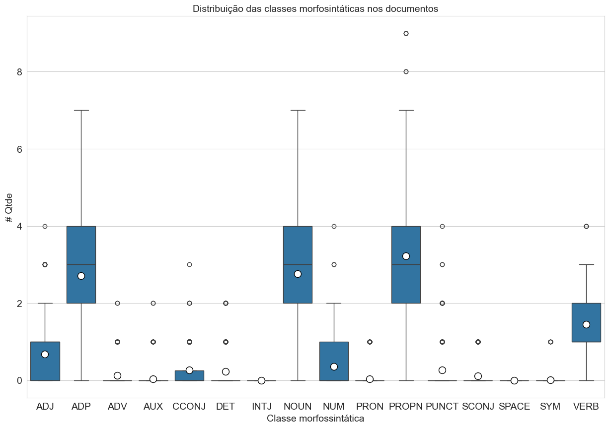
    


Quantidade de POS Tagging nos documentos


```python
# Import das bibliotecas.
import matplotlib.pyplot as plt
import seaborn as sns
import numpy as np

sns.set(style="darkgrid")

# Aumenta o tamanho da plotagem e o tamanho da fonte.
plt.rcParams["figure.figsize"] = (20,10)

# Lista em ordem crescente os dados
order = dfstats_documentos_pos['pos'].value_counts(ascending=False).index

# Plota o número de tokens de cada tamanho
ax = sns.countplot(x="pos", data = dfstats_documentos_pos, order=order)

# Adiciona os valores as colunas
for p in ax.patches:
    ax.annotate(f"{p.get_height()}", (p.get_x()+0.2, p.get_height()+1))

plt.title("Quantidade de POS Tagging nos documentos")
plt.xlabel("#Classe morfossintática")
plt.ylabel("#Quantidade")

plt.show()
```


    
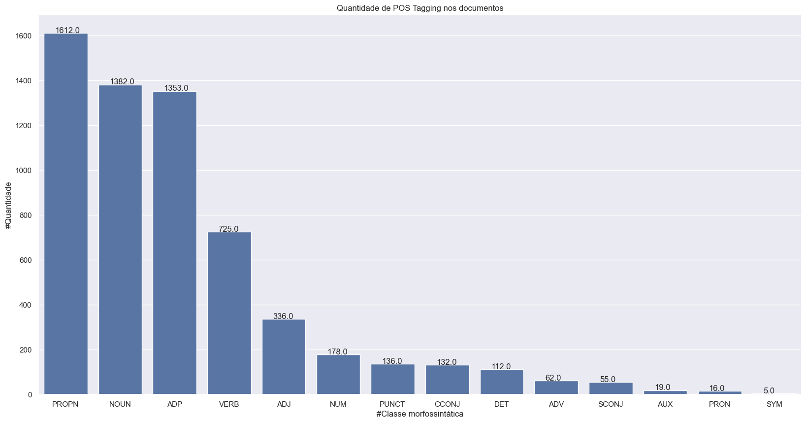
    


#### 5.2.3.3 NER


```python
# Import das bibliotecas.
import pandas as pd

# Formata o número de casas decimais dos números reais
pd.set_option("display.precision", 2)

# Cria um DataFrame das estatísticas
dfstats_documentos_dic_ner = pd.DataFrame([getSomaDic(x[1]) for x in stats_documentos_dic_ner])

# Exibe as estatísticas
dfstats_documentos_dic_ner.describe(include="all")
```


<div>
<style scoped>
    .dataframe tbody tr th:only-of-type {
        vertical-align: middle;
    }

    .dataframe tbody tr th {
        vertical-align: top;
    }

    .dataframe thead th {
        text-align: right;
    }
</style>
<table border="1" class="dataframe">
  <thead>
    <tr style="text-align: right;">
      <th></th>
      <th>LOC</th>
      <th>MISC</th>
      <th>ORG</th>
      <th>PER</th>
    </tr>
  </thead>
  <tbody>
    <tr>
      <th>count</th>
      <td>500.00</td>
      <td>500.00</td>
      <td>500.00</td>
      <td>500.00</td>
    </tr>
    <tr>
      <th>mean</th>
      <td>0.98</td>
      <td>0.30</td>
      <td>0.76</td>
      <td>0.02</td>
    </tr>
    <tr>
      <th>std</th>
      <td>0.87</td>
      <td>0.49</td>
      <td>0.65</td>
      <td>0.16</td>
    </tr>
    <tr>
      <th>min</th>
      <td>0.00</td>
      <td>0.00</td>
      <td>0.00</td>
      <td>0.00</td>
    </tr>
    <tr>
      <th>25%</th>
      <td>0.00</td>
      <td>0.00</td>
      <td>0.00</td>
      <td>0.00</td>
    </tr>
    <tr>
      <th>50%</th>
      <td>1.00</td>
      <td>0.00</td>
      <td>1.00</td>
      <td>0.00</td>
    </tr>
    <tr>
      <th>75%</th>
      <td>2.00</td>
      <td>1.00</td>
      <td>1.00</td>
      <td>0.00</td>
    </tr>
    <tr>
      <th>max</th>
      <td>4.00</td>
      <td>2.00</td>
      <td>4.00</td>
      <td>2.00</td>
    </tr>
  </tbody>
</table>
</div>


Organiza os dados para gerar o boxplot


```python
# Converte os dados para o boxplot
lista_dic_ner = []
# Percorre as estatísticas ner dos documentos
for x in stats_documentos_dic_ner:
    # Soma as estatísticas das sentencas do documento
    posx = getSomaDic(x[1])
    for chave, valor in posx.items():
        lista_dic_ner.append([x[0], chave, valor])

# Converte em um dataframe
dfstats_documentos_dic_ner = pd.DataFrame(lista_dic_ner, columns=("id", "ner", "qtde"))
```


```python
# Import das bibliotecas.
import seaborn as sns
import numpy as np
import matplotlib.pyplot as plt

# Estilo do gráfico
sns.set_style("whitegrid")

# Define o tamanho do gráfico
fig = plt.figure(figsize =(15, 10))

# Lista em ordem alfabética das colunas
ordem = sorted(dfstats_documentos_dic_ner['ner'].unique())

# Insere os dados no gráfico com o ponto(branco) da média do grupo
box_plot = sns.boxplot(x = "ner", y = "qtde", data = dfstats_documentos_dic_ner, order = ordem, showmeans=True,
            meanprops={"marker":"o", "markerfacecolor":"white", "markeredgecolor":"black","markersize":"10"})

# Título do Gráfico
plt.title("Distribuição das classes de entidades nos documentos")
# Texto do eixo x
plt.xlabel("Classe entidades")
# Texto do eixo y
plt.ylabel("# Qtde")

# Mostra o gráfico
plt.show()
```


    

    


Quantidade de NER nos documentos


```python
# Import das bibliotecas.
import matplotlib.pyplot as plt
import seaborn as sns
import numpy as np

sns.set(style="darkgrid")

# Aumenta o tamanho da plotagem e o tamanho da fonte.
plt.rcParams["figure.figsize"] = (20,10)

# Lista em ordem crescente os dados
order = dfstats_documentos_ner['classe'].value_counts(ascending=False).index

# Plota o número de tokens de cada tamanho
ax = sns.countplot(x="classe", data = dfstats_documentos_ner, order=order)

# Adiciona os valores as colunas
for p in ax.patches:
    ax.annotate(f"{p.get_height()}", (p.get_x()+0.2, p.get_height()+1))

plt.title("Quantidade de entidades nos documentos")
plt.xlabel("#Classe entidade")
plt.ylabel("#Quantidade")

plt.show()
```


    
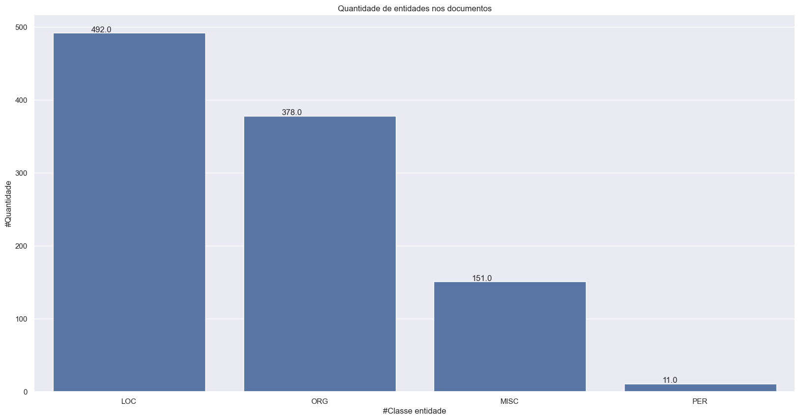
    


#### 5.2.3.4 Lista palavras

Lista as 20 palavras com maiores ocorrências no conjunto de dados.


```python
for i, valor in enumerate(sorted(dicionario_palavras, key = dicionario_palavras.get, reverse=True)):
  if i < 20:
    print(valor, "=>", dicionario_palavras[valor])
```

    de => 545
    PF => 269
    em => 200
    Federal => 164
    Polícia => 152
    e => 132
    no => 131
    , => 91
    Operação => 90
    da => 87
    do => 85
    com => 79
    deflagra => 74
    combate => 72
    apreende => 72
    para => 64
    a => 63
    prende => 55
    na => 49
    drogas => 47
    

#### 5.2.3.5 Lista palavras desconhecidas e ocorrências

Lista as 20 palavras desconhecidas pelo BERT com maiores ocorrência.


```python
lista_palavras_desconhecidas_ocorrencias = []

for palavra in sorted(list(dict.fromkeys([x[0] for x in lista_palavras_desconhecidas_geral]))):
  conta = 0
  tokenizada = ""
  for x in sorted(lista_palavras_desconhecidas_geral, key = lambda x: x[0]):
    if x[0] == palavra:
      conta = conta + 1
      tokenizada = x[1]
  #print(palavra, "=>", tokenizada, "=>", conta)
  lista_palavras_desconhecidas_ocorrencias.append([palavra, tokenizada, conta])

for i, palavra in enumerate(sorted(lista_palavras_desconhecidas_ocorrencias, key = lambda x: x[2], reverse=True)):
  if i < 20:
     print(palavra[0], "=>", palavra[1], "=>", palavra[2])
```

    PF => ['P', '##F'] => 269
    deflagra => ['def', '##la', '##gra'] => 74
    apreende => ['apre', '##ende'] => 72
    prende => ['pre', '##nde'] => 55
    CGU => ['C', '##G', '##U'] => 39
    cigarros => ['cig', '##arro', '##s'] => 37
    apreendem => ['apre', '##ende', '##m'] => 33
    cocaína => ['co', '##ca', '##ína'] => 33
    BPFRON => ['B', '##P', '##F', '##RO', '##N'] => 31
    fraudes => ['fraude', '##s'] => 22
    investiga => ['investi', '##ga'] => 20
    contrabandeados => ['contra', '##band', '##e', '##ados'] => 19
    criminosa => ['crimin', '##osa'] => 17
    desarticula => ['desar', '##tic', '##ula'] => 15
    desvios => ['desvio', '##s'] => 14
    maconha => ['ma', '##con', '##ha'] => 14
    foragido => ['fora', '##gi', '##do'] => 12
    Correios => ['Corre', '##ios'] => 11
    Receita => ['Rece', '##ita'] => 11
    carregados => ['carregado', '##s'] => 11
    

### 5.2.4 Por sentença

#### 5.2.4.1 Gerais


```python
# Import das bibliotecas.
import pandas as pd

# Formata o número de casas decimais dos números reais
pd.set_option("display.precision", 2)

# Cria um DataFrame das estatísticas
df_stats = pd.DataFrame(data=stats_sentencas)

df_stats.describe(include="all")
```


<div>
<style scoped>
    .dataframe tbody tr th:only-of-type {
        vertical-align: middle;
    }

    .dataframe tbody tr th {
        vertical-align: top;
    }

    .dataframe thead th {
        text-align: right;
    }
</style>
<table border="1" class="dataframe">
  <thead>
    <tr style="text-align: right;">
      <th></th>
      <th>id</th>
      <th>sentenca</th>
      <th>qtdepalavras</th>
      <th>qtdetokensbert</th>
      <th>qtdepalavrassemstopword</th>
      <th>qtdelocverbo</th>
      <th>qtdeverbo</th>
      <th>qtdeverboaux</th>
      <th>qtdesubstantivo</th>
      <th>qtdeverboauxsubstantivo</th>
      <th>qtdepalavrasdesconhecidas</th>
      <th>qtdener</th>
    </tr>
  </thead>
  <tbody>
    <tr>
      <th>count</th>
      <td>567.00</td>
      <td>567.00</td>
      <td>567.00</td>
      <td>567.00</td>
      <td>567.00</td>
      <td>567.00</td>
      <td>567.00</td>
      <td>567.00</td>
      <td>567.00</td>
      <td>567.00</td>
      <td>567.00</td>
      <td>567.00</td>
    </tr>
    <tr>
      <th>mean</th>
      <td>253.67</td>
      <td>0.16</td>
      <td>10.80</td>
      <td>15.16</td>
      <td>7.51</td>
      <td>1.25</td>
      <td>1.28</td>
      <td>1.31</td>
      <td>2.44</td>
      <td>3.75</td>
      <td>3.01</td>
      <td>1.82</td>
    </tr>
    <tr>
      <th>std</th>
      <td>144.56</td>
      <td>0.47</td>
      <td>4.53</td>
      <td>6.28</td>
      <td>2.96</td>
      <td>0.73</td>
      <td>0.77</td>
      <td>0.77</td>
      <td>1.50</td>
      <td>1.91</td>
      <td>1.68</td>
      <td>0.89</td>
    </tr>
    <tr>
      <th>min</th>
      <td>1.00</td>
      <td>0.00</td>
      <td>1.00</td>
      <td>1.00</td>
      <td>0.00</td>
      <td>0.00</td>
      <td>0.00</td>
      <td>0.00</td>
      <td>0.00</td>
      <td>0.00</td>
      <td>0.00</td>
      <td>0.00</td>
    </tr>
    <tr>
      <th>25%</th>
      <td>127.50</td>
      <td>0.00</td>
      <td>8.00</td>
      <td>12.00</td>
      <td>6.00</td>
      <td>1.00</td>
      <td>1.00</td>
      <td>1.00</td>
      <td>1.00</td>
      <td>2.00</td>
      <td>2.00</td>
      <td>1.00</td>
    </tr>
    <tr>
      <th>50%</th>
      <td>256.00</td>
      <td>0.00</td>
      <td>11.00</td>
      <td>15.00</td>
      <td>8.00</td>
      <td>1.00</td>
      <td>1.00</td>
      <td>1.00</td>
      <td>2.00</td>
      <td>4.00</td>
      <td>3.00</td>
      <td>2.00</td>
    </tr>
    <tr>
      <th>75%</th>
      <td>380.50</td>
      <td>0.00</td>
      <td>13.00</td>
      <td>19.00</td>
      <td>9.00</td>
      <td>2.00</td>
      <td>2.00</td>
      <td>2.00</td>
      <td>3.00</td>
      <td>5.00</td>
      <td>4.00</td>
      <td>2.00</td>
    </tr>
    <tr>
      <th>max</th>
      <td>500.00</td>
      <td>3.00</td>
      <td>23.00</td>
      <td>38.00</td>
      <td>17.00</td>
      <td>4.00</td>
      <td>4.00</td>
      <td>4.00</td>
      <td>7.00</td>
      <td>10.00</td>
      <td>9.00</td>
      <td>5.00</td>
    </tr>
  </tbody>
</table>
</div>


```python
# Import das bibliotecas.
import seaborn as sns
import numpy as np
import matplotlib.pyplot as plt

# Define o tamanho do gráfico
fig, ax = plt.subplots(figsize =(15, 10))

# Estilo do gráfico
sns.set_style("whitegrid")

# Título do Gráfico
plt.title("Distribuição des quantidades das sentenças")
# Texto do eixo x
plt.xlabel("Quantidades avaliadas")
# Texto do eixo y
plt.ylabel("Quantidade")

rotulos = [[x["qtdepalavras"] for x in stats_sentencas],
           [x["qtdetokensbert"] for x in stats_sentencas],
           [x["qtdepalavrassemstopword"] for x in stats_sentencas],
           [x["qtdelocverbo"] for x in stats_sentencas],
           [x["qtdeverbo"] for x in stats_sentencas],
           [x["qtdeverboaux"] for x in stats_sentencas],
           [x["qtdesubstantivo"] for x in stats_sentencas],
           [x["qtdeverboauxsubstantivo"] for x in stats_sentencas],
           [x["qtdener"] for x in stats_sentencas],
           ]

# Estrutura do gráfico
ax.boxplot(rotulos, patch_artist=True,
           showmeans=True,
           meanprops={"marker":"o", "markerfacecolor":"white", "markeredgecolor":"black","markersize":"10"})

# Rótulos para os boxplots
indices = [x for x in range(1, len(rotulos)+1)]
plt.xticks(indices, ["Palavras",
                     "Tokens BERT",
                     "Palavras menos\nstopwords",
                     "Locuções\nverbais",
                     "Verbos",
                     "Verbo+Aux",
                     "Substantivo",
                     "Verbo+Aux\n+Substantivo",
                     "NER"])

# Mostra o gráfico
plt.show()
```


    
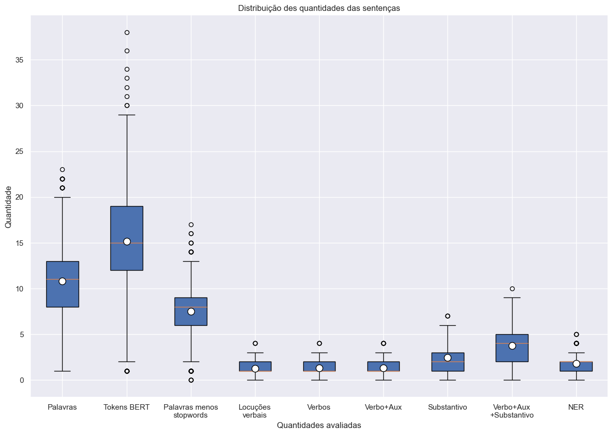
    


#### 5.2.4.2 POS Tagging

https://universaldependencies.org/docs/u/pos/


```python
# Import das bibliotecas.
import pandas as pd

# Formata o número de casas decimais dos números reais
pd.set_option("display.precision", 2)

# Cria um DataFrame das estatísticas
df_stats_sentencas_dic_pos = pd.DataFrame([getSomaDic([x[2]]) for x in stats_sentencas_dic_pos])

# Exibe as estatísticas
df_stats_sentencas_dic_pos.describe()
```


<div>
<style scoped>
    .dataframe tbody tr th:only-of-type {
        vertical-align: middle;
    }

    .dataframe tbody tr th {
        vertical-align: top;
    }

    .dataframe thead th {
        text-align: right;
    }
</style>
<table border="1" class="dataframe">
  <thead>
    <tr style="text-align: right;">
      <th></th>
      <th>PRON</th>
      <th>VERB</th>
      <th>PUNCT</th>
      <th>DET</th>
      <th>NOUN</th>
      <th>AUX</th>
      <th>CCONJ</th>
      <th>ADP</th>
      <th>PROPN</th>
      <th>ADJ</th>
      <th>ADV</th>
      <th>NUM</th>
      <th>SCONJ</th>
      <th>SYM</th>
      <th>SPACE</th>
      <th>INTJ</th>
    </tr>
  </thead>
  <tbody>
    <tr>
      <th>count</th>
      <td>567.00</td>
      <td>567.00</td>
      <td>567.00</td>
      <td>567.00</td>
      <td>567.00</td>
      <td>567.00</td>
      <td>567.00</td>
      <td>567.00</td>
      <td>567.00</td>
      <td>567.00</td>
      <td>567.00</td>
      <td>567.00</td>
      <td>567.0</td>
      <td>5.67e+02</td>
      <td>567.0</td>
      <td>567.0</td>
    </tr>
    <tr>
      <th>mean</th>
      <td>0.03</td>
      <td>1.28</td>
      <td>0.24</td>
      <td>0.20</td>
      <td>2.44</td>
      <td>0.03</td>
      <td>0.23</td>
      <td>2.39</td>
      <td>2.84</td>
      <td>0.59</td>
      <td>0.11</td>
      <td>0.31</td>
      <td>0.1</td>
      <td>8.82e-03</td>
      <td>0.0</td>
      <td>0.0</td>
    </tr>
    <tr>
      <th>std</th>
      <td>0.17</td>
      <td>0.77</td>
      <td>0.55</td>
      <td>0.44</td>
      <td>1.50</td>
      <td>0.20</td>
      <td>0.46</td>
      <td>1.40</td>
      <td>1.72</td>
      <td>0.73</td>
      <td>0.32</td>
      <td>0.59</td>
      <td>0.3</td>
      <td>9.36e-02</td>
      <td>0.0</td>
      <td>0.0</td>
    </tr>
    <tr>
      <th>min</th>
      <td>0.00</td>
      <td>0.00</td>
      <td>0.00</td>
      <td>0.00</td>
      <td>0.00</td>
      <td>0.00</td>
      <td>0.00</td>
      <td>0.00</td>
      <td>0.00</td>
      <td>0.00</td>
      <td>0.00</td>
      <td>0.00</td>
      <td>0.0</td>
      <td>0.00e+00</td>
      <td>0.0</td>
      <td>0.0</td>
    </tr>
    <tr>
      <th>25%</th>
      <td>0.00</td>
      <td>1.00</td>
      <td>0.00</td>
      <td>0.00</td>
      <td>1.00</td>
      <td>0.00</td>
      <td>0.00</td>
      <td>1.00</td>
      <td>2.00</td>
      <td>0.00</td>
      <td>0.00</td>
      <td>0.00</td>
      <td>0.0</td>
      <td>0.00e+00</td>
      <td>0.0</td>
      <td>0.0</td>
    </tr>
    <tr>
      <th>50%</th>
      <td>0.00</td>
      <td>1.00</td>
      <td>0.00</td>
      <td>0.00</td>
      <td>2.00</td>
      <td>0.00</td>
      <td>0.00</td>
      <td>2.00</td>
      <td>3.00</td>
      <td>0.00</td>
      <td>0.00</td>
      <td>0.00</td>
      <td>0.0</td>
      <td>0.00e+00</td>
      <td>0.0</td>
      <td>0.0</td>
    </tr>
    <tr>
      <th>75%</th>
      <td>0.00</td>
      <td>2.00</td>
      <td>0.00</td>
      <td>0.00</td>
      <td>3.00</td>
      <td>0.00</td>
      <td>0.00</td>
      <td>3.00</td>
      <td>4.00</td>
      <td>1.00</td>
      <td>0.00</td>
      <td>1.00</td>
      <td>0.0</td>
      <td>0.00e+00</td>
      <td>0.0</td>
      <td>0.0</td>
    </tr>
    <tr>
      <th>max</th>
      <td>1.00</td>
      <td>4.00</td>
      <td>4.00</td>
      <td>2.00</td>
      <td>7.00</td>
      <td>2.00</td>
      <td>3.00</td>
      <td>7.00</td>
      <td>9.00</td>
      <td>4.00</td>
      <td>2.00</td>
      <td>4.00</td>
      <td>1.0</td>
      <td>1.00e+00</td>
      <td>0.0</td>
      <td>0.0</td>
    </tr>
  </tbody>
</table>
</div>


```python
# Converte os dados para o boxplot
lista_postagging = []
# Percorre as estatísticas pos dos documentos
for x in stats_sentencas_dic_pos:
    # Soma as estatísticas das sentencas do documento
    posx = getSomaDic([x[2]])
    for chave, valor in posx.items():
        lista_postagging.append([x[0], chave, valor])

# Converte em um dataframe
df_stats_sentencas_dic_pos = pd.DataFrame(lista_postagging, columns=("id", "pos", "qtde"))
```


```python
# Import das bibliotecas.
import seaborn as sns
import numpy as np
import matplotlib.pyplot as plt

# Estilo do gráfico
sns.set_style("whitegrid")

# Define o tamanho do gráfico
fig = plt.figure(figsize =(15, 10))

# Lista em ordem alfabética das colunas
ordem = sorted(df_stats_sentencas_dic_pos['pos'].unique())

# Insere os dados no gráfico com o ponto(branco) da média do grupo
box_plot = sns.boxplot(x = "pos", y = "qtde", data = df_stats_sentencas_dic_pos, order = ordem, showmeans=True,
            meanprops={"marker":"o", "markerfacecolor":"white", "markeredgecolor":"black","markersize":"10"})

# Título do Gráfico
plt.title("Distribuição das classes morfosintáticas nos documentos")
# Texto do eixo x
plt.xlabel("Classe morfossintática")
# Texto do eixo y
plt.ylabel("# Qtde")

# Mostra o gráfico
plt.show()
```


    
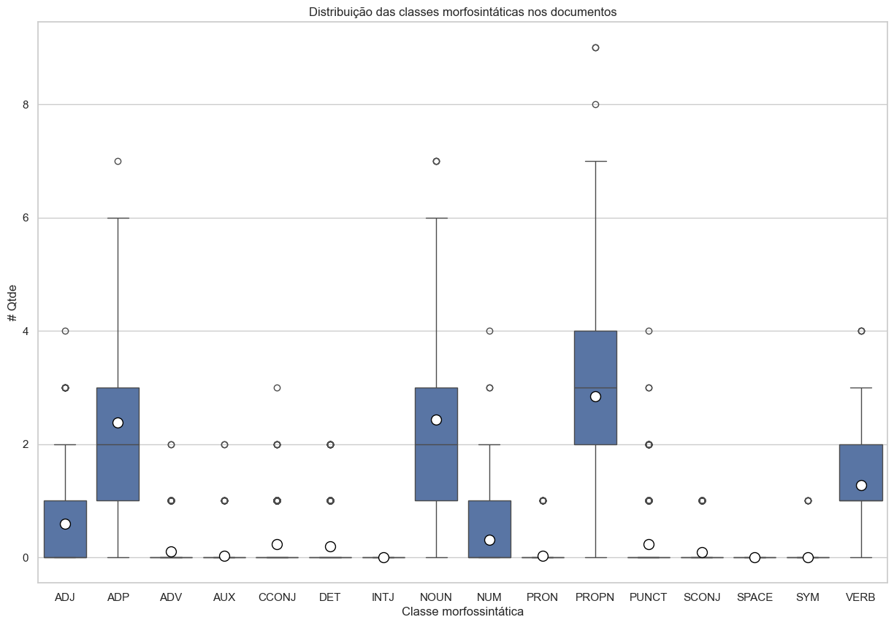
    


Quantidade de ocorrências de classes morfossintática por sentença


```python
# Import das bibliotecas.
import matplotlib.pyplot as plt
import seaborn as sns
import numpy as np

sns.set(style="darkgrid")

# Aumenta o tamanho da plotagem e o tamanho da fonte.
plt.rcParams["figure.figsize"] = (20,10)

df_pos = df_stats_sentencas_dic_pos[df_stats_sentencas_dic_pos["pos"].isin(["NOUN","VERB","AUX"])]

# Plota o número de tokens de cada tamanho
ax = sns.countplot(x="qtde",hue="pos"  ,data=df_pos)

# Adiciona os valores as colunas
for p in ax.patches:
    ax.annotate('{0:g}'.format(p.get_height()), (p.get_x()+0.1, p.get_height()+0.1))

plt.title("Quantidade de ocorrências de classes morfossintática por sentença")
plt.xlabel("#Ocorrências por sentença")
plt.ylabel("#Sentenças")

# Insere a legenda e por padrão usa o label de cada gráfico em duas colunas na parte inferior
plt.legend(title='Legenda:', loc='upper right', fontsize=12)._legend_box.align='left'

plt.show()
```

    2026-05-24 19:12:53,659 : INFO : Using categorical units to plot a list of strings that are all parsable as floats or dates. If these strings should be plotted as numbers, cast to the appropriate data type before plotting.
    

    2026-05-24 19:12:53,666 : INFO : Using categorical units to plot a list of strings that are all parsable as floats or dates. If these strings should be plotted as numbers, cast to the appropriate data type before plotting.
    


    

    


Ex.: Existe 4(#Sentenças) sentenças onde palavras da classe morfossintática VERB(azul legenda) ocorrem uma vez(#Ocorrências por sentença).

#### 5.2.4.3 Gráficos de POS Tagging nas sentenças dos documentos


```python
# Import das bibliotecas.
import matplotlib.pyplot as plt
import seaborn as sns
import numpy as np

sns.set(style="darkgrid")

# Aumenta o tamanho da plotagem e o tamanho da fonte.
plt.rcParams["figure.figsize"] = (20,10)

# Plota o número de tokens de cada tamanho
ax = sns.countplot(x=[f["qtde"] for i, f in df_stats_sentencas_dic_pos.iterrows() if f["pos"]=="VERB"])

# Adiciona os valores as colunas
for p in ax.patches:
    ax.annotate(f"{p.get_height()}", (p.get_x()+0.35, p.get_height()+0.2))

plt.title("Quantidade de VERB por sentença")
plt.xlabel("#Qtde de VERB")
plt.ylabel("#Sentenças")

plt.show()
```

    2026-05-24 19:12:54,150 : INFO : Using categorical units to plot a list of strings that are all parsable as floats or dates. If these strings should be plotted as numbers, cast to the appropriate data type before plotting.
    

    2026-05-24 19:12:54,155 : INFO : Using categorical units to plot a list of strings that are all parsable as floats or dates. If these strings should be plotted as numbers, cast to the appropriate data type before plotting.
    


    
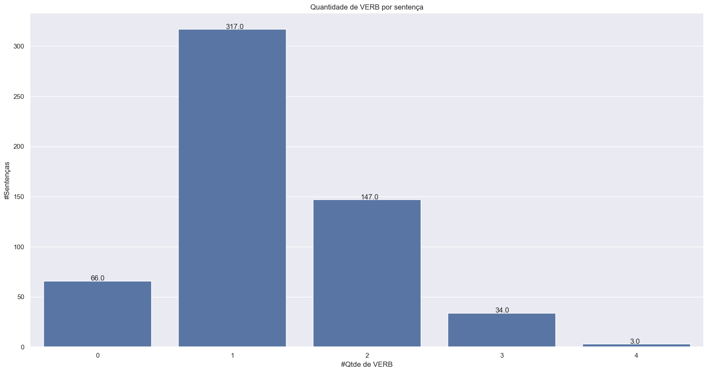
    


```python
# Import das bibliotecas.
import matplotlib.pyplot as plt
import seaborn as sns
import numpy as np

sns.set(style="darkgrid")

# Aumenta o tamanho da plotagem e o tamanho da fonte.
plt.rcParams["figure.figsize"] = (20,10)

# Plota o número de tokens de cada tamanho
ax = sns.countplot(x=[f["qtde"] for i, f in df_stats_sentencas_dic_pos.iterrows() if f["pos"]=="NOUN"])

# Adiciona os valores as colunas
for p in ax.patches:
    ax.annotate(f"{p.get_height()}", (p.get_x()+0.3, p.get_height()+0.2))

plt.title("Quantidade de NOUN por sentença")
plt.xlabel("#Qtde de NOUN")
plt.ylabel("#Sentenças")

plt.show()
```

    2026-05-24 19:12:54,587 : INFO : Using categorical units to plot a list of strings that are all parsable as floats or dates. If these strings should be plotted as numbers, cast to the appropriate data type before plotting.
    

    2026-05-24 19:12:54,594 : INFO : Using categorical units to plot a list of strings that are all parsable as floats or dates. If these strings should be plotted as numbers, cast to the appropriate data type before plotting.
    


    

    


```python
# Import das bibliotecas.
import matplotlib.pyplot as plt
import seaborn as sns
import numpy as np

sns.set(style="darkgrid")

# Aumenta o tamanho da plotagem e o tamanho da fonte.
plt.rcParams["figure.figsize"] = (20,10)

# Plota o número de tokens de cada tamanho
ax = sns.countplot(x=[f["qtde"] for i, f in df_stats_sentencas_dic_pos.iterrows() if f["pos"]=="AUX"])

# Adiciona os valores as colunas
for p in ax.patches:
    ax.annotate(f"{p.get_height()}", (p.get_x()+0.3, p.get_height()+0.2))

plt.title("Quantidade de AUX por sentença")
plt.xlabel("#Qtde de AUX")
plt.ylabel("#Sentenças")

plt.show()
```

    2026-05-24 19:12:55,059 : INFO : Using categorical units to plot a list of strings that are all parsable as floats or dates. If these strings should be plotted as numbers, cast to the appropriate data type before plotting.
    

    2026-05-24 19:12:55,065 : INFO : Using categorical units to plot a list of strings that are all parsable as floats or dates. If these strings should be plotted as numbers, cast to the appropriate data type before plotting.
    


    
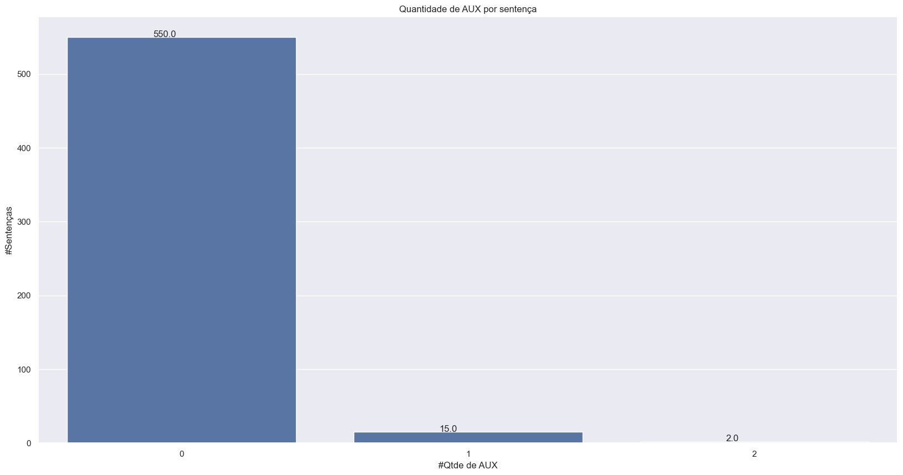
    


```python
# Import das bibliotecas.
import matplotlib.pyplot as plt
import seaborn as sns
import numpy as np

sns.set(style="darkgrid")

# Aumenta o tamanho da plotagem e o tamanho da fonte.
plt.rcParams["figure.figsize"] = (20,10)

# Plota o número de tokens de cada tamanho
ax = sns.countplot(x=[f["qtde"] for i, f in df_stats_sentencas_dic_pos.iterrows() if f["pos"]=="SCONJ"])

# Adiciona os valores as colunas
for p in ax.patches:
    ax.annotate(f"{p.get_height()}", (p.get_x()+0.3, p.get_height()+0.2))

plt.title("Quantidade de SCONJ por sentença")
plt.xlabel("#Qtde de SCONJ")
plt.ylabel("#Sentenças")

plt.show()
```

    2026-05-24 19:12:55,459 : INFO : Using categorical units to plot a list of strings that are all parsable as floats or dates. If these strings should be plotted as numbers, cast to the appropriate data type before plotting.
    

    2026-05-24 19:12:55,467 : INFO : Using categorical units to plot a list of strings that are all parsable as floats or dates. If these strings should be plotted as numbers, cast to the appropriate data type before plotting.
    


    

    


```python
# Import das bibliotecas.
import matplotlib.pyplot as plt
import seaborn as sns
import numpy as np

sns.set(style="darkgrid")

# Aumenta o tamanho da plotagem e o tamanho da fonte.
plt.rcParams["figure.figsize"] = (20,10)

# Plota o número de tokens de cada tamanho
ax = sns.countplot(x=[f["qtde"] for i, f in df_stats_sentencas_dic_pos.iterrows() if f["pos"]=="CCONJ"])

# Adiciona os valores as colunas
for p in ax.patches:
    ax.annotate(f"{p.get_height()}", (p.get_x()+0.3, p.get_height()+0.2))

plt.title("Quantidade de CCONJ por sentença")
plt.xlabel("#Qtde de CCONJ")
plt.ylabel("#Sentenças")

plt.show()
```

    2026-05-24 19:12:55,845 : INFO : Using categorical units to plot a list of strings that are all parsable as floats or dates. If these strings should be plotted as numbers, cast to the appropriate data type before plotting.
    

    2026-05-24 19:12:55,849 : INFO : Using categorical units to plot a list of strings that are all parsable as floats or dates. If these strings should be plotted as numbers, cast to the appropriate data type before plotting.
    


    
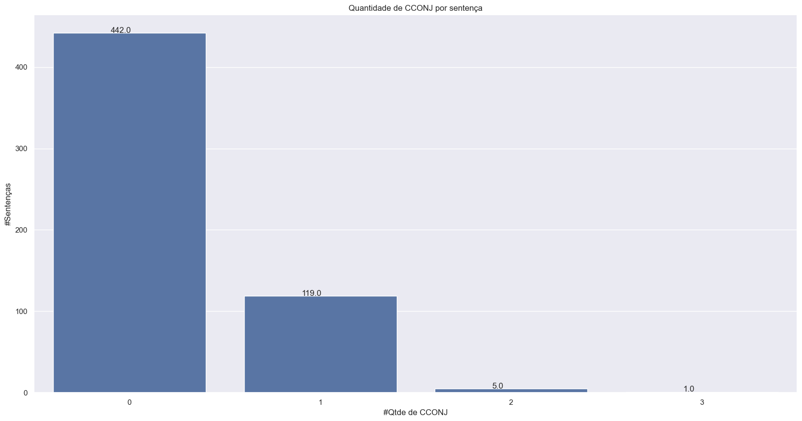
    


```python
# Import das bibliotecas.
import matplotlib.pyplot as plt
import seaborn as sns
import numpy as np

sns.set(style="darkgrid")

# Aumenta o tamanho da plotagem e o tamanho da fonte.
plt.rcParams["figure.figsize"] = (20,10)

# Plota o número de tokens de cada tamanho
ax = sns.countplot(x=[f["qtde"] for i, f in df_stats_sentencas_dic_pos.iterrows() if f["pos"]=="PRON"])

# Adiciona os valores as colunas
for p in ax.patches:
    ax.annotate(f"{p.get_height()}", (p.get_x()+0.3, p.get_height()+0.2))

plt.title("Quantidade de PRON por sentença")
plt.xlabel("#Qtde de PRON")
plt.ylabel("#Sentenças")

plt.show()
```

    2026-05-24 19:12:56,239 : INFO : Using categorical units to plot a list of strings that are all parsable as floats or dates. If these strings should be plotted as numbers, cast to the appropriate data type before plotting.
    

    2026-05-24 19:12:56,244 : INFO : Using categorical units to plot a list of strings that are all parsable as floats or dates. If these strings should be plotted as numbers, cast to the appropriate data type before plotting.
    


    
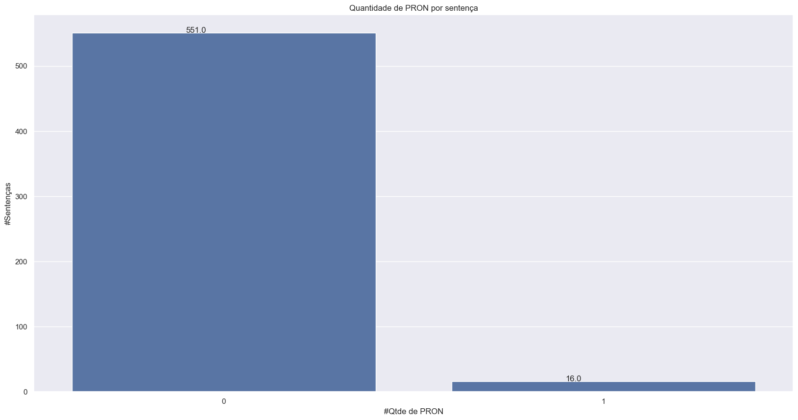
    


#### 5.2.4.4 NER


```python
# Import das bibliotecas.
import pandas as pd

# Formata o número de casas decimais dos números reais
pd.set_option("display.precision", 2)

# Cria um DataFrame das estatísticas
df_stats_sentencas_dic_ner = pd.DataFrame([getSomaDic([x[2]]) for x in stats_sentencas_dic_ner])

# Exibe as estatísticas
df_stats_sentencas_dic_ner.describe()
```


<div>
<style scoped>
    .dataframe tbody tr th:only-of-type {
        vertical-align: middle;
    }

    .dataframe tbody tr th {
        vertical-align: top;
    }

    .dataframe thead th {
        text-align: right;
    }
</style>
<table border="1" class="dataframe">
  <thead>
    <tr style="text-align: right;">
      <th></th>
      <th>LOC</th>
      <th>MISC</th>
      <th>ORG</th>
      <th>PER</th>
    </tr>
  </thead>
  <tbody>
    <tr>
      <th>count</th>
      <td>567.00</td>
      <td>567.00</td>
      <td>567.00</td>
      <td>567.00</td>
    </tr>
    <tr>
      <th>mean</th>
      <td>0.87</td>
      <td>0.27</td>
      <td>0.67</td>
      <td>0.02</td>
    </tr>
    <tr>
      <th>std</th>
      <td>0.83</td>
      <td>0.47</td>
      <td>0.64</td>
      <td>0.14</td>
    </tr>
    <tr>
      <th>min</th>
      <td>0.00</td>
      <td>0.00</td>
      <td>0.00</td>
      <td>0.00</td>
    </tr>
    <tr>
      <th>25%</th>
      <td>0.00</td>
      <td>0.00</td>
      <td>0.00</td>
      <td>0.00</td>
    </tr>
    <tr>
      <th>50%</th>
      <td>1.00</td>
      <td>0.00</td>
      <td>1.00</td>
      <td>0.00</td>
    </tr>
    <tr>
      <th>75%</th>
      <td>1.00</td>
      <td>1.00</td>
      <td>1.00</td>
      <td>0.00</td>
    </tr>
    <tr>
      <th>max</th>
      <td>4.00</td>
      <td>2.00</td>
      <td>4.00</td>
      <td>1.00</td>
    </tr>
  </tbody>
</table>
</div>


```python
# Converte os dados para o boxplot
lista_ner = []
# Percorre as estatísticas pos dos documentos
for x in stats_sentencas_dic_ner:
    # Soma as estatísticas das sentencas do documento
    posx = getSomaDic([x[2]])
    for chave, valor in posx.items():
        lista_ner.append([x[0], chave, valor])

# Converte em um dataframe
df_stats_sentencas_dic_ner = pd.DataFrame(lista_ner, columns=("id", "ner", "qtde"))
```


```python
# Import das bibliotecas.
import seaborn as sns
import numpy as np
import matplotlib.pyplot as plt

# Estilo do gráfico
sns.set_style("whitegrid")

# Define o tamanho do gráfico
fig = plt.figure(figsize =(15, 10))

# Lista em ordem alfabética das colunas
ordem = sorted(df_stats_sentencas_dic_ner['ner'].unique())

# Insere os dados no gráfico com o ponto(branco) da média do grupo
box_plot = sns.boxplot(x = "ner", y = "qtde", data = df_stats_sentencas_dic_ner, order = ordem, showmeans=True,
            meanprops={"marker":"o", "markerfacecolor":"white", "markeredgecolor":"black","markersize":"10"})

# Título do Gráfico
plt.title("Distribuição das classes entidades nos documentos")
# Texto do eixo x
plt.xlabel("Classe entidade")
# Texto do eixo y
plt.ylabel("# Qtde")

# Mostra o gráfico
plt.show()
```


    

    


Quantidade de ocorrências de classes entidades por sentença


```python
# Import das bibliotecas.
import matplotlib.pyplot as plt
import seaborn as sns
import numpy as np

sns.set(style="darkgrid")

# Aumenta o tamanho da plotagem e o tamanho da fonte.
plt.rcParams["figure.figsize"] = (20,10)

df_ner = df_stats_sentencas_dic_ner[df_stats_sentencas_dic_ner["ner"].isin(["LOC","MISC","ORG","PER"])]

# Plota o número de tokens de cada tamanho
ax = sns.countplot(x="qtde",hue="ner" ,data=df_ner)

# Adiciona os valores as colunas
for p in ax.patches:
    ax.annotate('{0:g}'.format(p.get_height()), (p.get_x()+0.1, p.get_height()+0.1))

plt.title("Quantidade de ocorrências de classes entidades por sentença")
plt.xlabel("#Ocorrências por sentença")
plt.ylabel("#Sentenças")

# Insere a legenda e por padrão usa o label de cada gráfico em duas colunas na parte inferior
plt.legend(title='Legenda:', loc='upper right', fontsize=12)._legend_box.align='left'

plt.show()
```

    2026-05-24 19:12:56,529 : INFO : Using categorical units to plot a list of strings that are all parsable as floats or dates. If these strings should be plotted as numbers, cast to the appropriate data type before plotting.
    

    2026-05-24 19:12:56,536 : INFO : Using categorical units to plot a list of strings that are all parsable as floats or dates. If these strings should be plotted as numbers, cast to the appropriate data type before plotting.
    


    

    


Ex.: Existe 4(#Sentenças) sentenças onde palavras da classe morfossintática LOC(azul legenda) ocorrem uma vez(#Ocorrências por sentença).

#### 5.2.4.5 Gráficos NER nas sentenças dos documentos


```python
# Import das bibliotecas.
import matplotlib.pyplot as plt
import seaborn as sns
import numpy as np

sns.set(style="darkgrid")

# Aumenta o tamanho da plotagem e o tamanho da fonte.
plt.rcParams["figure.figsize"] = (20,10)

# Plota o número de tokens de cada tamanho
ax = sns.countplot(x=[f["qtde"] for i, f in df_stats_sentencas_dic_ner.iterrows() if f["ner"]=="LOC"])

# Adiciona os valores as colunas
for p in ax.patches:
    ax.annotate(f"{p.get_height()}", (p.get_x()+0.35, p.get_height()+0.2))

plt.title("Quantidade de LOC por sentença")
plt.xlabel("#Qtde de LOC")
plt.ylabel("#Sentenças")

plt.show()
```

    2026-05-24 19:12:56,813 : INFO : Using categorical units to plot a list of strings that are all parsable as floats or dates. If these strings should be plotted as numbers, cast to the appropriate data type before plotting.
    

    2026-05-24 19:12:56,819 : INFO : Using categorical units to plot a list of strings that are all parsable as floats or dates. If these strings should be plotted as numbers, cast to the appropriate data type before plotting.
    


    
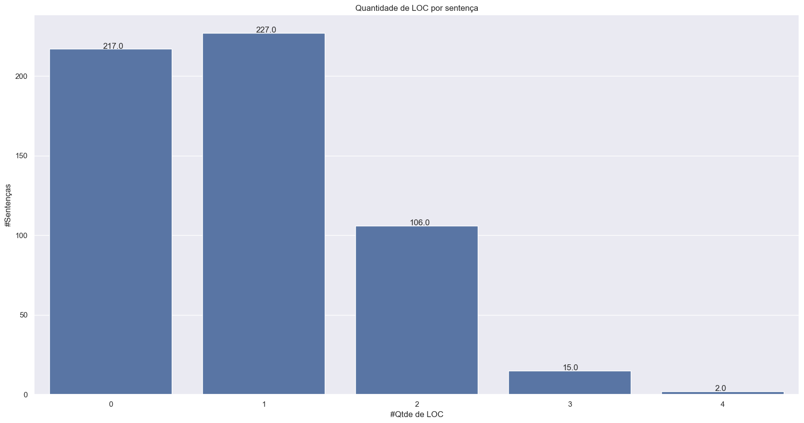
    


```python
# Import das bibliotecas.
import matplotlib.pyplot as plt
import seaborn as sns
import numpy as np

sns.set(style="darkgrid")

# Aumenta o tamanho da plotagem e o tamanho da fonte.
plt.rcParams["figure.figsize"] = (20,10)

# Plota o número de tokens de cada tamanho
ax = sns.countplot(x=[f["qtde"] for i, f in df_stats_sentencas_dic_ner.iterrows() if f["ner"]=="MISC"])

# Adiciona os valores as colunas
for p in ax.patches:
    ax.annotate(f"{p.get_height()}", (p.get_x()+0.35, p.get_height()+0.2))

plt.title("Quantidade de MISC por sentença")
plt.xlabel("#Qtde de MISC")
plt.ylabel("#Sentenças")

plt.show()
```

    2026-05-24 19:12:57,035 : INFO : Using categorical units to plot a list of strings that are all parsable as floats or dates. If these strings should be plotted as numbers, cast to the appropriate data type before plotting.
    

    2026-05-24 19:12:57,042 : INFO : Using categorical units to plot a list of strings that are all parsable as floats or dates. If these strings should be plotted as numbers, cast to the appropriate data type before plotting.
    


    

    


```python
# Import das bibliotecas.
import matplotlib.pyplot as plt
import seaborn as sns
import numpy as np

sns.set(style="darkgrid")

# Aumenta o tamanho da plotagem e o tamanho da fonte.
plt.rcParams["figure.figsize"] = (20,10)

# Plota o número de tokens de cada tamanho
ax = sns.countplot(x=[f["qtde"] for i, f in df_stats_sentencas_dic_ner.iterrows() if f["ner"]=="ORG"])

# Adiciona os valores as colunas
for p in ax.patches:
    ax.annotate(f"{p.get_height()}", (p.get_x()+0.35, p.get_height()+0.2))

plt.title("Quantidade de ORG por sentença")
plt.xlabel("#Qtde de ORG")
plt.ylabel("#Sentenças")

plt.show()
```

    2026-05-24 19:12:57,265 : INFO : Using categorical units to plot a list of strings that are all parsable as floats or dates. If these strings should be plotted as numbers, cast to the appropriate data type before plotting.
    

    2026-05-24 19:12:57,271 : INFO : Using categorical units to plot a list of strings that are all parsable as floats or dates. If these strings should be plotted as numbers, cast to the appropriate data type before plotting.
    


    

    


### 5.2.5 Por Janela

#### 5.2.5.1 Função que gera as janelas


```python
def contaItensLista(lista):
  '''
  Conta os itens das lista de listas.

  Parâmetros:
    `lista` - Uma lista de lista itens.

  Retorno:
    `qtde_itens` - Quantidade de itens das listas.
  '''
  # Quantidade itens da lista
  qtde_itens = 0

  for item in lista:
    qtde_itens = qtde_itens + len(item)

  return qtde_itens
```


```python
def truncaJanela(lista_janela,
                 maximo_itens,
                 lista_centro_janela):
  '''
  Trunca as palavras da janela até o máximo da janela.

  Parâmetros:
    `lista_janela` - Um dataframe com os itens.
    `maximo_itens` - Máximo de itens na janela. Trunca das extremidades preservando a palavra central.
    `lista_centro_janela` - Lista com os índices dos centros da janela.

  Retorno:
    `lista_janela` - Janela truncada pelo máximo de itens.
  '''
  # Quantidade de itens nas janelas antes
  qtde_itens1 = contaItensLista(lista_janela)
  # print("quantidade de itens janela antes:", qtde_itens1)

  # Controle se não alcançado o máximo de palavras
  minimo_alcancado = False

  # Indices para os elementos a serem excluídos
  indice_esquerda = 0
  indice_direita = len(lista_janela) -1

  # Remove as palavras das extremidade que ultrapassam o tamanho máximo
  while qtde_itens1 > maximo_itens and minimo_alcancado == False:

    # Recupera os intervalo das folhas da direita e esquerda e centro
    # Intervalo da folha da esquerda do centro
    # Sempre inicia em 0
    inicio_folha_esquerda = 0
    fim_folha_esquerda = lista_centro_janela[0]

    # Intervalo do centro
    #inicio_centro_esquerda = lista_centro_janela[0]
    #fim_centro_direita = lista_centro_janela[-1]+1

    # Intervalo da folha da direita do centro
    inicio_folha_direita = lista_centro_janela[-1]+1
    # Vai até o final da lista
    fim_folha_direita = len(lista_janela)

    # Conta os elementos dos intervalos
    conta_itens_esquerda = contaItensLista(lista_janela[inicio_folha_esquerda:fim_folha_esquerda])
    #conta_itens_centro = contaItensLista(lista_janela[inicio_centro_esquerda:fim_centro_direita])
    conta_itens_direita = contaItensLista(lista_janela[inicio_folha_direita:fim_folha_direita])

    # print("")
    # print("inicio_folha_esquerda :", inicio_folha_esquerda, "/fim_folha_esquerda:", fim_folha_esquerda, " conta:", conta_itens_esquerda)
    # print("inicio_centro_esquerda:",inicio_centro_esquerda,"/fim_centro_direita:", fim_centro_direita, " conta:", conta_itens_centro)
    # print("inicio_folha_direita  :",inicio_folha_direita,"/fim_folha_direita:", fim_folha_direita, " conta:", conta_itens_direita)

    # Se a quantidade de itens a direita for maior apaga deste lado
    if conta_itens_direita > conta_itens_esquerda:
      # Remove da direita
      if len(lista_janela[indice_direita]) > 0:
        # Remove do fim da janela
        lista_janela[indice_direita].pop()
        if len(lista_janela[indice_direita]) == 0:
          # Não pode ser menor que o centro
          if indice_direita > lista_centro_janela[-1]:
            indice_direita = indice_direita - 1
    else:
        # Remove da esquerda
        if len(lista_janela[indice_esquerda]) > 0:
          # Remove do inicio da janela
          lista_janela[indice_esquerda].pop(0)
          if len(lista_janela[indice_esquerda]) == 0:
            # Não pode ser menor que o centro
            if indice_esquerda < lista_centro_janela[0]:
              indice_esquerda = indice_esquerda + 1

    # Calcula a nova quantidade de itens
    qtde_itens2 = contaItensLista(lista_janela)

    # Verifica se conseguiu reduzir a quantidade de itens
    if (qtde_itens1 == qtde_itens2):
      print("Atenção!: Truncamento de janela não conseguiu reduzir além de ", qtde_itens2, " para o máximo ", maximo_itens)
      minimo_alcancado = True

    # Atribui uma nova quantidade
    qtde_itens1 = qtde_itens2

  return lista_janela
```


```python
def getJanelaLista(lista, tamanho_janela, indice_passo, maximo_itens=None):
  '''
  Cria janelas de itens de uma lista

  Parâmetros:
    `lista` - Uma lista de lista com os itens a se serem colocados em uma janela.
    `tamanho_janela` - Tamanho da janela a ser construída.
    `indice_passo` - Índice do passo que se deseja da janela.
    `maximo_itens` - Máximo de itens na janela. Trunca das extremidades preservando a palavra central.

  Retorno:
    `lista_janela` - Lista com os itens em janelas.
    `string_janela` - String com os itens em janelas.
    `lista_indice_janela` - Lista com os índices dos itens que forma a janela.
    `lista_centro_janela` - Lista com os índices dos centros da janela.
  '''

  # Se a lista de itens é menor ou igual ao tamanho da janela
  if len(lista) <= tamanho_janela:

    # Recupera os itens da janela
    lista_janela = lista

    # Guarda os índices dos itens das janelas
    lista_indice_janela = []

    # Adiciona os índices das janelas
    for i in range(len(lista)):
      lista_indice_janela.append(i)

    # Guarda os índices dos centros das janelas
    lista_centro_janela = []
    # Calcula o centro
    centro_janela = int((len(lista)/2))
    lista_centro_janela.append(centro_janela)

    # Concatena em uma string as palavras das itens da janela
    lista_janela_itens = []
    for item in lista_janela:
      lista_janela_itens.append(" ".join(item))

    return lista_janela, " ".join(lista_janela_itens), lista_indice_janela, lista_centro_janela

  else:
    # Lista maior que o tamanho da janela
    # Calcula o tamanho da folha da janela(quantidade de itens a esquerda e direita do centro da janela).
    folha_janela = int((tamanho_janela-1) /2)
    # Define o centro da janela
    centro_janela = -1
    # Se a janela está dentro do intervalo da lista de itens
    if indice_passo >= 0 and indice_passo < len(lista):

      # Guarda os itens da janela
      lista_janela = []
      # Guarda os índices dos itens das janelas
      lista_indice_janela = []
      # Guarda os índices dos centros das janelas
      # Por enquanto somente centro com um elemento
      lista_centro_janela = []

      # Inicio da lista sem janelas completas depois do meio da janela, folha da direita do centro
      if indice_passo < folha_janela:
        # print("Inicio da lista")
        # itens anteriores
        #Evita estourar o início da lista
        inicio = 0
        fim = indice_passo
        # print("Anterior: inicio:", inicio, " fim:", fim)
        for j in range(inicio, fim):
          # Recupera o documento da lista
          documento = lista[j]
          lista_janela.append(documento)
          # Adiciona o indice do documento na lista
          lista_indice_janela.append(j)

        # item central
        # Recupera o documento da lista
        documento = lista[indice_passo]
        lista_janela.append(documento)
        # Adiciona o indice do documento na lista
        lista_indice_janela.append(indice_passo)
        # Guarda o centro da janela
        centro_janela = len(lista_janela)-1
        lista_centro_janela.append(centro_janela)

        # itens posteriores
        inicio = indice_passo + 1
        fim = indice_passo + folha_janela + 1
        # print("Posterior: inicio:", inicio, " fim:", fim)
        for j in range(inicio,fim):
          # Recupera o documento da lista
          documento = lista[j]
          lista_janela.append(documento)
          # Adiciona o indice do documento na lista
          lista_indice_janela.append(j)

      else:
        # Meio da lista com janelas completas antes e depois, folhas de tamanhos iguais a esquerda e a direita
        if indice_passo < len(lista)-folha_janela:
          # print(" Meio da lista")

          # itens anteriores
          inicio = indice_passo - folha_janela
          fim = indice_passo
          # print("inicio:", inicio, " fim:", fim)
          for j in range(inicio, fim):
            # Recupera o documento da lista
            documento = lista[j]
            # Adiciona o documento a janela
            lista_janela.append(documento)
            # Adiciona o indice do documento na lista
            lista_indice_janela.append(j)

          # item central
          # Recupera o documento da lista
          documento = lista[indice_passo]
          # Adiciona o documento a janela
          lista_janela.append(documento)
          # Adiciona o indice do documento na lista
          lista_indice_janela.append(indice_passo)
          # Guarda o centro da janela
          centro_janela = len(lista_janela)-1
          lista_centro_janela.append(centro_janela)

          # itens posteriores
          inicio = indice_passo + 1
          fim = indice_passo + 1 + folha_janela
          for j in range(inicio,fim):
            # Recupera o documento da lista
            documento = lista[j]
            # Adiciona o documento a janela
            lista_janela.append(documento)
            # Adiciona o indice do documento na lista
            lista_indice_janela.append(j)

        else:
          # Fim da lista sem janelas completas antes do meio da janela, folha da esquerda do centro
          if indice_passo >= len(lista)-folha_janela:
            # print("Fim da lista")

            # itens anteriores
            inicio = indice_passo - folha_janela
            fim = indice_passo
            #print("inicio:", inicio, " fim:", fim)
            for j in range(inicio, fim):
              # Recupera o documento da lista
              documento = lista[j]
              # Adiciona o documento a janela
              lista_janela.append(documento)
              # Adiciona o indice do documento na lista
              lista_indice_janela.append(j)

            # item central
            # Recupera o documento da lista
            documento = lista[indice_passo]
            # Adiciona o documento a janela
            lista_janela.append(documento)
            # Adiciona o indice do documento na lista
            lista_indice_janela.append(indice_passo)
            # Guarda o centro da janela
            centro_janela = len(lista_janela)-1
            lista_centro_janela.append(centro_janela)

            # itens posteriores
            inicio = indice_passo + 1
            fim = indice_passo + 1 + folha_janela
            # Evita o extrapolar o limite da lista de itens
            if fim > len(lista):
              fim = len(lista)
            for j in range(inicio,fim):
              # Recupera o documento da lista
              documento = lista[j]
              # Adiciona o documento a janela
              lista_janela.append(documento)
              # Adiciona o indice do documento na lista
              lista_indice_janela.append(j)
    else:
      print("Índice fora do intervalo da lista de itens.")

    # Se existir maximo_itens realiza o truncamento
    if maximo_itens != None:
      # Cria uma copia da lista de itens para evitar a referência
      lista_apagar = []
      for item in lista_janela:
          lista_apagar.append(item.copy())

      # Trunca a quantidade de itens da janela até o máximo de itens.
      lista_janela = truncaJanela(lista_apagar, maximo_itens, lista_centro_janela)

    # Junta em uma string os itens das listas  da janela
    lista_janela_itens = []
    for item in lista_janela:
      lista_janela_itens.append(" ".join(item))

    return lista_janela, " ".join(lista_janela_itens), lista_indice_janela, lista_centro_janela
```

#### 5.2.5.2 Calcula palavras e tokens por janela


```python
# Import das bibliotecas.
from tqdm.notebook import tqdm as tqdm_notebook

# Lista das estatísticas
stats_documento_janelas = []
stats_janelas = []

print("Processando",len(df_dataset),"documentos")

# Barra de progresso dos documentos
df_dataset_bar = tqdm_notebook(df_dataset.iterrows(), desc=f"Documentos", unit=f" documento", total=len(df_dataset))

# Percorre os documentos do conjunto de dados
for i, linha_documento in df_dataset_bar:
    # Recupera o id do documento
    id_documento = linha_documento["id"]
    #print("\nid_documento:",id_documento)

    # Carrega a lista das sentenças do documento de acordo com o tipo armazenado
    lista_sentenca_documento = linha_documento["sentencas"]
    # print("lista_sentenca_documento:",lista_sentenca_documento)
    #print("len(lista_sentenca_documento):",len(lista_sentenca_documento))

    # Localiza e carrega a lista das POSTagging das sentenças do documento de acordo com o tipo armazenado
    # Considera somente a posição 1 com as sentenças
    lista_pos_documento = df_dataset_pos.iloc[i].iloc[1]
    #print("lista_pos_documento:",lista_pos_documento)
    #print("len(lista_pos_documento):",len(lista_pos_documento))

    # Inicialização contadores de documento
    total_palavras_documento = 0

    # Inicialização contadores de documento
    total_palavras_documento = 0
    total_tokens_BERT_documento = 0
    total_janela_tamanho_3 = 0
    total_janela_tamanho_5 = 0
    total_token_BERT_tamanho_3 = 0
    total_token_BERT_tamanho_5 = 0

    # Converte em um dataframe
    pd_lista_sentenca = pd.DataFrame(lista_sentenca_documento, columns = ["documento"])
    # print("len(pd_lista_sentenca):",len(pd_lista_sentenca))

    # Gera uma lista de lista de palavras da sentença para gerar as janelas.
    lista_documento_palavras = []
    for j, x in pd_lista_sentenca.iterrows():
      # Recupera a lista dos tokens da sentença
      sentenca_token = lista_pos_documento[j][0]
      lista_documento_palavras.append(sentenca_token)
    # print("lista_documento_palavras:",lista_documento_palavras)

    for j, x in pd_lista_sentenca.iterrows():
      # recupera a sentença
      sentenca = lista_sentenca_documento[j]
      #print(j, "\doc:", x['documento'])

      # Recupera a lista dos tokens da sentença
      sentenca_token = lista_pos_documento[j][0]
      # print("sentenca_token:",sentenca_token)
      #print("len(sentenca_token):",len(sentenca_token))

      ######### Estatísticas das palavras da sentença
      # Quantidade de palavras por Sentença
      qtdePalavra = len(sentenca_token)

      # Acumula a quantidade de palavras da Sentença
      total_palavras_documento = total_palavras_documento + qtdePalavra

      ######### Estatísticas dos tokens BERT
      # Divide a Sentença em tokens do BERT
      sentenca_tokenizada = tokenizer.tokenize(sentenca)

      # Quantidade de tokens por Sentença
      qtde_token_BERT = len(sentenca_tokenizada)

      # Acumula a quantidade de tokens da Sentença
      total_tokens_BERT_documento = total_tokens_BERT_documento + qtde_token_BERT

      ######### Gera janelas de tamanho 3 (1 anterior + 1 centro + 1 posterior)
      lista_janela3, string_janela3, lista_indice_janela3, centro_janela3 = getJanelaLista(lista_documento_palavras, 3, j)

      # Divide a Sentença em tokens do BERT
      sentenca_tokenizada_janela3 = tokenizer.tokenize(string_janela3)

      # Quantidade de tokens por Sentença
      qtde_token_BERT_janela3 = len(sentenca_tokenizada_janela3)

      # Acumula a quantidade de tokens da Sentença
      total_token_BERT_tamanho_3 = total_token_BERT_tamanho_3 + qtde_token_BERT_janela3

      # Conta as palavras da janela
      qtde_palavras_janela3 = contaItensLista(lista_janela3)

      # Acumula os totais do documento
      total_janela_tamanho_3 = total_janela_tamanho_3 + qtde_palavras_janela3

      ######### Gera janelas de tamanho 5 (2 anterior + 1 centro + 2 posterior)
      lista_janela5, string_janela5, lista_indice_janela5, centro_janela5 = getJanelaLista(lista_documento_palavras, 5, j)

      #Divide a Sentença em tokens do BERT
      sentenca_tokenizada_janela5 = tokenizer.tokenize(string_janela5)

      # Quantidade de tokens por Sentença
      qtde_token_BERT_janela5 = len(sentenca_tokenizada_janela5)

      # Acumula a quantidade de tokens da Sentença
      total_token_BERT_tamanho_5 = total_token_BERT_tamanho_5 + qtde_token_BERT_janela5

      # Conta as palavras da janela
      qtde_palavras_janela5 = contaItensLista(lista_janela5)

      # Acumula os totais do documento
      total_janela_tamanho_5 = total_janela_tamanho_5 + qtde_palavras_janela5

      # Registra as estatística das janelas
      stats_janelas.append(
        {
          "id": id_documento,
          "qtdepalavras" : qtdePalavra,
          "qtdetokensbert" : qtde_token_BERT,
          "qtdepalavrasjanela3" : qtde_palavras_janela3,
          "qtdepalavrasjanela5" : qtde_palavras_janela5,
          "qtdetokenbertjanela3" : qtde_token_BERT_janela3,
          "qtdetokenbertjanela5" : qtde_token_BERT_janela5,
        }
      )

    # Registra as estatística do documento
    stats_documento_janelas.append(
      {
        "id": id_documento,
        "qtdesentencas": len(lista_sentenca_documento),
        "qtdepalavras" : total_palavras_documento,
        "qtdetokensbert" : total_tokens_BERT_documento,
        "totalpalavrasjanela3" : total_janela_tamanho_3,
        "totalpalavrasjanela5" : total_janela_tamanho_5,
        "totaltokenbertjanela3" : total_token_BERT_tamanho_3,
        "totaltokenbertjanela5" : total_token_BERT_tamanho_5,
      }
    )
```

    Processando 500 documentos
    


    Documentos:   0%|          | 0/500 [00:00<?, ? documento/s]


#### 5.2.5.3 Estatísticas palavras e tokens por janela


```python
# Import das bibliotecas.
import pandas as pd

# Formata o número de casas decimais dos números reais
pd.set_option("display.precision", 2)

# Cria um DataFrame das estatísticas
dfstats_janelas = pd.DataFrame(data=stats_janelas)

dfstats_janelas.describe(include="all")
```


<div>
<style scoped>
    .dataframe tbody tr th:only-of-type {
        vertical-align: middle;
    }

    .dataframe tbody tr th {
        vertical-align: top;
    }

    .dataframe thead th {
        text-align: right;
    }
</style>
<table border="1" class="dataframe">
  <thead>
    <tr style="text-align: right;">
      <th></th>
      <th>id</th>
      <th>qtdepalavras</th>
      <th>qtdetokensbert</th>
      <th>qtdepalavrasjanela3</th>
      <th>qtdepalavrasjanela5</th>
      <th>qtdetokenbertjanela3</th>
      <th>qtdetokenbertjanela5</th>
    </tr>
  </thead>
  <tbody>
    <tr>
      <th>count</th>
      <td>567.00</td>
      <td>567.00</td>
      <td>567.00</td>
      <td>567.00</td>
      <td>567.00</td>
      <td>567.00</td>
      <td>567.00</td>
    </tr>
    <tr>
      <th>mean</th>
      <td>253.67</td>
      <td>10.80</td>
      <td>15.16</td>
      <td>12.36</td>
      <td>12.52</td>
      <td>17.41</td>
      <td>17.64</td>
    </tr>
    <tr>
      <th>std</th>
      <td>144.56</td>
      <td>4.53</td>
      <td>6.28</td>
      <td>3.92</td>
      <td>3.83</td>
      <td>5.72</td>
      <td>5.60</td>
    </tr>
    <tr>
      <th>min</th>
      <td>1.00</td>
      <td>1.00</td>
      <td>1.00</td>
      <td>2.00</td>
      <td>3.00</td>
      <td>2.00</td>
      <td>3.00</td>
    </tr>
    <tr>
      <th>25%</th>
      <td>127.50</td>
      <td>8.00</td>
      <td>12.00</td>
      <td>10.00</td>
      <td>10.00</td>
      <td>14.00</td>
      <td>14.00</td>
    </tr>
    <tr>
      <th>50%</th>
      <td>256.00</td>
      <td>11.00</td>
      <td>15.00</td>
      <td>12.00</td>
      <td>12.00</td>
      <td>17.00</td>
      <td>17.00</td>
    </tr>
    <tr>
      <th>75%</th>
      <td>380.50</td>
      <td>13.00</td>
      <td>19.00</td>
      <td>15.00</td>
      <td>15.00</td>
      <td>21.00</td>
      <td>21.00</td>
    </tr>
    <tr>
      <th>max</th>
      <td>500.00</td>
      <td>23.00</td>
      <td>38.00</td>
      <td>27.00</td>
      <td>27.00</td>
      <td>40.00</td>
      <td>40.00</td>
    </tr>
  </tbody>
</table>
</div>


#### 5.2.5.4 Estatísticas palavras e tokens em janelas por documento


```python
# Import das bibliotecas.
import pandas as pd

# Formata o número de casas decimais dos números reais
pd.set_option("display.precision", 2)

# Cria um DataFrame das estatísticas
dfstats_documentos_janela = pd.DataFrame(data=stats_documento_janelas)

dfstats_documentos_janela.describe(include="all")
```


<div>
<style scoped>
    .dataframe tbody tr th:only-of-type {
        vertical-align: middle;
    }

    .dataframe tbody tr th {
        vertical-align: top;
    }

    .dataframe thead th {
        text-align: right;
    }
</style>
<table border="1" class="dataframe">
  <thead>
    <tr style="text-align: right;">
      <th></th>
      <th>id</th>
      <th>qtdesentencas</th>
      <th>qtdepalavras</th>
      <th>qtdetokensbert</th>
      <th>totalpalavrasjanela3</th>
      <th>totalpalavrasjanela5</th>
      <th>totaltokenbertjanela3</th>
      <th>totaltokenbertjanela5</th>
    </tr>
  </thead>
  <tbody>
    <tr>
      <th>count</th>
      <td>500.00</td>
      <td>500.00</td>
      <td>500.00</td>
      <td>500.00</td>
      <td>500.00</td>
      <td>500.0</td>
      <td>500.00</td>
      <td>500.00</td>
    </tr>
    <tr>
      <th>mean</th>
      <td>250.50</td>
      <td>1.13</td>
      <td>12.25</td>
      <td>17.19</td>
      <td>14.02</td>
      <td>14.2</td>
      <td>19.74</td>
      <td>20.00</td>
    </tr>
    <tr>
      <th>std</th>
      <td>144.48</td>
      <td>0.45</td>
      <td>3.61</td>
      <td>5.25</td>
      <td>7.92</td>
      <td>8.6</td>
      <td>11.51</td>
      <td>12.47</td>
    </tr>
    <tr>
      <th>min</th>
      <td>1.00</td>
      <td>1.00</td>
      <td>3.00</td>
      <td>3.00</td>
      <td>3.00</td>
      <td>3.0</td>
      <td>3.00</td>
      <td>3.00</td>
    </tr>
    <tr>
      <th>25%</th>
      <td>125.75</td>
      <td>1.00</td>
      <td>10.00</td>
      <td>14.00</td>
      <td>10.00</td>
      <td>10.0</td>
      <td>14.00</td>
      <td>14.00</td>
    </tr>
    <tr>
      <th>50%</th>
      <td>250.50</td>
      <td>1.00</td>
      <td>12.00</td>
      <td>17.00</td>
      <td>12.00</td>
      <td>12.0</td>
      <td>17.00</td>
      <td>17.00</td>
    </tr>
    <tr>
      <th>75%</th>
      <td>375.25</td>
      <td>1.00</td>
      <td>14.00</td>
      <td>20.00</td>
      <td>15.00</td>
      <td>15.0</td>
      <td>21.00</td>
      <td>21.00</td>
    </tr>
    <tr>
      <th>max</th>
      <td>500.00</td>
      <td>4.00</td>
      <td>27.00</td>
      <td>40.00</td>
      <td>81.00</td>
      <td>81.0</td>
      <td>108.00</td>
      <td>108.00</td>
    </tr>
  </tbody>
</table>
</div>


### 5.2.6 Por Documento

#### 5.2.6.1 Gráfico Quantidade de documentos por quantidade de sentenças


```python
# Import das bibliotecas.
import matplotlib.pyplot as plt
import seaborn as sns
import numpy as np

sns.set(style="darkgrid")

# Aumenta o tamanho da plotagem e o tamanho da fonte.
plt.rcParams["figure.figsize"] = (20,10)

# Plota o número de tokens de cada tamanho
ax = sns.countplot(x=[f["qtdesentencas"] for f in stats_documentos])

# Adiciona os valores as colunas
for p in ax.patches:
    ax.annotate(f"{p.get_height()}", (p.get_x()+0.3, p.get_height()+0.2))

plt.title("Quantidade de documentos por quantidade sentença")
plt.xlabel("#Sentenças em documentos")
plt.ylabel("#Documentos")

plt.show()
```

    2026-05-24 19:12:58,056 : INFO : Using categorical units to plot a list of strings that are all parsable as floats or dates. If these strings should be plotted as numbers, cast to the appropriate data type before plotting.
    

    2026-05-24 19:12:58,062 : INFO : Using categorical units to plot a list of strings that are all parsable as floats or dates. If these strings should be plotted as numbers, cast to the appropriate data type before plotting.
    


    
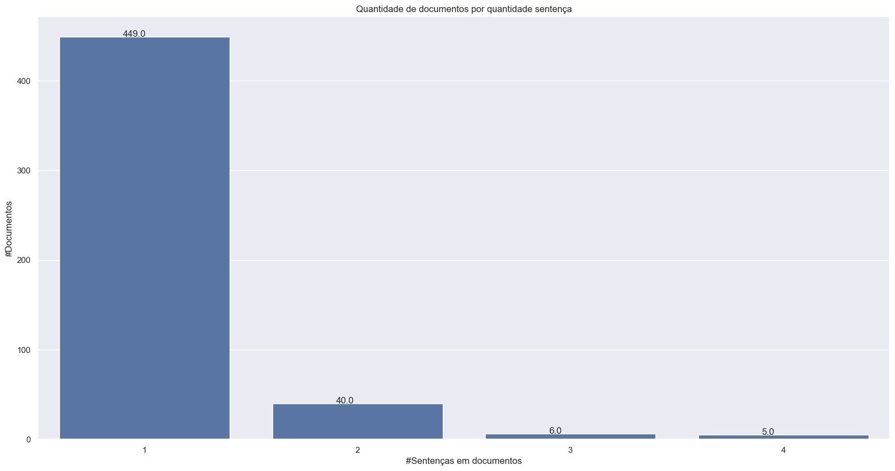
    


#### 5.2.6.2 Gráfico Quantidade de documentos  por quantidade de palavras


```python
# Import das bibliotecas.
import matplotlib.pyplot as plt
import seaborn as sns
import numpy as np

sns.set(style="darkgrid")

# Aumenta o tamanho da plotagem e o tamanho da fonte.
plt.rcParams["figure.figsize"] = (20,10)

# Plota o número de tokens de cada tamanho
ax = sns.countplot(x=[f["qtdepalavras"] for f in stats_documentos])

# Adiciona os valores as colunas
for p in ax.patches:
    ax.annotate(f"{p.get_height()}", (p.get_x()+0.2, p.get_height()+1))

plt.title("Quantidade de documentos  por quantidade de palavras")
plt.xlabel("#Palavras em documentos")
plt.ylabel("#Documentos")

plt.show()
```

    2026-05-24 19:12:58,174 : INFO : Using categorical units to plot a list of strings that are all parsable as floats or dates. If these strings should be plotted as numbers, cast to the appropriate data type before plotting.
    

    2026-05-24 19:12:58,181 : INFO : Using categorical units to plot a list of strings that are all parsable as floats or dates. If these strings should be plotted as numbers, cast to the appropriate data type before plotting.
    


    

    


#### 5.2.6.3 Gráfico Quantidade de documentos  por quantidade de tokens


```python
# Import das bibliotecas.
import matplotlib.pyplot as plt
import seaborn as sns
import numpy as np

sns.set(style="darkgrid")

# Aumenta o tamanho da plotagem e o tamanho da fonte.
plt.rcParams["figure.figsize"] = (20,10)

# Plota o número de tokens de cada tamanho
ax = sns.countplot(x=[f["qtdetokensbert"] for f in stats_documentos])

# Adiciona os valores as colunas
for p in ax.patches:
    ax.annotate(f"{p.get_height()}", (p.get_x()+0.3, p.get_height()+0.01))

plt.title("Quantidade de documentos  por quantidade de tokens")
plt.xlabel("#Tokens em documentos")
plt.ylabel("#Documentos")

plt.show()
```

    2026-05-24 19:12:58,415 : INFO : Using categorical units to plot a list of strings that are all parsable as floats or dates. If these strings should be plotted as numbers, cast to the appropriate data type before plotting.
    

    2026-05-24 19:12:58,422 : INFO : Using categorical units to plot a list of strings that are all parsable as floats or dates. If these strings should be plotted as numbers, cast to the appropriate data type before plotting.
    


    

    


#### 5.2.6.4 Gráfico Quantidade de documentos  por quantidade de palavras desconsiderando as stopword


```python
# Import das bibliotecas.
import matplotlib.pyplot as plt
import seaborn as sns
import numpy as np

sns.set(style="darkgrid")

# Aumenta o tamanho da plotagem e o tamanho da fonte.
plt.rcParams["figure.figsize"] = (20,10)

# Plota o número de tokens de cada tamanho
ax = sns.countplot(x=[f["qtdepalavrassemstopword"] for f in stats_documentos])

# Adiciona os valores as colunas
for p in ax.patches:
    ax.annotate(f"{p.get_height()}", (p.get_x()+0.4, p.get_height()+0.01))

plt.title("Quantidade de documentos  por quantidade de palavras sem stopwords")
plt.xlabel("#Palavras em documentos sem stopwords")
plt.ylabel("#Documentos")

plt.show()
```

    2026-05-24 19:12:58,716 : INFO : Using categorical units to plot a list of strings that are all parsable as floats or dates. If these strings should be plotted as numbers, cast to the appropriate data type before plotting.
    

    2026-05-24 19:12:58,722 : INFO : Using categorical units to plot a list of strings that are all parsable as floats or dates. If these strings should be plotted as numbers, cast to the appropriate data type before plotting.
    


    

    


#### 5.2.6.5 Gráfico Quantidade de documentos  por quantidade de locuções verbais


```python
# Import das bibliotecas.
import matplotlib.pyplot as plt
import seaborn as sns
import numpy as np

sns.set(style="darkgrid")

# Aumenta o tamanho da plotagem e o tamanho da fonte.
plt.rcParams["figure.figsize"] = (20,10)

# Plota o número de tokens de cada tamanho
ax = sns.countplot(x=[f["qtdelocverbo"] for f in stats_documentos])

# Adiciona os valores as colunas
for p in ax.patches:
    ax.annotate(f"{p.get_height()}", (p.get_x()+0.35, p.get_height()+0.01))

plt.title("Quantidade de documentos  por quantidade de locuções verbais")
plt.xlabel("#Locuções verbais em documentos")
plt.ylabel("#Documentos")

plt.show()
```

    2026-05-24 19:12:59,190 : INFO : Using categorical units to plot a list of strings that are all parsable as floats or dates. If these strings should be plotted as numbers, cast to the appropriate data type before plotting.
    

    2026-05-24 19:12:59,197 : INFO : Using categorical units to plot a list of strings that are all parsable as floats or dates. If these strings should be plotted as numbers, cast to the appropriate data type before plotting.
    


    

    


#### 5.2.6.6 Gráfico Quantidade de documentos  por quantidade de verbos


```python
# Import das bibliotecas.
import matplotlib.pyplot as plt
import seaborn as sns
import numpy as np

sns.set(style="darkgrid")

# Aumenta o tamanho da plotagem e o tamanho da fonte.
plt.rcParams["figure.figsize"] = (20,10)

# Plota o número de tokens de cada tamanho
ax = sns.countplot(x=[f["qtdeverbo"] for f in stats_documentos])

# Adiciona os valores as colunas
for p in ax.patches:
    ax.annotate(f"{p.get_height()}", (p.get_x()+0.4, p.get_height()+0.01))

plt.title("Quantidade de documentos  por quantidade de verbos")
plt.xlabel("#Verbos em documentos")
plt.ylabel("#Documentos")

plt.show()
```

    2026-05-24 19:12:59,344 : INFO : Using categorical units to plot a list of strings that are all parsable as floats or dates. If these strings should be plotted as numbers, cast to the appropriate data type before plotting.
    

    2026-05-24 19:12:59,349 : INFO : Using categorical units to plot a list of strings that are all parsable as floats or dates. If these strings should be plotted as numbers, cast to the appropriate data type before plotting.
    


    

    


#### 5.2.6.7 Gráfico Quantidade de documentos  por quantidade de verbos(VERB) e verbos auxiliares(AUX)


```python
# Import das bibliotecas.
import matplotlib.pyplot as plt
import seaborn as sns
import numpy as np

sns.set(style="darkgrid")

# Aumenta o tamanho da plotagem e o tamanho da fonte.
plt.rcParams["figure.figsize"] = (20,10)

# Plota o número de tokens de cada tamanho
ax = sns.countplot(x=[f["qtdeverboaux"] for f in stats_documentos])

# Adiciona os valores as colunas
for p in ax.patches:
    ax.annotate(f"{p.get_height()}", (p.get_x()+0.4, p.get_height()+0.01))

plt.title("Quantidade de documentos  por quantidade de verbos e aux")
plt.xlabel("#Verbos e auxiliar em documentos")
plt.ylabel("#Documentos")

plt.show()
```

    2026-05-24 19:12:59,482 : INFO : Using categorical units to plot a list of strings that are all parsable as floats or dates. If these strings should be plotted as numbers, cast to the appropriate data type before plotting.
    

    2026-05-24 19:12:59,488 : INFO : Using categorical units to plot a list of strings that are all parsable as floats or dates. If these strings should be plotted as numbers, cast to the appropriate data type before plotting.
    


    
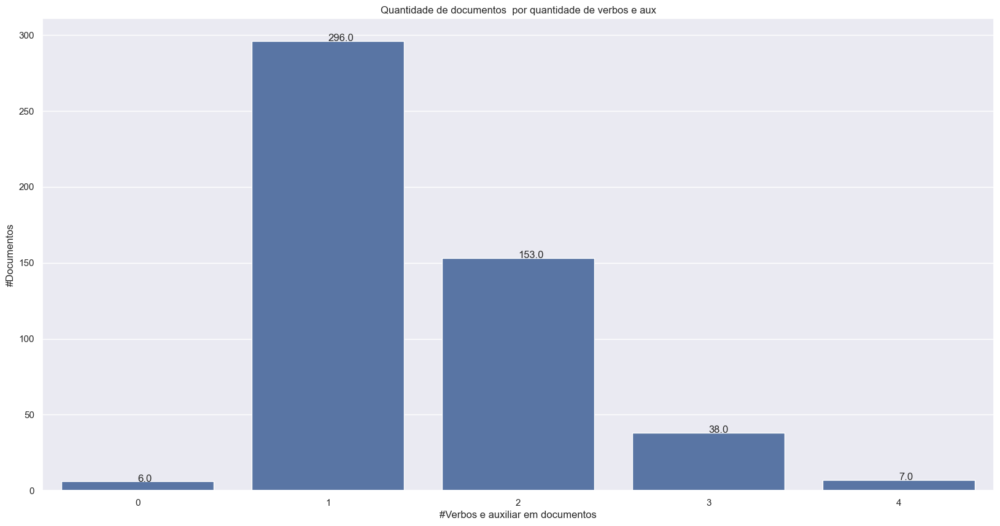
    


#### 5.2.6.8 Gráfico Quantidade de documentos  por quantidade de substantivos(NOUN)


```python
# Import das bibliotecas.
import matplotlib.pyplot as plt
import seaborn as sns
import numpy as np

sns.set(style="darkgrid")

# Aumenta o tamanho da plotagem e o tamanho da fonte.
plt.rcParams["figure.figsize"] = (20,10)

# Plota o número de tokens de cada tamanho
ax = sns.countplot(x=[f["qtdesubstantivo"] for f in stats_documentos])

# Adiciona os valores as colunas
for p in ax.patches:
    ax.annotate(f"{p.get_height()}", (p.get_x()+0.4, p.get_height()+0.01))

plt.title("Quantidade de documentos  por quantidade de substantivos")
plt.xlabel("#Substantivos em documentos")
plt.ylabel("#Documentos")

plt.show()
```

    2026-05-24 19:12:59,622 : INFO : Using categorical units to plot a list of strings that are all parsable as floats or dates. If these strings should be plotted as numbers, cast to the appropriate data type before plotting.
    

    2026-05-24 19:12:59,627 : INFO : Using categorical units to plot a list of strings that are all parsable as floats or dates. If these strings should be plotted as numbers, cast to the appropriate data type before plotting.
    


    

    


#### 5.2.6.9 Gráfico Quantidade de documentos  por quantidade de verbos(AUX) e substantivo(NOUN)


```python
# Import das bibliotecas.
import matplotlib.pyplot as plt
import seaborn as sns
import numpy as np

sns.set(style="darkgrid")

# Aumenta o tamanho da plotagem e o tamanho da fonte.
plt.rcParams["figure.figsize"] = (20,10)

# Plota o número de tokens de cada tamanho
ax = sns.countplot(x=[f["qtdeverboauxsubstantivo"] for f in stats_documentos])

# Adiciona os valores as colunas
for p in ax.patches:
    ax.annotate(f"{p.get_height()}", (p.get_x()+0.4, p.get_height()+0.01))

plt.title("Quantidade de documentos  por quantidade de verbos(AUX) e substantivos")
plt.xlabel("#Verbos(AUX) e substantivos em documentos")
plt.ylabel("#Documentos")

plt.show()
```

    2026-05-24 19:12:59,775 : INFO : Using categorical units to plot a list of strings that are all parsable as floats or dates. If these strings should be plotted as numbers, cast to the appropriate data type before plotting.
    

    2026-05-24 19:12:59,781 : INFO : Using categorical units to plot a list of strings that are all parsable as floats or dates. If these strings should be plotted as numbers, cast to the appropriate data type before plotting.
    


    
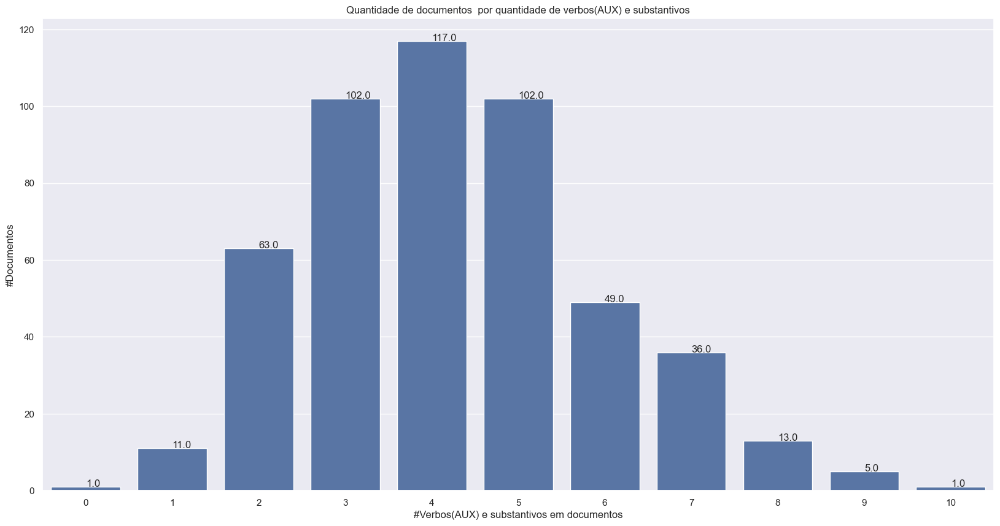
    


#### 5.2.6.10 Gráfico Quantidade de documentos por quantidade de entidades reconhecidas


```python
# Import das bibliotecas.
import matplotlib.pyplot as plt
import seaborn as sns
import numpy as np

sns.set(style="darkgrid")

# Aumenta o tamanho da plotagem e o tamanho da fonte.
plt.rcParams["figure.figsize"] = (20,10)

# Plota o número de tokens de cada tamanho
ax = sns.countplot(x=[f["qtdener"] for f in stats_documentos])

# Adiciona os valores as colunas
for p in ax.patches:
    ax.annotate(f"{p.get_height()}", (p.get_x()+0.4, p.get_height()+0.01))

plt.title("Quantidade de documentos por quantidade de entidades")
plt.xlabel("#Entidades em documentos")
plt.ylabel("#Documentos")

plt.show()
```

    2026-05-24 19:12:59,947 : INFO : Using categorical units to plot a list of strings that are all parsable as floats or dates. If these strings should be plotted as numbers, cast to the appropriate data type before plotting.
    

    2026-05-24 19:12:59,953 : INFO : Using categorical units to plot a list of strings that are all parsable as floats or dates. If these strings should be plotted as numbers, cast to the appropriate data type before plotting.
    


    

    


#### 5.2.6.11 Gráfico da distribuição do comprimento dos documentos tokenizados


```python
# Recupera o comprimento dos documentos tokenizados
tamanhos_sentencas = [len(x) for x in documento_tokenizado]
```


```python
# Import das bibliotecas
import matplotlib.pyplot as plt
import seaborn as sns

sns.set(style='darkgrid')

# Aumenta o tamanho da plotagem e o tamanho da fonte.
sns.set(font_scale=1.5)
plt.rcParams["figure.figsize"] = (12,6)

# Adiciona os valores as colunas
plt.scatter(range(0, len(tamanhos_sentencas)), tamanhos_sentencas, marker="|")

plt.xlabel("#Documento")
plt.ylabel("#Tamanho documentos")
plt.title("Tamanhos dos documentos tokenizados antes de classificar")

plt.show()
```


    

    


```python
# Import das bibliotecas
import matplotlib.pyplot as plt
import seaborn as sns

# Use plot styling from seaborn.
sns.set(style='darkgrid')

# Increase the plot size and font size.
sns.set(font_scale=1.5)
plt.rcParams["figure.figsize"] = (12,6)

plt.scatter(range(0, len(tamanhos_sentencas)), sorted(tamanhos_sentencas), marker="|")

plt.xlabel("#Documento")
plt.ylabel("#Tamanho documentos")
plt.title("Tamanhos dos documentos tokenizados classificados")

plt.show()
```


    

    


### 5.2.7 Por sentença

#### 5.2.7.1 Gráfico Quantidade de sentenças de documentos  por quantidade de palavras


```python
# Import das bibliotecas.
import matplotlib.pyplot as plt
import seaborn as sns
import numpy as np

sns.set(style="darkgrid")

# Aumenta o tamanho da plotagem e o tamanho da fonte.
plt.rcParams["figure.figsize"] = (20,10)

# Plota o número de tokens de cada tamanho
ax = sns.countplot(x=[f["qtdepalavras"] for f in stats_sentencas])

# Adiciona os valores as colunas
for p in ax.patches:
    ax.annotate(f"{p.get_height()}", (p.get_x()+0.2, p.get_height()+0.01))

plt.title("Quantidade de sentenças de documentos  por quantidade de palavras")
plt.xlabel("#Palavras em sentenças")
plt.ylabel("#Sentenças")

plt.show()
```

    2026-05-24 19:13:00,337 : INFO : Using categorical units to plot a list of strings that are all parsable as floats or dates. If these strings should be plotted as numbers, cast to the appropriate data type before plotting.
    

    2026-05-24 19:13:00,343 : INFO : Using categorical units to plot a list of strings that are all parsable as floats or dates. If these strings should be plotted as numbers, cast to the appropriate data type before plotting.
    


    
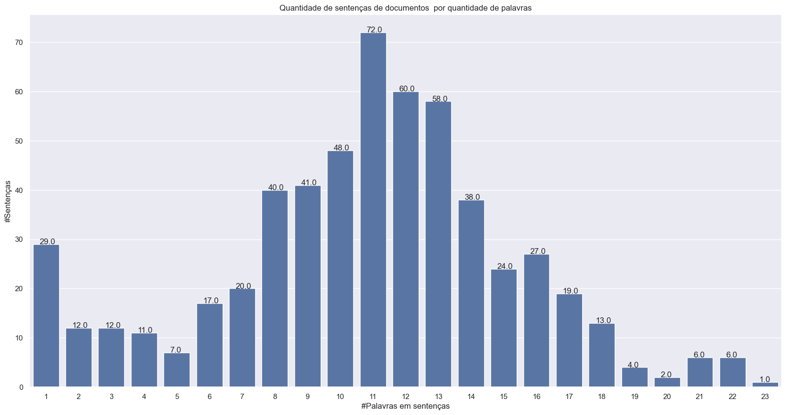
    


#### 5.2.7.2 Gráfico Quantidade de sentenças de documentos  por quantidade de tokens


```python
# Import das bibliotecas.
import matplotlib.pyplot as plt
import seaborn as sns
import numpy as np

sns.set(style="darkgrid")

# Aumenta o tamanho da plotagem e o tamanho da fonte.
plt.rcParams["figure.figsize"] = (20,10)

# Plota o número de tokens de cada tamanho
ax = sns.countplot(x=[f["qtdetokensbert"] for f in stats_sentencas])

# Adiciona os valores as colunas
for p in ax.patches:
    ax.annotate(f"{p.get_height()}", (p.get_x()+0.2, p.get_height()+0.01))

plt.title("Quantidade de sentenças de documentos  por quantidade de tokens")
plt.xlabel("#Tokens em sentenças")
plt.ylabel("#Sentenças")

plt.show()
```

    2026-05-24 19:13:00,575 : INFO : Using categorical units to plot a list of strings that are all parsable as floats or dates. If these strings should be plotted as numbers, cast to the appropriate data type before plotting.
    

    2026-05-24 19:13:00,582 : INFO : Using categorical units to plot a list of strings that are all parsable as floats or dates. If these strings should be plotted as numbers, cast to the appropriate data type before plotting.
    


    
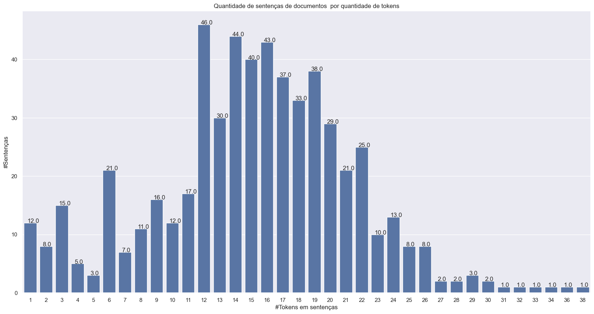
    


#### 5.2.7.3 Gráfico Quantidade de sentenças de documentos  por quantidade de palavras desconsiderando stopwords


```python
# Import das bibliotecas.
import matplotlib.pyplot as plt
import seaborn as sns
import numpy as np

sns.set(style="darkgrid")

# Aumenta o tamanho da plotagem e o tamanho da fonte.
plt.rcParams["figure.figsize"] = (20,10)

# Plota o número de tokens de cada tamanho
ax = sns.countplot(x=[f["qtdepalavrassemstopword"] for f in stats_sentencas])

# Adiciona os valores as colunas
for p in ax.patches:
    ax.annotate(f"{p.get_height()}", (p.get_x()+0.2, p.get_height()+0.01))

plt.title("Quantidade de sentenças de documentos por quantidade de palavras desconsiderando stopword")
plt.xlabel("#Palavras em sentenças sem stopword")
plt.ylabel("#Sentenças")

plt.show()
```

    2026-05-24 19:13:00,902 : INFO : Using categorical units to plot a list of strings that are all parsable as floats or dates. If these strings should be plotted as numbers, cast to the appropriate data type before plotting.
    

    2026-05-24 19:13:00,909 : INFO : Using categorical units to plot a list of strings that are all parsable as floats or dates. If these strings should be plotted as numbers, cast to the appropriate data type before plotting.
    


    

    


#### 5.2.7.4 Gráfico Quantidade de sentenças de documentos  por quantidade de locuções verbais


```python
# Import das bibliotecas.
import matplotlib.pyplot as plt
import seaborn as sns
import numpy as np

sns.set(style="darkgrid")

# Aumenta o tamanho da plotagem e o tamanho da fonte.
plt.rcParams["figure.figsize"] = (20,10)

# Plota o número de tokens de cada tamanho
ax = sns.countplot(x=[f["qtdelocverbo"] for f in stats_sentencas])

# Adiciona os valores as colunas
for p in ax.patches:
    ax.annotate(f"{p.get_height()}", (p.get_x()+0.35, p.get_height()+0.1))

plt.title("Quantidade de sentenças de documentos  por quantidade de locuções verbais")
plt.xlabel("#Locuções verbais em sentenças")
plt.ylabel("#Sentenças")

plt.show()
```

    2026-05-24 19:13:01,118 : INFO : Using categorical units to plot a list of strings that are all parsable as floats or dates. If these strings should be plotted as numbers, cast to the appropriate data type before plotting.
    

    2026-05-24 19:13:01,125 : INFO : Using categorical units to plot a list of strings that are all parsable as floats or dates. If these strings should be plotted as numbers, cast to the appropriate data type before plotting.
    


    
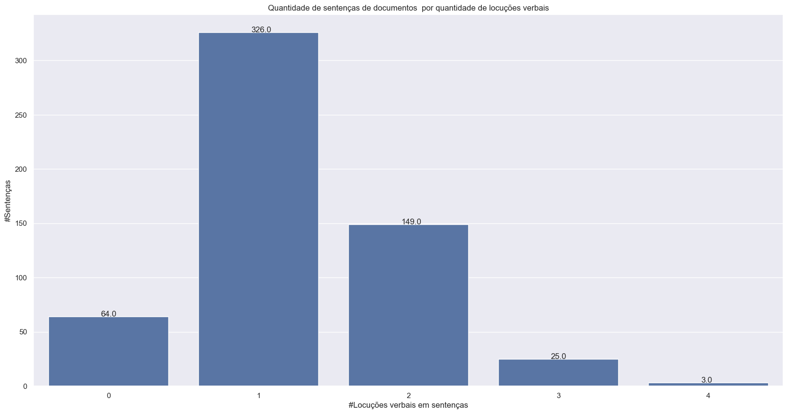
    


#### 5.2.7.5 Gráfico Quantidade de sentenças de documentos  por quantidade de verbos(VERB)


```python
# Import das bibliotecas.
import matplotlib.pyplot as plt
import seaborn as sns
import numpy as np

sns.set(style="darkgrid")

# Aumenta o tamanho da plotagem e o tamanho da fonte.
plt.rcParams["figure.figsize"] = (20,10)

# Plota o número de tokens de cada tamanho
ax = sns.countplot(x=[f["qtdeverbo"] for f in stats_sentencas])

# Adiciona os valores as colunas
for p in ax.patches:
    ax.annotate(f"{p.get_height()}", (p.get_x()+0.35, p.get_height()+0.1))

plt.title("Quantidade de sentenças de documentos  por quantidade de verbos")
plt.xlabel("#Verbos em sentenças")
plt.ylabel("#Sentenças")

plt.show()
```

    2026-05-24 19:13:01,269 : INFO : Using categorical units to plot a list of strings that are all parsable as floats or dates. If these strings should be plotted as numbers, cast to the appropriate data type before plotting.
    

    2026-05-24 19:13:01,272 : INFO : Using categorical units to plot a list of strings that are all parsable as floats or dates. If these strings should be plotted as numbers, cast to the appropriate data type before plotting.
    


    
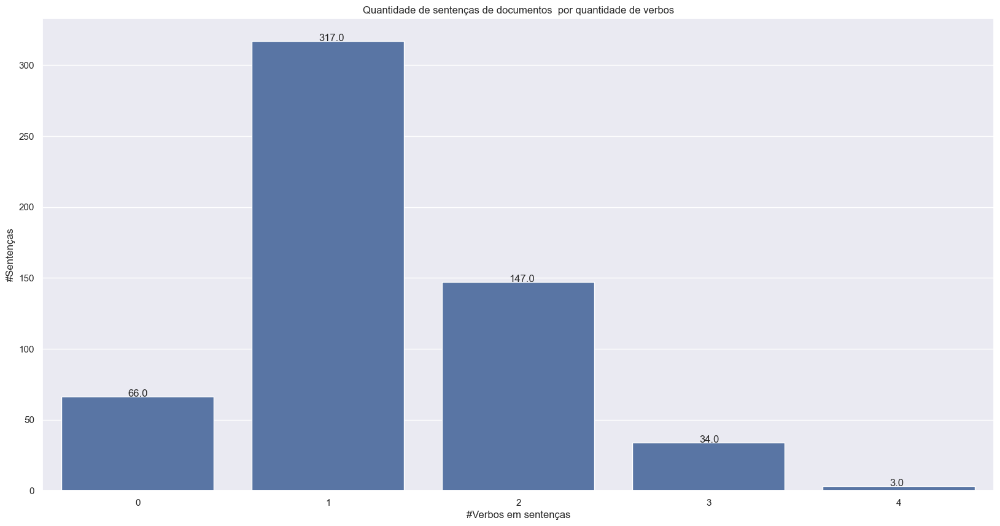
    


#### 5.2.7.6 Gráfico Quantidade de sentenças de documentos  por quantidade de verbos(VERB) e verbos auxiliares(AUX)


```python
# Import das bibliotecas.
import matplotlib.pyplot as plt
import seaborn as sns
import numpy as np

sns.set(style="darkgrid")

# Aumenta o tamanho da plotagem e o tamanho da fonte.
plt.rcParams["figure.figsize"] = (20,10)

# Plota o número de tokens de cada tamanho
ax = sns.countplot(x=[f["qtdeverboaux"] for f in stats_sentencas])

# Adiciona os valores as colunas
for p in ax.patches:
    ax.annotate(f"{p.get_height()}", (p.get_x()+0.4, p.get_height()+0.1))

plt.title("Quantidade de sentenças por documentos  por quantidade de verbos e aux")
plt.xlabel("#Verbos e auxiliar em sentenças")
plt.ylabel("#Sentenças")

plt.show()
```

    2026-05-24 19:13:01,412 : INFO : Using categorical units to plot a list of strings that are all parsable as floats or dates. If these strings should be plotted as numbers, cast to the appropriate data type before plotting.
    

    2026-05-24 19:13:01,418 : INFO : Using categorical units to plot a list of strings that are all parsable as floats or dates. If these strings should be plotted as numbers, cast to the appropriate data type before plotting.
    


    

    


#### 5.2.7.7 Gráfico Quantidade de sentenças de documentos  por quantidade de substantivos(NOUN)


```python
# Import das bibliotecas.
import matplotlib.pyplot as plt
import seaborn as sns
import numpy as np

sns.set(style="darkgrid")

# Aumenta o tamanho da plotagem e o tamanho da fonte.
plt.rcParams["figure.figsize"] = (20,10)

# Plota o número de tokens de cada tamanho
ax = sns.countplot(x=[f["qtdesubstantivo"] for f in stats_sentencas])

# Adiciona os valores as colunas
for p in ax.patches:
    ax.annotate(f"{p.get_height()}", (p.get_x()+0.4, p.get_height()+0.1))

plt.title("Quantidade de sentenças de documentos  por quantidade de substantivos")
plt.xlabel("#Substantivos em sentenças")
plt.ylabel("#Sentenças")

plt.show()
```

    2026-05-24 19:13:01,552 : INFO : Using categorical units to plot a list of strings that are all parsable as floats or dates. If these strings should be plotted as numbers, cast to the appropriate data type before plotting.
    

    2026-05-24 19:13:01,558 : INFO : Using categorical units to plot a list of strings that are all parsable as floats or dates. If these strings should be plotted as numbers, cast to the appropriate data type before plotting.
    


    
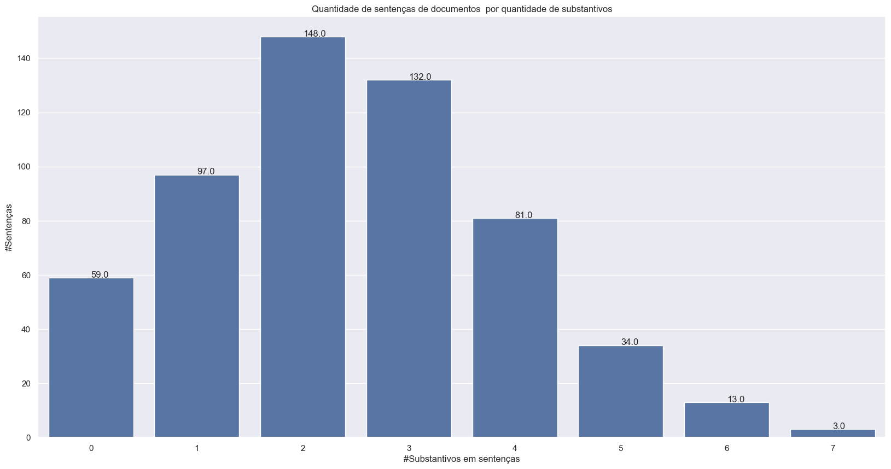
    


#### 5.2.7.8 Gráfico Quantidade de sentenças de documentos  por quantidade de verbos(AUX) e substantivo


```python
# Import das bibliotecas.
import matplotlib.pyplot as plt
import seaborn as sns
import numpy as np

sns.set(style="darkgrid")

# Aumenta o tamanho da plotagem e o tamanho da fonte.
plt.rcParams["figure.figsize"] = (20,10)

# Plota o número de tokens de cada tamanho
ax = sns.countplot(x=[f["qtdeverboauxsubstantivo"] for f in stats_sentencas])

# Adiciona os valores as colunas
for p in ax.patches:
    ax.annotate(f"{p.get_height()}", (p.get_x()+0.3, p.get_height()+0.1))

plt.title("Quantidade de sentenças de documentos  por quantidade de verbos(AUX) e substantivos")
plt.xlabel("#Verbos(AUX) e substantivos em sentenças")
plt.ylabel("#Sentenças")

plt.show()
```

    2026-05-24 19:13:01,712 : INFO : Using categorical units to plot a list of strings that are all parsable as floats or dates. If these strings should be plotted as numbers, cast to the appropriate data type before plotting.
    

    2026-05-24 19:13:01,717 : INFO : Using categorical units to plot a list of strings that are all parsable as floats or dates. If these strings should be plotted as numbers, cast to the appropriate data type before plotting.
    


    
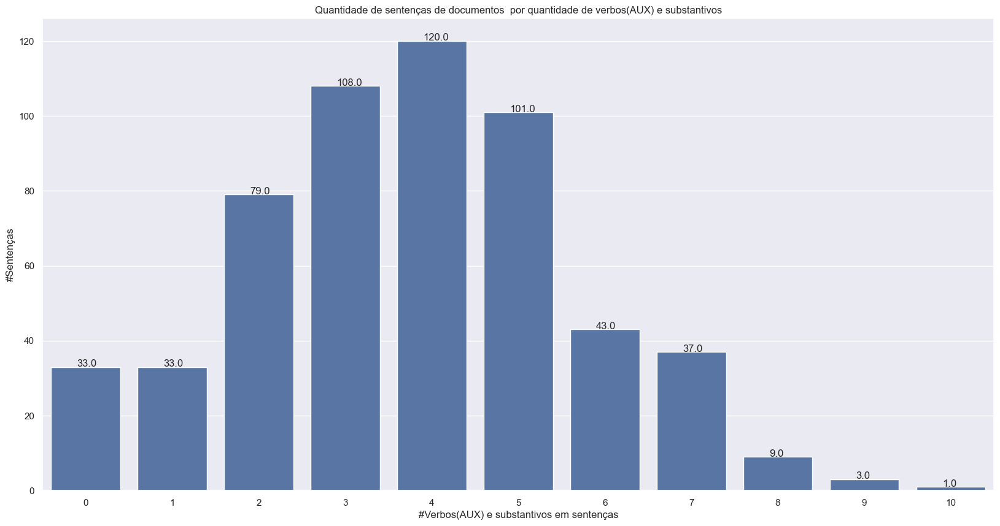
    


#### 5.2.7.9 Gráfico Quantidade de sentenças de documentos  por quantidade de entidades


```python
# Import das bibliotecas.
import matplotlib.pyplot as plt
import seaborn as sns
import numpy as np

sns.set(style="darkgrid")

# Aumenta o tamanho da plotagem e o tamanho da fonte.
plt.rcParams["figure.figsize"] = (20,10)

# Plota o número de tokens de cada tamanho
ax = sns.countplot(x=[f["qtdener"] for f in stats_sentencas])

# Adiciona os valores as colunas
for p in ax.patches:
    ax.annotate(f"{p.get_height()}", (p.get_x()+0.4, p.get_height()+0.1))

plt.title("Quantidade de sentenças de documentos por quantidade de entidades")
plt.xlabel("#Entidades em sentenças")
plt.ylabel("#Sentenças")

plt.show()
```

    2026-05-24 19:13:01,880 : INFO : Using categorical units to plot a list of strings that are all parsable as floats or dates. If these strings should be plotted as numbers, cast to the appropriate data type before plotting.
    

    2026-05-24 19:13:01,884 : INFO : Using categorical units to plot a list of strings that are all parsable as floats or dates. If these strings should be plotted as numbers, cast to the appropriate data type before plotting.
    


    

    


# 6 Finalização

## 6.1 Tempo final de processamento


```python
# Pega o tempo atual menos o tempo do início do processamento.
final_processamento = time.time()
tempo_total_processamento = formataTempo(final_processamento - inicio_processamento)

print("")
print("  Tempo processamento:  {:} (h:mm:ss)".format(tempo_total_processamento))
```

    
      Tempo processamento:  0:00:25 (h:mm:ss)
    
