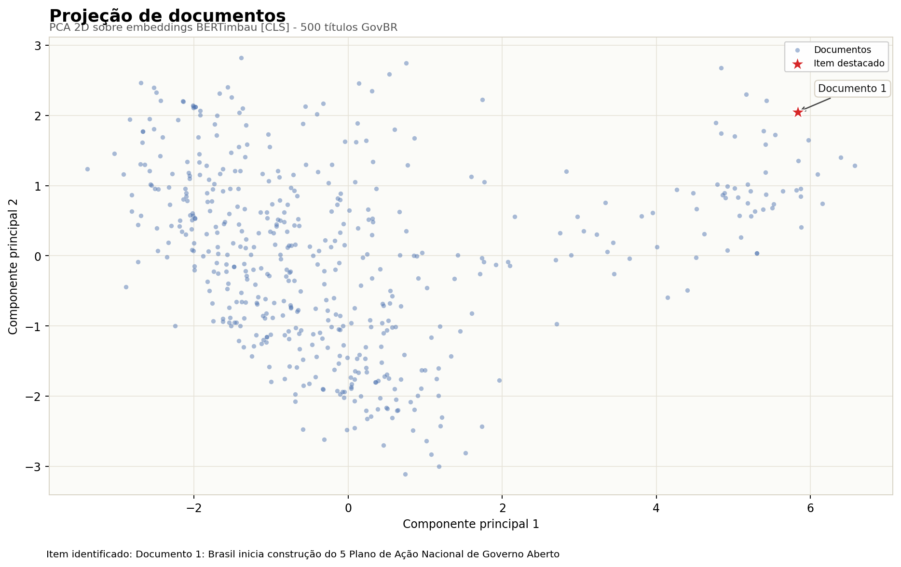
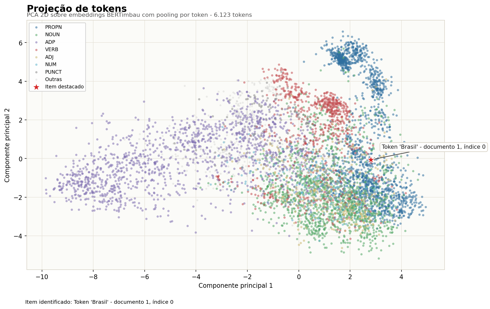
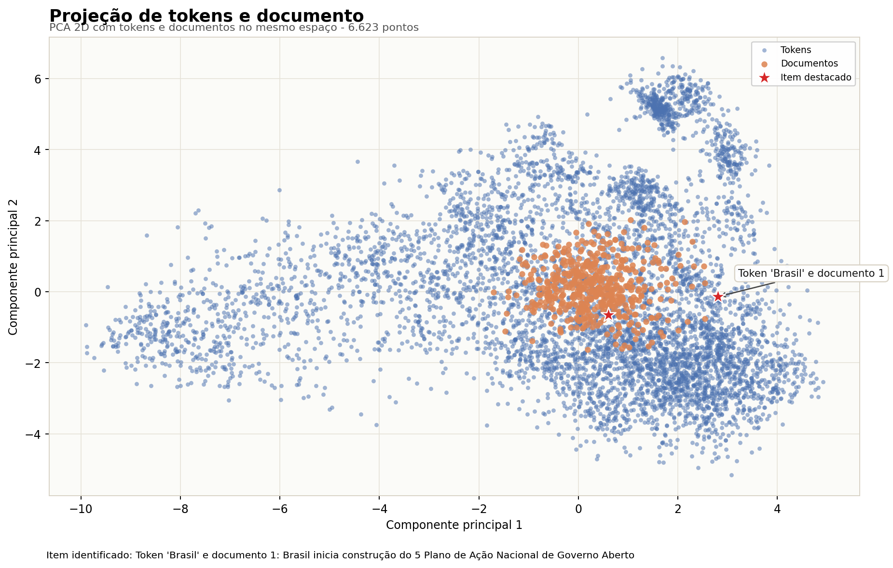
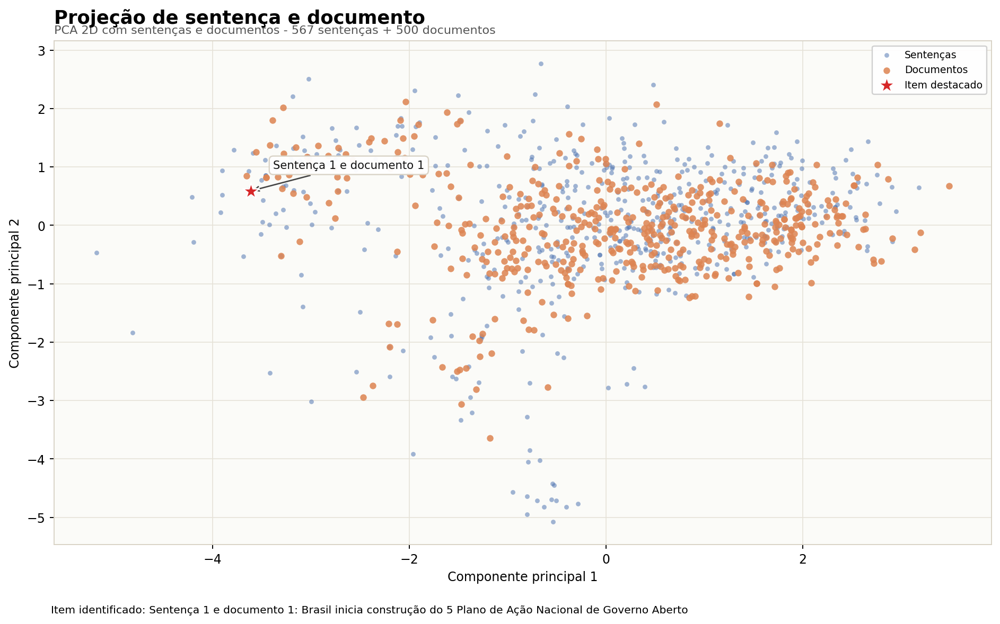

# Avaliação a Distância 2 - Projeção de Embeddings

**Aluno:** Fernando Paladini

## Repositório

Link do repositório pessoal no GitHub: [https://github.com/paladini/sri](https://github.com/paladini/sri)

Os notebooks estão na raiz do repositório e os arquivos gerados foram organizados na pasta `projecao/`.

## Dataset e execução

Foi reutilizado o texto analisado na Avaliação a Distância 1: o dataset de notícias GovBR `divergente/noticias-govbr-ptbr-1`, adaptado para `data/documentos.csv` com 500 títulos em português. Esse corpus é diferente do CSTNews usado nos notebooks de exemplo do professor.

Os notebooks executados foram:

1. `3_2_1_GerarArquivosProjecaoEmbeddingsDocumento_v1.ipynb`
2. `3_2_2_GerarArquivosProjecaoEmbeddingsToken_v1.ipynb`
3. `3_2_3_GerarArquivosProjecaoEmbeddingsToken_Documento_v1.ipynb`
4. `3_2_4_GerarArquivosProjecaoEmbeddingsSentenca_Documento_v1.ipynb`

## Arquivos gerados

| Projeção | Registros | Metadados | Pontos |
|---|---|---:|---:|
| Documento | `projecao/documento/records_documento_768_base_CLS.tsv` | `projecao/documento/meta_documento_768_base_CLS.tsv` | 500 |
| Tokens | `projecao/token/DOALL_records_token_768_base_POOL.tsv` | `projecao/token/DOALL_meta_token_768_base_POOL.tsv` | 6.123 |
| Tokens e documento | `projecao/token_documento/DOALL_records_token_documento_768_base_POOL.tsv` | `projecao/token_documento/DOALL_meta_token_documento_768_base_POOL.tsv` | 6.623 |
| Sentença e documento | `projecao/sentenca_documento/DOALL_records_sentenca_documento_768_base.tsv` | `projecao/sentenca_documento/DOALL_meta_sentenca_documento_768_base.tsv` | 1.067 |

## Links do Embedding Projector

- Documento: https://projector.tensorflow.org/?config=https://raw.githubusercontent.com/paladini/sri/main/projecao/config_documento.json
- Tokens: https://projector.tensorflow.org/?config=https://raw.githubusercontent.com/paladini/sri/main/projecao/config_token.json
- Tokens e documento: https://projector.tensorflow.org/?config=https://raw.githubusercontent.com/paladini/sri/main/projecao/config_token_documento.json
- Sentença e documento: https://projector.tensorflow.org/?config=https://raw.githubusercontent.com/paladini/sri/main/projecao/config_sentenca_documento.json

## Leitura das projeções

As projeções foram reduzidas para duas dimensões com PCA apenas para visualização, então elas não mostram toda a informação dos embeddings originais de 768 dimensões. Mesmo assim, os gráficos ajudam a observar a distribuição dos documentos, tokens e sentenças do corpus GovBR. Em todos os casos eu destaquei o mesmo documento de referência, usando o token `Brasil` e a primeira sentença/documento, para facilitar a comparação entre as quatro projeções pedidas.

## Projeções

### Documento

Documento projetado: `Brasil inicia construção do 5 Plano de Ação Nacional de Governo Aberto`

### Tokens

Token projetado: `Brasil`, no documento 1.

### Tokens e documento

Token e documento projetados: `Brasil` e documento 1.

### Sentença e documento

Sentença projetada: `Brasil inicia construção do 5 Plano de Ação Nacional de Governo Aberto`

Documento projetado: `Brasil inicia construção do 5 Plano de Ação Nacional de Governo Aberto`

